# Architecture & Design

<cite>
**Referenced Files in This Document**
- [App.jsx](file://src/App.jsx)
- [main.tsx](file://src/main.tsx)
- [package.json](file://package.json)
- [index.css](file://src/index.css)
- [Home.jsx](file://src/pages/Home/Home.jsx)
- [Navbar.jsx](file://src/pages/Home/Navbar.jsx)
- [Hero.jsx](file://src/pages/Home/Hero.jsx)
- [FeaturedCourses.jsx](file://src/pages/Home/FeaturedCourses.jsx)
- [CourseCard.jsx](file://src/pages/Home/CourseCard.jsx)
- [Pricing.jsx](file://src/pages/Home/Pricing.jsx)
- [Testimonials.jsx](file://src/pages/Home/Testimonials.jsx)
- [FAQ.jsx](file://src/pages/Home/FAQ.jsx)
- [homeData.js](file://src/pages/Home/homeData.js)
- [Button.jsx](file://src/pages/Home/Button.jsx)
- [useCursor.js](file://src/pages/Home/useCursor.js)
</cite>

## Table of Contents
1. [Introduction](#introduction)
2. [Project Structure](#project-structure)
3. [Core Components](#core-components)
4. [Architecture Overview](#architecture-overview)
5. [Detailed Component Analysis](#detailed-component-analysis)
6. [Dependency Analysis](#dependency-analysis)
7. [Performance Considerations](#performance-considerations)
8. [Troubleshooting Guide](#troubleshooting-guide)
9. [Conclusion](#conclusion)

## Introduction
This document describes CourseCraft’s component-based Single Page Application (SPA) architecture built with React 19 and Vite. The design emphasizes:
- A flat SPA root rendering a single page component
- A data-driven content management approach via centralized data modules
- A styling architecture powered by Tailwind CSS v4 with a custom theme
- Responsive design patterns using CSS Grid, clamp-based typography, and runtime layout adjustments
- Custom hooks for interactive enhancements
- Component composition patterns that promote reuse and maintainability

## Project Structure
The client-side application follows a feature-based organization under src/pages/Home, with a small SPA entry in App.jsx and a global Tailwind theme in index.css. Dependencies are declared in package.json, and the bundler is Vite.

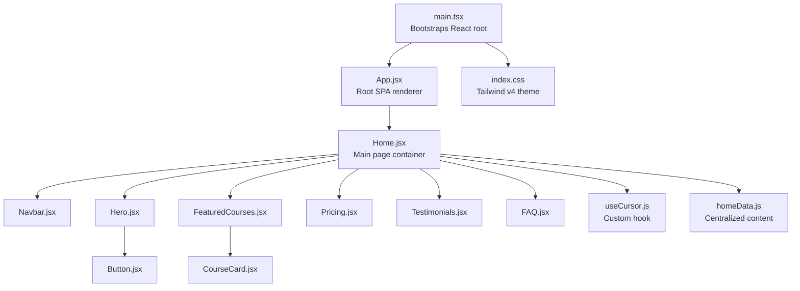

**Diagram sources**
- [main.tsx:1-11](file://src/main.tsx#L1-L11)
- [App.jsx:1-10](file://src/App.jsx#L1-L10)
- [Home.jsx:1-40](file://src/pages/Home/Home.jsx#L1-L40)
- [Navbar.jsx:1-125](file://src/pages/Home/Navbar.jsx#L1-L125)
- [Hero.jsx:1-105](file://src/pages/Home/Hero.jsx#L1-L105)
- [FeaturedCourses.jsx:1-46](file://src/pages/Home/FeaturedCourses.jsx#L1-L46)
- [CourseCard.jsx:1-54](file://src/pages/Home/CourseCard.jsx#L1-L54)
- [Pricing.jsx:1-41](file://src/pages/Home/Pricing.jsx#L1-L41)
- [Testimonials.jsx:1-42](file://src/pages/Home/Testimonials.jsx#L1-L42)
- [FAQ.jsx:1-19](file://src/pages/Home/FAQ.jsx#L1-L19)
- [Button.jsx:1-30](file://src/pages/Home/Button.jsx#L1-L30)
- [useCursor.js:1-29](file://src/pages/Home/useCursor.js#L1-L29)
- [homeData.js:1-157](file://src/pages/Home/homeData.js#L1-L157)
- [index.css:1-8](file://src/index.css#L1-L8)

**Section sources**
- [main.tsx:1-11](file://src/main.tsx#L1-L11)
- [App.jsx:1-10](file://src/App.jsx#L1-L10)
- [package.json:1-38](file://package.json#L1-L38)
- [index.css:1-8](file://src/index.css#L1-L8)

## Core Components
- Root SPA renderer: App.jsx renders the Home page inside a full viewport container.
- Home page container: Home.jsx composes the page sections and mounts a custom cursor element via a hook.
- Navigation: Navbar.jsx implements responsive desktop and mobile layouts with a slide-down drawer and hover states.
- Content sections: Hero.jsx, FeaturedCourses.jsx, Pricing.jsx, Testimonials.jsx, and FAQ.jsx encapsulate distinct page regions.
- Data layer: homeData.js centralizes all textual, media, and structural content for the homepage.
- Styling: index.css defines a Tailwind v4 theme with custom color tokens.
- Interactivity: useCursor.js attaches a custom mouse follower and scales on interactive elements.

Key implementation patterns:
- Composition: Home.jsx imports and composes child components.
- Centralized data: Each section imports content constants from homeData.js.
- Responsive logic: Components compute layout state on resize and update styles accordingly.
- Minimal local state: Components rely on props and centralized data, reducing duplication.

**Section sources**
- [App.jsx:1-10](file://src/App.jsx#L1-L10)
- [Home.jsx:1-40](file://src/pages/Home/Home.jsx#L1-L40)
- [Navbar.jsx:1-125](file://src/pages/Home/Navbar.jsx#L1-L125)
- [Hero.jsx:1-105](file://src/pages/Home/Hero.jsx#L1-L105)
- [FeaturedCourses.jsx:1-46](file://src/pages/Home/FeaturedCourses.jsx#L1-L46)
- [Pricing.jsx:1-41](file://src/pages/Home/Pricing.jsx#L1-L41)
- [Testimonials.jsx:1-42](file://src/pages/Home/Testimonials.jsx#L1-L42)
- [FAQ.jsx:1-19](file://src/pages/Home/FAQ.jsx#L1-L19)
- [homeData.js:1-157](file://src/pages/Home/homeData.js#L1-L157)
- [index.css:1-8](file://src/index.css#L1-L8)
- [useCursor.js:1-29](file://src/pages/Home/useCursor.js#L1-L29)

## Architecture Overview
CourseCraft uses a minimal SPA pattern:
- The React root mounts App.jsx, which renders Home.jsx.
- Home.jsx orchestrates page sections and applies global styles.
- Sections consume data from homeData.js, ensuring content is decoupled from markup.
- Tailwind CSS v4 provides utility-first styling with a custom theme.

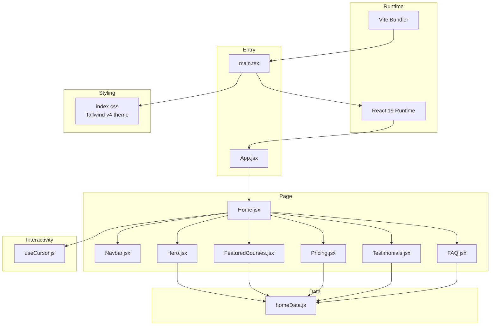

**Diagram sources**
- [main.tsx:1-11](file://src/main.tsx#L1-L11)
- [App.jsx:1-10](file://src/App.jsx#L1-L10)
- [Home.jsx:1-40](file://src/pages/Home/Home.jsx#L1-L40)
- [Navbar.jsx:1-125](file://src/pages/Home/Navbar.jsx#L1-L125)
- [Hero.jsx:1-105](file://src/pages/Home/Hero.jsx#L1-L105)
- [FeaturedCourses.jsx:1-46](file://src/pages/Home/FeaturedCourses.jsx#L1-L46)
- [Pricing.jsx:1-41](file://src/pages/Home/Pricing.jsx#L1-L41)
- [Testimonials.jsx:1-42](file://src/pages/Home/Testimonials.jsx#L1-L42)
- [FAQ.jsx:1-19](file://src/pages/Home/FAQ.jsx#L1-L19)
- [homeData.js:1-157](file://src/pages/Home/homeData.js#L1-L157)
- [index.css:1-8](file://src/index.css#L1-L8)
- [useCursor.js:1-29](file://src/pages/Home/useCursor.js#L1-L29)

## Detailed Component Analysis

### SPA Root and Page Container
- App.jsx renders Home inside a full viewport container, establishing the SPA boundary.
- Home.jsx composes all page sections and mounts a custom cursor element via a ref returned by useCursor.js.

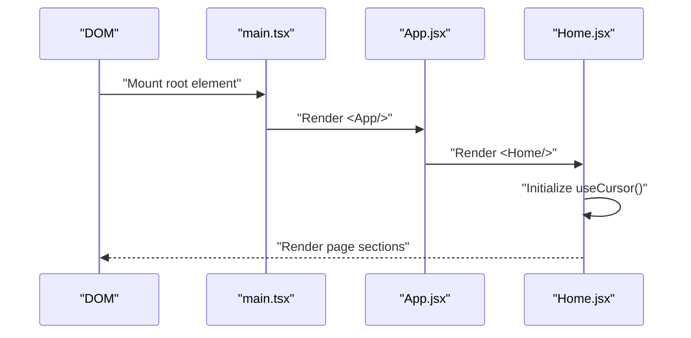

**Diagram sources**
- [main.tsx:1-11](file://src/main.tsx#L1-L11)
- [App.jsx:1-10](file://src/App.jsx#L1-L10)
- [Home.jsx:1-40](file://src/pages/Home/Home.jsx#L1-L40)
- [useCursor.js:1-29](file://src/pages/Home/useCursor.js#L1-L29)

**Section sources**
- [App.jsx:1-10](file://src/App.jsx#L1-L10)
- [Home.jsx:1-40](file://src/pages/Home/Home.jsx#L1-L40)
- [useCursor.js:1-29](file://src/pages/Home/useCursor.js#L1-L29)

### Navigation Component (Responsive)
- Implements desktop and mobile layouts with a slide-down drawer triggered by a hamburger menu.
- Uses responsive detection to switch between desktop and mobile UI.
- Integrates with Button.jsx for CTAs and applies hover states.

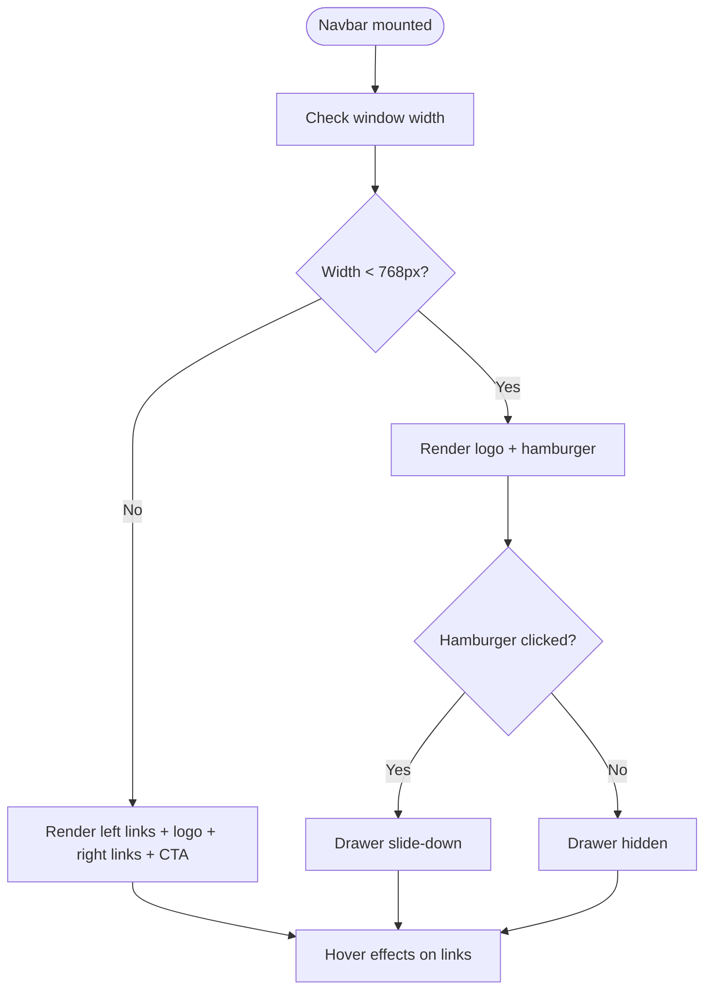

**Diagram sources**
- [Navbar.jsx:1-125](file://src/pages/Home/Navbar.jsx#L1-L125)
- [Button.jsx:1-30](file://src/pages/Home/Button.jsx#L1-L30)

**Section sources**
- [Navbar.jsx:1-125](file://src/pages/Home/Navbar.jsx#L1-L125)
- [Button.jsx:1-30](file://src/pages/Home/Button.jsx#L1-L30)

### Hero Section (Responsive Grid)
- Uses CSS Grid to split layout into copy and course grid areas.
- Computes mobile vs desktop layout on resize and adjusts borders and alignment.
- Renders a stats bar and integrates RevealOnScroll for staggered animations.

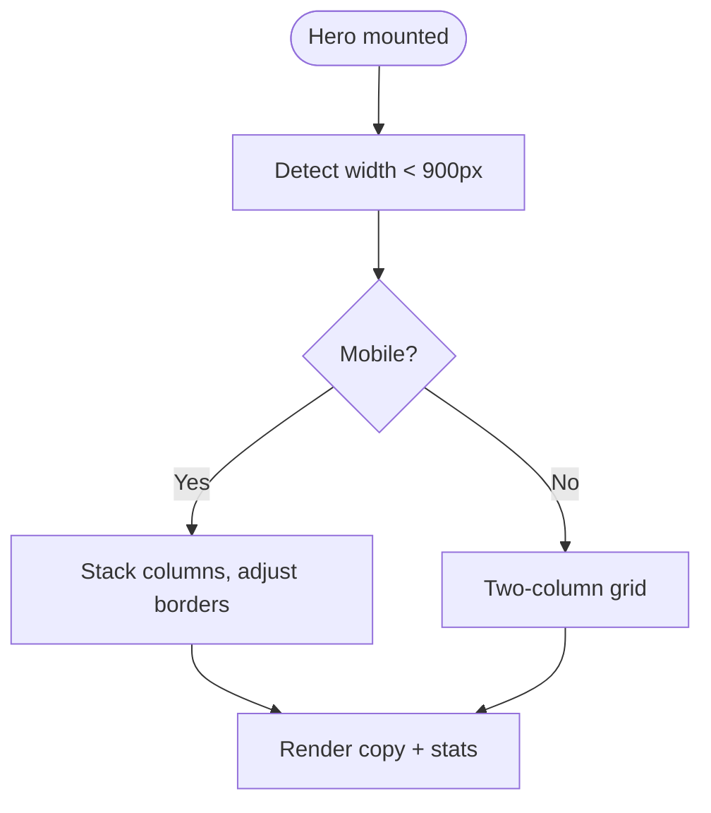

**Diagram sources**
- [Hero.jsx:1-105](file://src/pages/Home/Hero.jsx#L1-L105)

**Section sources**
- [Hero.jsx:1-105](file://src/pages/Home/Hero.jsx#L1-L105)

### Featured Courses (Grid and Borders)
- Dynamically computes number of columns based on viewport width.
- Applies responsive borders between cards and reveals them progressively.
- Uses CourseCard.jsx to render each course with hover effects and pricing.

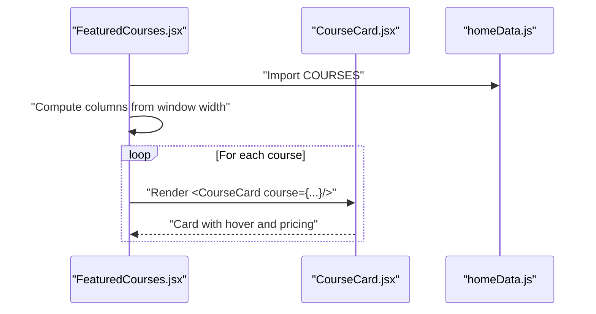

**Diagram sources**
- [FeaturedCourses.jsx:1-46](file://src/pages/Home/FeaturedCourses.jsx#L1-L46)
- [CourseCard.jsx:1-54](file://src/pages/Home/CourseCard.jsx#L1-L54)
- [homeData.js:57-61](file://src/pages/Home/homeData.js#L57-L61)

**Section sources**
- [FeaturedCourses.jsx:1-46](file://src/pages/Home/FeaturedCourses.jsx#L1-L46)
- [CourseCard.jsx:1-54](file://src/pages/Home/CourseCard.jsx#L1-L54)
- [homeData.js:57-61](file://src/pages/Home/homeData.js#L57-L61)

### Pricing Section (Feature Comparison)
- Adapts to 3-column desktop and single column on mobile.
- Uses PricingCol to render plans and RevealOnScroll for staggered appearance.

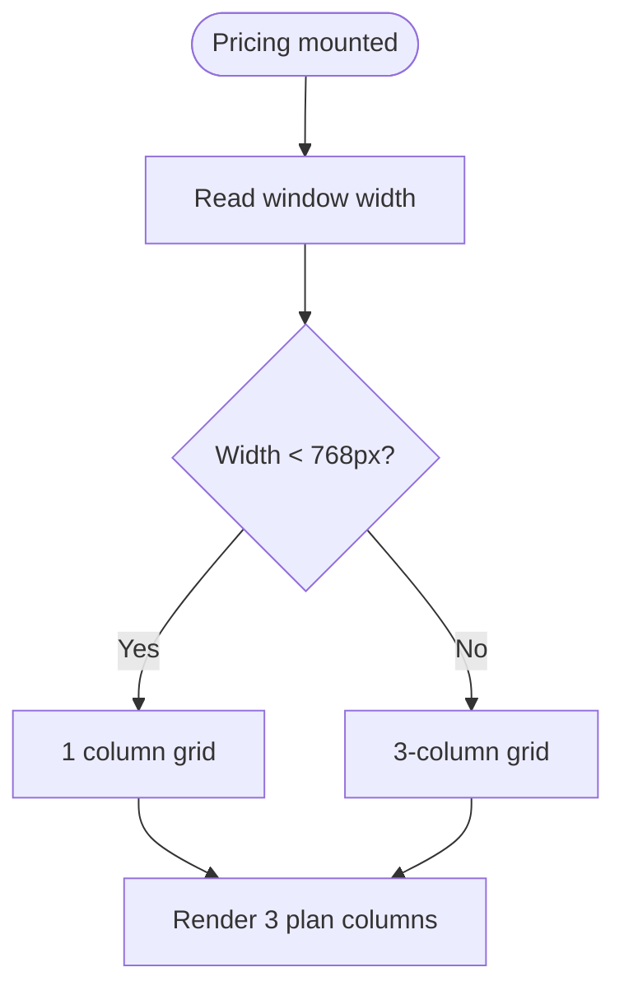

**Diagram sources**
- [Pricing.jsx:1-41](file://src/pages/Home/Pricing.jsx#L1-L41)

**Section sources**
- [Pricing.jsx:1-41](file://src/pages/Home/Pricing.jsx#L1-L41)
- [homeData.js:99-133](file://src/pages/Home/homeData.js#L99-L133)

### Testimonials (Adaptive Grid)
- Computes number of columns based on viewport width and slices testimonials accordingly.
- Applies responsive borders between rows and columns.

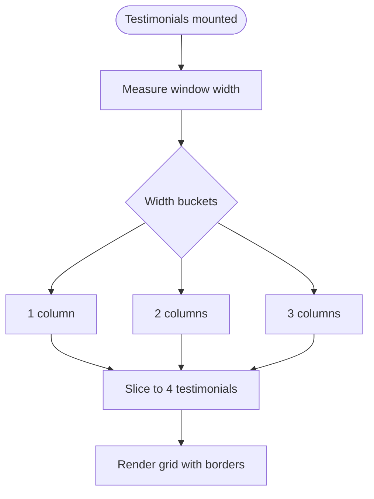

**Diagram sources**
- [Testimonials.jsx:1-42](file://src/pages/Home/Testimonials.jsx#L1-L42)

**Section sources**
- [Testimonials.jsx:1-42](file://src/pages/Home/Testimonials.jsx#L1-L42)
- [homeData.js:89-96](file://src/pages/Home/homeData.js#L89-L96)

### FAQ Section
- Renders a list of FAQ items using FAQItem components sourced from homeData.js.

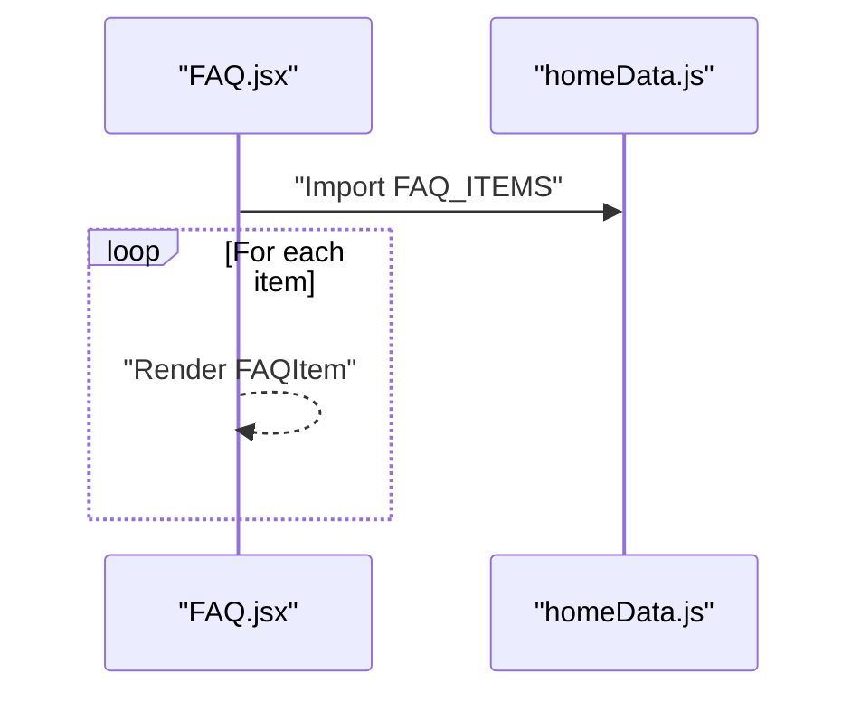

**Diagram sources**
- [FAQ.jsx:1-19](file://src/pages/Home/FAQ.jsx#L1-L19)
- [homeData.js:136-142](file://src/pages/Home/homeData.js#L136-L142)

**Section sources**
- [FAQ.jsx:1-19](file://src/pages/Home/FAQ.jsx#L1-L19)
- [homeData.js:136-142](file://src/pages/Home/homeData.js#L136-L142)

### Data-Driven Content Management
- All page content (navigation links, hero cells, testimonials, pricing plans, FAQs, etc.) is centralized in homeData.js.
- Components import named exports and render lists without embedding literals.
- This approach simplifies content updates and enforces consistency.

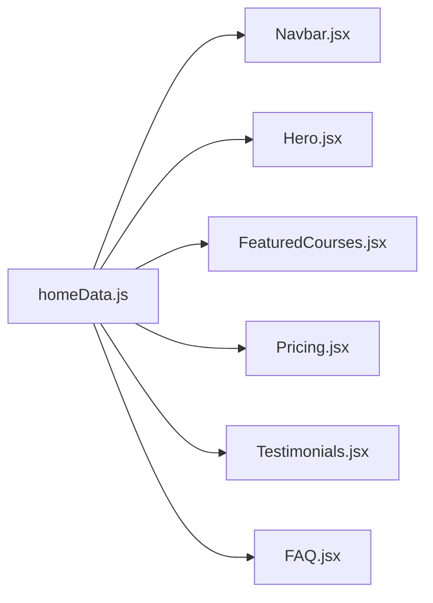

**Diagram sources**
- [homeData.js:1-157](file://src/pages/Home/homeData.js#L1-L157)
- [Navbar.jsx:7](file://src/pages/Home/Navbar.jsx#L7)
- [Hero.jsx:8](file://src/pages/Home/Hero.jsx#L8)
- [FeaturedCourses.jsx:7](file://src/pages/Home/FeaturedCourses.jsx#L7)
- [Pricing.jsx:7](file://src/pages/Home/Pricing.jsx#L7)
- [Testimonials.jsx:6](file://src/pages/Home/Testimonials.jsx#L6)
- [FAQ.jsx:4](file://src/pages/Home/FAQ.jsx#L4)

**Section sources**
- [homeData.js:1-157](file://src/pages/Home/homeData.js#L1-L157)

### Styling Architecture and Theme
- Tailwind CSS v4 is configured via index.css with a custom theme block defining color tokens.
- Components apply Tailwind utilities for layout, spacing, typography, and color.
- CSS clamp is used for fluid typography in Hero.jsx to scale headings smoothly across breakpoints.

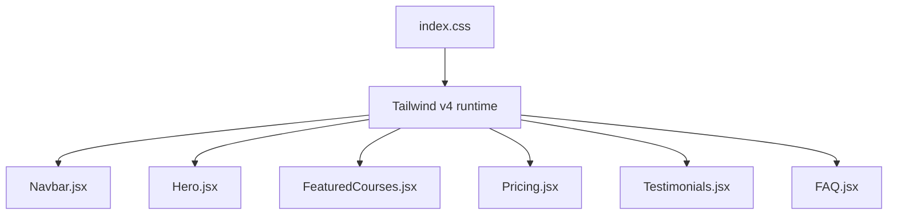

**Diagram sources**
- [index.css:1-8](file://src/index.css#L1-L8)
- [Navbar.jsx:1](file://src/pages/Home/Navbar.jsx#L1)
- [Hero.jsx:1](file://src/pages/Home/Hero.jsx#L1)
- [FeaturedCourses.jsx:1](file://src/pages/Home/FeaturedCourses.jsx#L1)
- [Pricing.jsx:1](file://src/pages/Home/Pricing.jsx#L1)
- [Testimonials.jsx:1](file://src/pages/Home/Testimonials.jsx#L1)
- [FAQ.jsx:1](file://src/pages/Home/FAQ.jsx#L1)

**Section sources**
- [index.css:1-8](file://src/index.css#L1-L8)
- [Hero.jsx:30-42](file://src/pages/Home/Hero.jsx#L30-L42)

### Custom Hook Implementation Strategy
- useCursor.js attaches a custom cursor element and scales it on hover of interactive targets.
- It manages event listeners and cleans them up on unmount.
- The hook returns a ref that Home.jsx attaches to a DOM node.

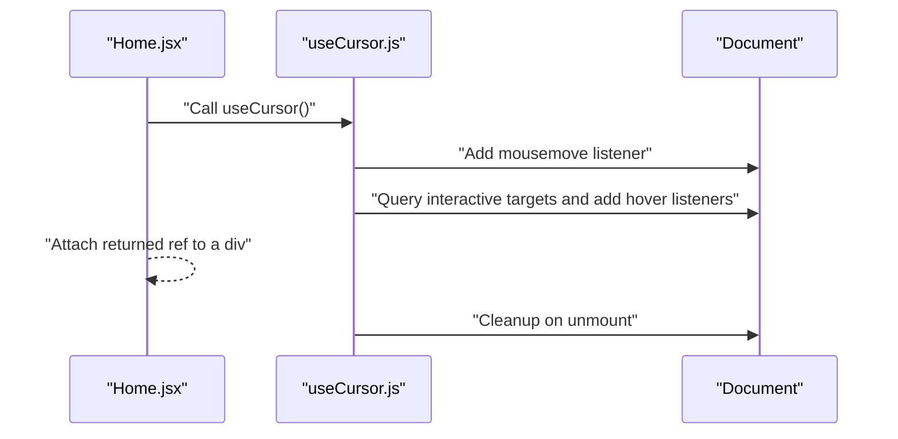

**Diagram sources**
- [Home.jsx:15-21](file://src/pages/Home/Home.jsx#L15-L21)
- [useCursor.js:1-29](file://src/pages/Home/useCursor.js#L1-L29)

**Section sources**
- [Home.jsx:15-21](file://src/pages/Home/Home.jsx#L15-L21)
- [useCursor.js:1-29](file://src/pages/Home/useCursor.js#L1-L29)

### Component Composition Patterns
- Home.jsx composes all sections and passes no props except the cursor ref.
- Child components import shared data and UI primitives (Button.jsx) to maintain consistency.
- RevealOnScroll is used across sections to coordinate staggered animations.

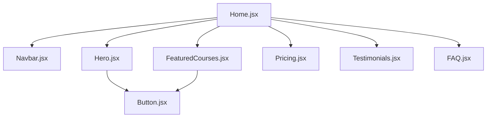

**Diagram sources**
- [Home.jsx:1-40](file://src/pages/Home/Home.jsx#L1-L40)
- [Hero.jsx:5](file://src/pages/Home/Hero.jsx#L5)
- [FeaturedCourses.jsx:4](file://src/pages/Home/FeaturedCourses.jsx#L4)
- [Button.jsx:1-30](file://src/pages/Home/Button.jsx#L1-L30)

**Section sources**
- [Home.jsx:1-40](file://src/pages/Home/Home.jsx#L1-L40)
- [Button.jsx:1-30](file://src/pages/Home/Button.jsx#L1-L30)

## Dependency Analysis
External dependencies include React 19, React DOM, Tailwind CSS v4, @tailwindcss/vite, react-router-dom, and motion. These enable the SPA runtime, styling, and animation capabilities.

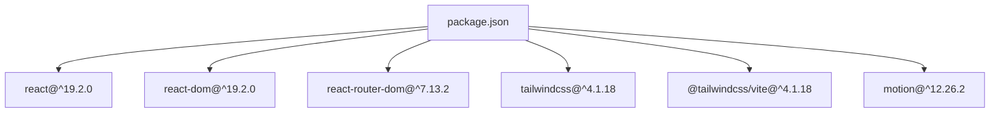

**Diagram sources**
- [package.json:12-18](file://package.json#L12-L18)

**Section sources**
- [package.json:1-38](file://package.json#L1-L38)

## Performance Considerations
- Minimal state: Components compute responsive layout on resize and avoid heavy internal state, reducing re-renders.
- Utility-first CSS: Tailwind utilities minimize CSS overhead and enable efficient styling.
- Event cleanup: useCursor.js removes event listeners on unmount to prevent memory leaks.
- Lazy loading: Consider deferring non-critical sections or images to improve initial load.
- Bundle optimization: Vite with Rolldown provides fast builds; ensure tree-shaking remains effective as the component library grows.

## Troubleshooting Guide
- Cursor not moving: Verify the ref is attached to a DOM node and interactive targets exist in the DOM when the hook runs.
- Navigation drawer not closing: Ensure the mobile state resets when the viewport becomes non-mobile.
- Layout shifts on resize: Confirm resize handlers update computed styles consistently and avoid synchronous layout thrashing.
- Theme colors not applied: Check that Tailwind v4 is properly imported and the theme block is present in index.css.

**Section sources**
- [useCursor.js:1-29](file://src/pages/Home/useCursor.js#L1-L29)
- [Navbar.jsx:13-20](file://src/pages/Home/Navbar.jsx#L13-L20)
- [index.css:1-8](file://src/index.css#L1-L8)

## Conclusion
CourseCraft’s architecture favors simplicity and clarity:
- A single-page SPA root with a composed page container
- Centralized data for content management
- Tailwind CSS v4 for scalable, theme-driven styling
- Responsive patterns leveraging runtime layout decisions
- Custom hooks for targeted interactivity

This foundation supports scalability by keeping components focused, data centralized, and styling declarative. As the platform evolves, maintainability can be preserved by continuing to compose small, reusable components and keeping content in data modules.