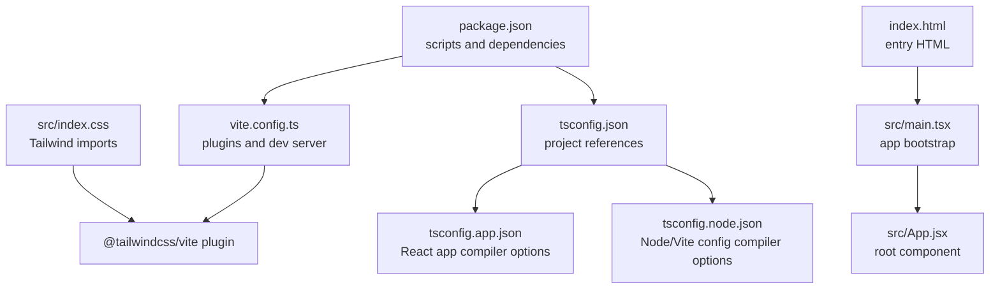
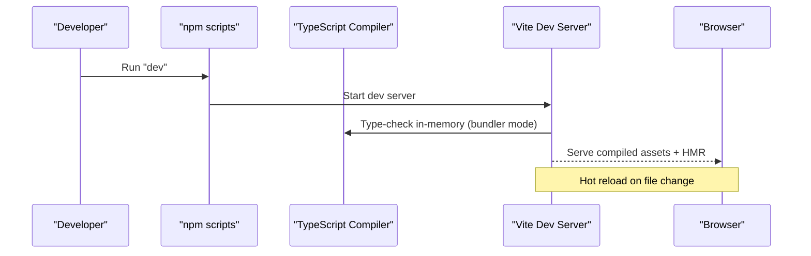
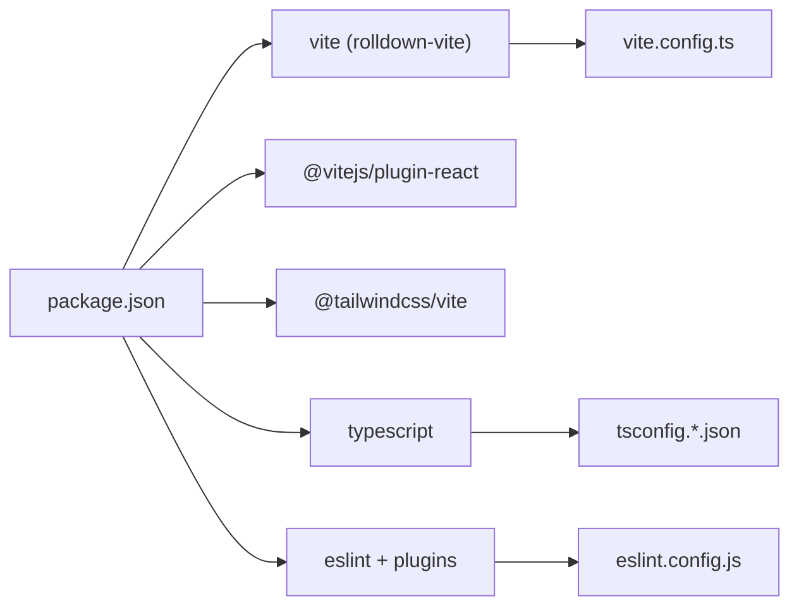

# Build & Deployment

<cite>
**Referenced Files in This Document**
- [vite.config.ts](file://vite.config.ts)
- [package.json](file://package.json)
- [tsconfig.json](file://tsconfig.json)
- [tsconfig.app.json](file://tsconfig.app.json)
- [tsconfig.node.json](file://tsconfig.node.json)
- [src/main.tsx](file://src/main.tsx)
- [index.html](file://index.html)
- [eslint.config.js](file://eslint.config.js)
- [src/index.css](file://src/index.css)
</cite>

## Table of Contents
1. [Introduction](#introduction)
2. [Project Structure](#project-structure)
3. [Core Components](#core-components)
4. [Architecture Overview](#architecture-overview)
5. [Detailed Component Analysis](#detailed-component-analysis)
6. [Dependency Analysis](#dependency-analysis)
7. [Performance Considerations](#performance-considerations)
8. [Troubleshooting Guide](#troubleshooting-guide)
9. [Conclusion](#conclusion)
10. [Appendices](#appendices)

## Introduction
This document describes the complete build and deployment workflow for CourseCraft’s frontend client. It covers Vite configuration, TypeScript compilation, asset optimization, development server and hot reload, production builds, bundle optimization, performance monitoring, environment configuration, CI/CD integration, and operational practices such as versioning, releases, and rollbacks. The goal is to enable reliable local development and repeatable, secure production deployments.

## Project Structure
The repository follows a conventional React + TypeScript + Vite setup with Tailwind CSS for styling. Key build and configuration files are centralized to keep the developer experience streamlined and maintainable.

**Diagram sources**
- [package.json:1-38](file://package.json#L1-L38)
- [vite.config.ts:1-8](file://vite.config.ts#L1-L8)
- [tsconfig.json:1-8](file://tsconfig.json#L1-L8)
- [tsconfig.app.json:1-29](file://tsconfig.app.json#L1-L29)
- [tsconfig.node.json:1-27](file://tsconfig.node.json#L1-L27)
- [index.html:1-15](file://index.html#L1-L15)
- [src/main.tsx:1-11](file://src/main.tsx#L1-L11)
- [src/index.css:1-8](file://src/index.css#L1-L8)

**Section sources**
- [package.json:1-38](file://package.json#L1-L38)
- [vite.config.ts:1-8](file://vite.config.ts#L1-L8)
- [tsconfig.json:1-8](file://tsconfig.json#L1-L8)
- [tsconfig.app.json:1-29](file://tsconfig.app.json#L1-L29)
- [tsconfig.node.json:1-27](file://tsconfig.node.json#L1-L27)
- [index.html:1-15](file://index.html#L1-L15)
- [src/main.tsx:1-11](file://src/main.tsx#L1-L11)
- [src/index.css:1-8](file://src/index.css#L1-L8)

## Core Components
- Vite build toolchain configured via vite.config.ts with React and Tailwind CSS plugins.
- TypeScript project references split into app and node configurations for strictness and bundler mode.
- npm scripts orchestrate development, type-checking/build, linting, and preview.
- HTML entry point mounts the React root and loads the TypeScript module.
- Tailwind CSS integrated via @tailwindcss/vite plugin and local theme overrides.

**Section sources**
- [vite.config.ts:1-8](file://vite.config.ts#L1-L8)
- [package.json:6-11](file://package.json#L6-L11)
- [tsconfig.app.json:1-29](file://tsconfig.app.json#L1-L29)
- [tsconfig.node.json:1-27](file://tsconfig.node.json#L1-L27)
- [index.html:12](file://index.html#L12)
- [src/index.css:1](file://src/index.css#L1)

## Architecture Overview
The build pipeline integrates TypeScript compilation and Vite bundling, with Tailwind CSS processing during development and production. The development server supports hot module replacement, while production builds optimize assets and code-splitting.

**Diagram sources**
- [package.json:7](file://package.json#L7)
- [vite.config.ts:5-7](file://vite.config.ts#L5-L7)
- [tsconfig.app.json:11-17](file://tsconfig.app.json#L11-L17)

## Detailed Component Analysis

### Vite Configuration
- Plugins: React refresh and Tailwind CSS integration.
- Development server: defaults serve from project root; assets resolved via Vite’s resolver.
- No explicit build.rollupOptions is present, so Vite defaults apply.

Best practices derived from current config:
- Keep plugins minimal to reduce dev startup time.
- Use bundler module resolution for optimal tree-shaking and compatibility.

**Section sources**
- [vite.config.ts:1-8](file://vite.config.ts#L1-L8)

### TypeScript Compilation Settings
- Project references:
  - tsconfig.app.json: React app settings with bundler module resolution, JSX transform, strict linting flags.
  - tsconfig.node.json: Node/Vite config with bundler mode and strict checks.
- Strictness: Enabled via strict flags and erasable syntax enforcement.
- Module detection: Forced to ESNext with verbatim module syntax.

Recommendations:
- Maintain separate app/node configs for isolation.
- Keep noEmit true for type-checking only in dev; rely on Vite for emission in production.

**Section sources**
- [tsconfig.json:1-8](file://tsconfig.json#L1-L8)
- [tsconfig.app.json:1-29](file://tsconfig.app.json#L1-L29)
- [tsconfig.node.json:1-27](file://tsconfig.node.json#L1-L27)

### Asset Pipeline and Tailwind CSS
- Tailwind is imported in src/index.css and processed by @tailwindcss/vite.
- Local theme tokens override Tailwind’s default palette.
- During production builds, Tailwind purges unused styles automatically by Vite’s default behavior.

Operational tips:
- Keep color tokens centralized in src/index.css for consistent theming.
- Avoid shipping unused CSS by scoping Tailwind utilities and removing dead classes.

**Section sources**
- [src/index.css:1-8](file://src/index.css#L1-L8)
- [vite.config.ts:3](file://vite.config.ts#L3)

### Development Server and Hot Reload
- Entry HTML mounts the React root and loads src/main.tsx as an ES module.
- Vite serves index.html and resolves module paths automatically.
- React plugin enables fast refresh; Tailwind plugin processes CSS on change.

Debugging workflow:
- Start dev server, edit files, observe instant browser updates.
- Use browser devtools network panel to confirm HMR and asset requests.

**Section sources**
- [index.html:12](file://index.html#L12)
- [src/main.tsx:1-11](file://src/main.tsx#L1-L11)
- [vite.config.ts:2](file://vite.config.ts#L2)

### Production Build and Preview
- Build script:
  - tsc -b runs incremental type-checking across project references.
  - vite build produces optimized assets and code-split bundles.
- Preview script serves the production build locally for smoke testing.

Optimization highlights:
- Bundler module resolution and verbatim module syntax improve tree-shaking.
- Vite’s default minifier and asset inlining are applied in production.

**Section sources**
- [package.json:8](file://package.json#L8)
- [tsconfig.app.json:11-17](file://tsconfig.app.json#L11-L17)

### Environment Configuration Management
- Current configuration does not define environment variables in Vite config.
- For environment-specific values, use Vite’s built-in env prefix convention and load-time injection.

Recommended pattern:
- Define variables with VITE_ prefix in .env files per environment.
- Access via import.meta.env in the app code.
- Keep secrets out of the repository; use CI/CD secrets stores.

[No sources needed since this section provides general guidance]

### CI/CD Pipeline Integration
- Recommended steps:
  - Install dependencies.
  - Run type-checking and linting.
  - Build production assets.
  - Upload artifacts for deployment.
- Secrets handling:
  - Inject environment variables via CI provider’s secret management.
  - Never commit sensitive values.

[No sources needed since this section provides general guidance]

### Deployment Strategies
- Static hosting:
  - Deploy dist/ contents to CDN or static host.
  - Configure base path if serving under a subpath.
- Containerized delivery:
  - Serve dist/ with a lightweight static server.
- Edge platforms:
  - Use platform-specific deployment commands or actions.

[No sources needed since this section provides general guidance]

### Version Management, Releases, and Rollback
- Versioning:
  - Increment package.json version consistently across releases.
- Release process:
  - Tag git commits for releases; automate artifact creation.
- Rollback:
  - Store previous build artifacts.
  - Re-deploy last known good version if needed.

[No sources needed since this section provides general guidance]

## Dependency Analysis
The build system relies on a focused set of packages. Dependencies are intentionally minimal to reduce maintenance overhead and improve reliability.

**Diagram sources**
- [package.json:12-36](file://package.json#L12-L36)
- [vite.config.ts:1-8](file://vite.config.ts#L1-L8)
- [tsconfig.json:1-8](file://tsconfig.json#L1-L8)
- [eslint.config.js:1-19](file://eslint.config.js#L1-L19)

**Section sources**
- [package.json:12-36](file://package.json#L12-L36)
- [vite.config.ts:1-8](file://vite.config.ts#L1-L8)
- [tsconfig.json:1-8](file://tsconfig.json#L1-L8)
- [eslint.config.js:1-19](file://eslint.config.js#L1-L19)

## Performance Considerations
- Tree-shaking and module resolution:
  - Use bundler module resolution and verbatim module syntax to maximize dead-code elimination.
- CSS optimization:
  - Tailwind purges unused utilities by default in production; keep utility usage scoped.
- Asset optimization:
  - Prefer modern image formats and lazy-load non-critical resources.
- Bundle size:
  - Split routes and components to leverage Vite’s dynamic imports.
  - Audit third-party libraries and remove unused ones.

[No sources needed since this section provides general guidance]

## Troubleshooting Guide
Common issues and resolutions:

- TypeScript errors during dev
  - Symptom: Type errors block dev server.
  - Action: Fix reported issues; ensure tsconfig.app.json strict flags are met.

- Vite fails to resolve modules
  - Symptom: Import errors in the browser console.
  - Action: Verify bundler module resolution and file extensions; avoid mixing require and import incorrectly.

- Tailwind utilities not applied
  - Symptom: Styles missing after edits.
  - Action: Confirm @tailwind directives in src/index.css and plugin registration in vite.config.ts.

- Production build fails type-check
  - Symptom: tsc -b errors before vite build.
  - Action: Resolve type errors; ensure tsconfig references are intact.

- Unexpected runtime behavior after build
  - Symptom: Missing environment variables or incorrect base path.
  - Action: Use VITE_ prefixed env vars; configure base in Vite config if serving under a subpath.

**Section sources**
- [tsconfig.app.json:11-25](file://tsconfig.app.json#L11-L25)
- [vite.config.ts:3](file://vite.config.ts#L3)
- [src/index.css:1](file://src/index.css#L1)
- [package.json:8](file://package.json#L8)

## Conclusion
CourseCraft’s build and deployment setup leverages a clean Vite + React + TypeScript + Tailwind stack with minimal configuration. By adhering to the recommended practices—strict TypeScript settings, disciplined environment variable management, and robust CI/CD integration—you can achieve reliable local development, efficient production builds, and safe operational deployments.

[No sources needed since this section summarizes without analyzing specific files]

## Appendices

### Appendix A: Build Commands Reference
- Development: starts the Vite dev server with hot reload.
- Type-check and build: runs type-checking then builds optimized assets.
- Lint: runs ESLint across the project.
- Preview: serves the production build locally.

**Section sources**
- [package.json:6-11](file://package.json#L6-L11)

### Appendix B: Security Considerations for Production
- Never embed secrets in client-side code; use backend APIs or environment injection via Vite.
- Enable Content Security Policy headers appropriate for your CDN/host.
- Use HTTPS and enforce secure cookies for any authentication flows.

[No sources needed since this section provides general guidance]