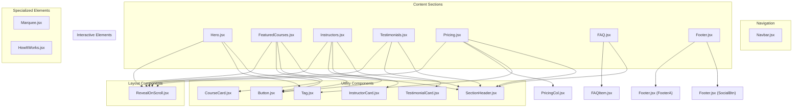
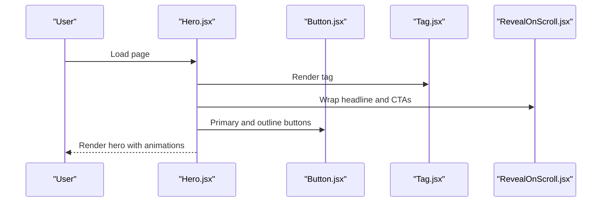
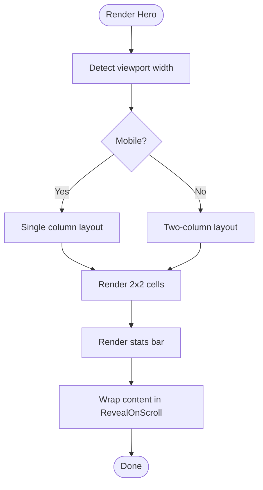
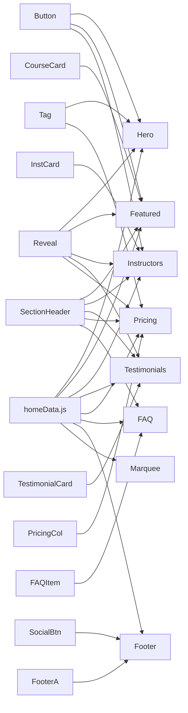

# Component Library

<cite>
**Referenced Files in This Document**
- [Hero.jsx](file://src/pages/Home/Hero.jsx)
- [FeaturedCourses.jsx](file://src/pages/Home/FeaturedCourses.jsx)
- [Instructors.jsx](file://src/pages/Home/Instructors.jsx)
- [Testimonials.jsx](file://src/pages/Home/Testimonials.jsx)
- [Pricing.jsx](file://src/pages/Home/Pricing.jsx)
- [FAQ.jsx](file://src/pages/Home/FAQ.jsx)
- [Footer.jsx](file://src/pages/Home/Footer.jsx)
- [Button.jsx](file://src/pages/Home/Button.jsx)
- [CourseCard.jsx](file://src/pages/Home/CourseCard.jsx)
- [InstructorCard.jsx](file://src/pages/Home/InstructorCard.jsx)
- [TestimonialCard.jsx](file://src/pages/Home/TestimonialCard.jsx)
- [SectionHeader.jsx](file://src/pages/Home/SectionHeader.jsx)
- [Tag.jsx](file://src/pages/Home/Tag.jsx)
- [RevealOnScroll.jsx](file://src/pages/Home/RevealOnScroll.jsx)
- [Marquee.jsx](file://src/pages/Home/Marquee.jsx)
- [Navbar.jsx](file://src/pages/Home/Navbar.jsx)
- [FAQItem.jsx](file://src/pages/Home/FAQItem.jsx)
- [PricingCol.jsx](file://src/pages/Home/PricingCol.jsx)
- [homeData.js](file://src/pages/Home/homeData.js)
- [globals.css](file://src/pages/Home/globals.css)
- [useCursor.js](file://src/pages/Home/useCursor.js)
</cite>

## Table of Contents
1. [Introduction](#introduction)
2. [Project Structure](#project-structure)
3. [Core Components](#core-components)
4. [Architecture Overview](#architecture-overview)
5. [Detailed Component Analysis](#detailed-component-analysis)
6. [Dependency Analysis](#dependency-analysis)
7. [Performance Considerations](#performance-considerations)
8. [Troubleshooting Guide](#troubleshooting-guide)
9. [Conclusion](#conclusion)
10. [Appendices](#appendices)

## Introduction
This document describes CourseCraft’s UI component library used on the home page. It covers reusable components across navigation, content sections, interactive elements, utility components, layout helpers, and specialized elements. For each component, we specify props, usage patterns, styling customization, composition strategies, responsiveness, accessibility considerations, and performance implications. We also illustrate component hierarchy, data flow, and state management approaches.

## Project Structure
The component library lives under src/pages/Home and is composed of:
- Navigation: Navbar
- Content sections: Hero, FeaturedCourses, Instructors, Testimonials, Pricing, FAQ, Footer
- Interactive elements: Testimonials, Pricing, FAQ
- Utility components: Button, CourseCard, InstructorCard, TestimonialCard, SectionHeader, Tag
- Layout components: SectionHeader, Tag, RevealOnScroll
- Specialized elements: Marquee, HowItWorks, Footer
- Data and styles: homeData.js, globals.css, useCursor.js

**Diagram sources**
- [Hero.jsx:1-105](file://src/pages/Home/Hero.jsx#L1-L105)
- [FeaturedCourses.jsx:1-46](file://src/pages/Home/FeaturedCourses.jsx#L1-L46)
- [Instructors.jsx:1-42](file://src/pages/Home/Instructors.jsx#L1-L42)
- [Testimonials.jsx:1-42](file://src/pages/Home/Testimonials.jsx#L1-L42)
- [Pricing.jsx:1-41](file://src/pages/Home/Pricing.jsx#L1-L41)
- [FAQ.jsx:1-19](file://src/pages/Home/FAQ.jsx#L1-L19)
- [Footer.jsx:1-81](file://src/pages/Home/Footer.jsx#L1-L81)
- [Button.jsx:1-30](file://src/pages/Home/Button.jsx#L1-L30)
- [CourseCard.jsx:1-54](file://src/pages/Home/CourseCard.jsx#L1-L54)
- [InstructorCard.jsx:1-32](file://src/pages/Home/InstructorCard.jsx#L1-L32)
- [TestimonialCard.jsx:1-28](file://src/pages/Home/TestimonialCard.jsx#L1-L28)
- [SectionHeader.jsx:1-21](file://src/pages/Home/SectionHeader.jsx#L1-L21)
- [Tag.jsx:1-11](file://src/pages/Home/Tag.jsx#L1-L11)
- [RevealOnScroll.jsx:1-28](file://src/pages/Home/RevealOnScroll.jsx#L1-L28)
- [Marquee.jsx:1-19](file://src/pages/Home/Marquee.jsx#L1-L19)
- [Navbar.jsx](file://src/pages/Home/Navbar.jsx)
- [FAQItem.jsx](file://src/pages/Home/FAQItem.jsx)
- [PricingCol.jsx](file://src/pages/Home/PricingCol.jsx)
- [homeData.js](file://src/pages/Home/homeData.js)
- [globals.css](file://src/pages/Home/globals.css)
- [useCursor.js](file://src/pages/Home/useCursor.js)

**Section sources**
- [Hero.jsx:1-105](file://src/pages/Home/Hero.jsx#L1-L105)
- [FeaturedCourses.jsx:1-46](file://src/pages/Home/FeaturedCourses.jsx#L1-L46)
- [Instructors.jsx:1-42](file://src/pages/Home/Instructors.jsx#L1-L42)
- [Testimonials.jsx:1-42](file://src/pages/Home/Testimonials.jsx#L1-L42)
- [Pricing.jsx:1-41](file://src/pages/Home/Pricing.jsx#L1-L41)
- [FAQ.jsx:1-19](file://src/pages/Home/FAQ.jsx#L1-L19)
- [Footer.jsx:1-81](file://src/pages/Home/Footer.jsx#L1-L81)
- [Button.jsx:1-30](file://src/pages/Home/Button.jsx#L1-L30)
- [CourseCard.jsx:1-54](file://src/pages/Home/CourseCard.jsx#L1-L54)
- [InstructorCard.jsx:1-32](file://src/pages/Home/InstructorCard.jsx#L1-L32)
- [TestimonialCard.jsx:1-28](file://src/pages/Home/TestimonialCard.jsx#L1-L28)
- [SectionHeader.jsx:1-21](file://src/pages/Home/SectionHeader.jsx#L1-L21)
- [Tag.jsx:1-11](file://src/pages/Home/Tag.jsx#L1-L11)
- [RevealOnScroll.jsx:1-28](file://src/pages/Home/RevealOnScroll.jsx#L1-L28)
- [Marquee.jsx:1-19](file://src/pages/Home/Marquee.jsx#L1-L19)
- [Navbar.jsx](file://src/pages/Home/Navbar.jsx)
- [FAQItem.jsx](file://src/pages/Home/FAQItem.jsx)
- [PricingCol.jsx](file://src/pages/Home/PricingCol.jsx)
- [homeData.js](file://src/pages/Home/homeData.js)
- [globals.css](file://src/pages/Home/globals.css)
- [useCursor.js](file://src/pages/Home/useCursor.js)

## Core Components
This section summarizes the primary components and their roles.

- Navbar: Provides top-level navigation.
- Hero: Hero unit with split layout, dynamic grid, and animated stats.
- FeaturedCourses: Grid of course cards with responsive columns and staggered reveals.
- Instructors: Grid of instructor cards with responsive columns and borders.
- Testimonials: Grid of testimonials with responsive columns and staggered reveals.
- Pricing: Three-column pricing plans with responsive stacking and staggered reveals.
- FAQ: List of FAQ items with a section header.
- Footer: Multi-column footer with brand, links, and social buttons.
- Button: Variantable button supporting anchor/button semantics.
- CourseCard: Course thumbnail, metadata, rating, pricing, and CTA.
- InstructorCard: Instructor image overlay with name, field, stats.
- TestimonialCard: Avatar, identity, star rating, and quote.
- SectionHeader: Tag, title, and optional right slot.
- Tag: Inline bracketed label.
- RevealOnScroll: Scroll-triggered fade-in with delays.
- Marquee: Infinite horizontal scrolling topics strip.

**Section sources**
- [Navbar.jsx](file://src/pages/Home/Navbar.jsx)
- [Hero.jsx:10-89](file://src/pages/Home/Hero.jsx#L10-L89)
- [FeaturedCourses.jsx:9-44](file://src/pages/Home/FeaturedCourses.jsx#L9-L44)
- [Instructors.jsx:9-41](file://src/pages/Home/Instructors.jsx#L9-L41)
- [Testimonials.jsx:8-41](file://src/pages/Home/Testimonials.jsx#L8-L41)
- [Pricing.jsx:9-40](file://src/pages/Home/Pricing.jsx#L9-L40)
- [FAQ.jsx:6-18](file://src/pages/Home/FAQ.jsx#L6-L18)
- [Footer.jsx:5-51](file://src/pages/Home/Footer.jsx#L5-L51)
- [Button.jsx:20-29](file://src/pages/Home/Button.jsx#L20-L29)
- [CourseCard.jsx:3-43](file://src/pages/Home/CourseCard.jsx#L3-L43)
- [InstructorCard.jsx:6-30](file://src/pages/Home/InstructorCard.jsx#L6-L30)
- [TestimonialCard.jsx:4-26](file://src/pages/Home/TestimonialCard.jsx#L4-L26)
- [SectionHeader.jsx:7-19](file://src/pages/Home/SectionHeader.jsx#L7-L19)
- [Tag.jsx:4-10](file://src/pages/Home/Tag.jsx#L4-L10)
- [RevealOnScroll.jsx:7-26](file://src/pages/Home/RevealOnScroll.jsx#L7-L26)
- [Marquee.jsx:4-18](file://src/pages/Home/Marquee.jsx#L4-L18)

## Architecture Overview
The component ecosystem follows a composition-first pattern:
- Data-driven components consume arrays and objects from homeData.js.
- Utility components (Button, Tag, SectionHeader) are reused across sections.
- Layout helpers (RevealOnScroll) manage cross-cutting UX behavior.
- Responsive behavior is centralized via window resize handlers in several sections.

**Diagram sources**
- [Hero.jsx:10-89](file://src/pages/Home/Hero.jsx#L10-L89)
- [Button.jsx:20-29](file://src/pages/Home/Button.jsx#L20-L29)
- [Tag.jsx:4-10](file://src/pages/Home/Tag.jsx#L4-L10)
- [RevealOnScroll.jsx:7-26](file://src/pages/Home/RevealOnScroll.jsx#L7-L26)

## Detailed Component Analysis

### Navigation: Navbar
- Purpose: Top navigation bar.
- Props: None (configuration via external assets/data).
- Usage: Place at the top of pages.
- Styling: Controlled by global CSS; integrates with theme tokens.
- Accessibility: Ensure focus outlines and keyboard navigation if extended.
- Performance: Stateless; minimal render cost.

**Section sources**
- [Navbar.jsx](file://src/pages/Home/Navbar.jsx)

### Content Sections

#### Hero
- Purpose: Hero unit with split layout (left content, right grid).
- Props: None.
- Behavior:
  - Detects viewport width to switch between single-column (mobile) and two-column (desktop) layouts.
  - Renders a 2x2 course cell grid and a stats bar.
  - Uses RevealOnScroll for staggered entrance.
- Styling:
  - Uses CSS variables for theme colors.
  - Responsive grid and typography scales.
- Accessibility:
  - Images have alt text.
  - Semantic headings and landmarks.
- Performance:
  - Resize listener attached once; cleanup on unmount.
  - Minimal reflows due to CSS Grid and transforms.

**Diagram sources**
- [Hero.jsx:10-89](file://src/pages/Home/Hero.jsx#L10-L89)

**Section sources**
- [Hero.jsx:10-89](file://src/pages/Home/Hero.jsx#L10-L89)

#### FeaturedCourses
- Purpose: Showcase featured courses in a responsive grid.
- Props: None.
- Behavior:
  - Computes columns based on viewport width.
  - Renders SectionHeader and a grid of CourseCard.
  - Applies staggered RevealOnScroll delays.
- Styling:
  - Dynamic grid-template-columns; responsive borders between items.
- Accessibility:
  - Cards are article elements with proper headings.
- Performance:
  - Efficient grid rendering; minimal state.

**Section sources**
- [FeaturedCourses.jsx:9-44](file://src/pages/Home/FeaturedCourses.jsx#L9-L44)
- [SectionHeader.jsx:7-19](file://src/pages/Home/SectionHeader.jsx#L7-L19)
- [CourseCard.jsx:3-43](file://src/pages/Home/CourseCard.jsx#L3-L43)
- [RevealOnScroll.jsx:7-26](file://src/pages/Home/RevealOnScroll.jsx#L7-L26)

#### Instructors
- Purpose: Display instructor profiles in a responsive grid.
- Props: None.
- Behavior:
  - Computes columns (4→2→1) based on viewport width.
  - Renders SectionHeader and a grid of InstructorCard.
  - Applies staggered RevealOnScroll delays.
- Styling:
  - Dynamic grid and responsive borders.
- Accessibility:
  - Images have alt text; semantic headings.
- Performance:
  - Lightweight grid with minimal DOM updates.

**Section sources**
- [Instructors.jsx:9-41](file://src/pages/Home/Instructors.jsx#L9-L41)
- [SectionHeader.jsx:7-19](file://src/pages/Home/SectionHeader.jsx#L7-L19)
- [InstructorCard.jsx:6-30](file://src/pages/Home/InstructorCard.jsx#L6-L30)
- [RevealOnScroll.jsx:7-26](file://src/pages/Home/RevealOnScroll.jsx#L7-L26)

#### Testimonials
- Purpose: Display student testimonials in a responsive grid.
- Props: None.
- Behavior:
  - Computes columns (3→2→1) based on viewport width.
  - Renders SectionHeader and a grid of TestimonialCard.
  - Applies staggered RevealOnScroll delays.
- Styling:
  - Dynamic grid and responsive borders.
- Accessibility:
  - Proper alt text and readable typography.
- Performance:
  - Efficient slicing and rendering.

**Section sources**
- [Testimonials.jsx:8-41](file://src/pages/Home/Testimonials.jsx#L8-L41)
- [SectionHeader.jsx:7-19](file://src/pages/Home/SectionHeader.jsx#L7-L19)
- [TestimonialCard.jsx:4-26](file://src/pages/Home/TestimonialCard.jsx#L4-L26)
- [RevealOnScroll.jsx:7-26](file://src/pages/Home/RevealOnScroll.jsx#L7-L26)

#### Pricing
- Purpose: Present pricing plans in a responsive grid.
- Props: None.
- Behavior:
  - Computes columns (3→1) based on viewport width.
  - Renders SectionHeader, Tag, and a grid of PricingCol.
  - Applies staggered RevealOnScroll delays.
- Styling:
  - Dynamic grid and responsive borders.
- Accessibility:
  - Clear headings and CTAs.
- Performance:
  - Stateless grid rendering.

**Section sources**
- [Pricing.jsx:9-40](file://src/pages/Home/Pricing.jsx#L9-L40)
- [SectionHeader.jsx:7-19](file://src/pages/Home/SectionHeader.jsx#L7-L19)
- [Tag.jsx:4-10](file://src/pages/Home/Tag.jsx#L4-L10)
- [PricingCol.jsx](file://src/pages/Home/PricingCol.jsx)
- [RevealOnScroll.jsx:7-26](file://src/pages/Home/RevealOnScroll.jsx#L7-L26)

#### FAQ
- Purpose: Display frequently asked questions.
- Props: None.
- Behavior:
  - Renders SectionHeader and a list of FAQItem.
- Styling:
  - Simple vertical rhythm with borders.
- Accessibility:
  - Expand/collapse semantics recommended if extended.
- Performance:
  - Stateless list rendering.

**Section sources**
- [FAQ.jsx:6-18](file://src/pages/Home/FAQ.jsx#L6-L18)
- [SectionHeader.jsx:7-19](file://src/pages/Home/SectionHeader.jsx#L7-L19)
- [FAQItem.jsx](file://src/pages/Home/FAQItem.jsx)

#### Footer
- Purpose: Site footer with branding, links, and social.
- Props: None.
- Behavior:
  - Computes columns (4→2→1) based on viewport width.
  - Renders brand, link columns, and social buttons.
  - Includes helper components SocialBtn and FooterA for hover states.
- Styling:
  - Responsive grid template columns and gaps.
- Accessibility:
  - Links have meaningful labels.
- Performance:
  - Stateless rendering with minimal state.

**Section sources**
- [Footer.jsx:5-51](file://src/pages/Home/Footer.jsx#L5-L51)

### Interactive Elements

#### Testimonials (interactive container)
- Purpose: Container component orchestrating responsive grid and reveals.
- Props: None.
- Behavior: Same as Testimonials.jsx.

**Section sources**
- [Testimonials.jsx:8-41](file://src/pages/Home/Testimonials.jsx#L8-L41)

#### Pricing (interactive container)
- Purpose: Container component orchestrating responsive grid and reveals.
- Props: None.
- Behavior: Same as Pricing.jsx.

**Section sources**
- [Pricing.jsx:9-40](file://src/pages/Home/Pricing.jsx#L9-L40)

#### FAQ (interactive container)
- Purpose: Container component orchestrating list rendering.
- Props: None.
- Behavior: Same as FAQ.jsx.

**Section sources**
- [FAQ.jsx:6-18](file://src/pages/Home/FAQ.jsx#L6-L18)

### Utility Components

#### Button
- Purpose: Unified button with variants and hover states.
- Props:
  - children: ReactNode
  - variant: "primary" | "outline" | "outline-light" (default: "primary")
  - href: string (optional)
  - onClick: func (optional)
  - className: string (optional)
  - style: object (optional)
- Behavior:
  - Switches tag to anchor when href is provided.
  - Manages hover state for variant transitions.
- Styling:
  - Base class plus variant-specific idle/hover classes.
  - Padding and typography controlled via inline styles.
- Accessibility:
  - Anchor vs button semantics preserved.
  - Focus visibility depends on global CSS.
- Performance:
  - Stateless with memoizable props.

**Section sources**
- [Button.jsx:20-29](file://src/pages/Home/Button.jsx#L20-L29)

#### CourseCard
- Purpose: Course card with thumbnail, metadata, rating, pricing, and CTA.
- Props:
  - course: object with keys: thumb, badge, badgeHot, rating, reviews, title, instructor, price, originalPrice, href
- Behavior:
  - Hover effects on thumbnail and small button.
- Styling:
  - Aspect ratio thumbnails, gradient overlays, and typography scaling.
- Accessibility:
  - Alt text for images; semantic headings.
- Performance:
  - Stateless rendering.

**Section sources**
- [CourseCard.jsx:3-43](file://src/pages/Home/CourseCard.jsx#L3-L43)

#### InstructorCard
- Purpose: Instructor profile card with image and overlay.
- Props:
  - instructor: object with keys: photo, name, field, courses, rating
- Behavior:
  - Hover effect on image grayscale.
- Styling:
  - Aspect ratio image and gradient overlay.
- Accessibility:
  - Alt text for images.
- Performance:
  - Stateless rendering.

**Section sources**
- [InstructorCard.jsx:6-30](file://src/pages/Home/InstructorCard.jsx#L6-L30)

#### TestimonialCard
- Purpose: Student testimonial with avatar, identity, stars, and quote.
- Props:
  - testimonial: object with keys: avatar, name, role, quote
- Behavior:
  - Static card with no interactivity.
- Styling:
  - Avatar sizing and quote typography.
- Accessibility:
  - Alt text for avatar.
- Performance:
  - Stateless rendering.

**Section sources**
- [TestimonialCard.jsx:4-26](file://src/pages/Home/TestimonialCard.jsx#L4-L26)

#### SectionHeader
- Purpose: Section heading with tag and optional right slot.
- Props:
  - tag: string (optional)
  - title: string (supports HTML)
  - right: ReactNode (optional)
- Behavior:
  - Renders tag via Tag and innerHTML for title.
- Styling:
  - Responsive typography and spacing.
- Accessibility:
  - Heading semantics via parent section.
- Performance:
  - Stateless rendering.

**Section sources**
- [SectionHeader.jsx:7-19](file://src/pages/Home/SectionHeader.jsx#L7-L19)
- [Tag.jsx:4-10](file://src/pages/Home/Tag.jsx#L4-L10)

#### Tag
- Purpose: Inline bracketed label.
- Props:
  - children: ReactNode
  - className: string (optional)
- Behavior:
  - Static label.
- Styling:
  - Compact typography and spacing.
- Accessibility:
  - No interactive semantics.
- Performance:
  - Stateless rendering.

**Section sources**
- [Tag.jsx:4-10](file://src/pages/Home/Tag.jsx#L4-L10)

### Layout Components

#### RevealOnScroll
- Purpose: Scroll-triggered fade-up reveal with optional delay.
- Props:
  - children: ReactNode
  - delay: number (optional)
  - instant: boolean (optional)
  - className: string (optional)
- Behavior:
  - Uses IntersectionObserver to add visibility class when in viewport.
  - Supports instant mode for above-the-fold content.
- Styling:
  - Expects CSS classes (e.g., is-visible, reveal, reveal--delay-N).
- Accessibility:
  - No assistive tech impact; improves perceived performance.
- Performance:
  - Single observer per element; disconnects on unmount.

**Section sources**
- [RevealOnScroll.jsx:7-26](file://src/pages/Home/RevealOnScroll.jsx#L7-L26)

### Specialized Elements

#### Marquee
- Purpose: Infinite horizontal scrolling topics strip.
- Props: None.
- Behavior:
  - Doubles items to create seamless loop.
- Styling:
  - Horizontal scrolling container and nowrap items.
- Accessibility:
  - Avoid auto-advancing content; ensure reduced motion compatibility.
- Performance:
  - Stateless rendering; smoothness depends on CSS animation.

**Section sources**
- [Marquee.jsx:4-18](file://src/pages/Home/Marquee.jsx#L4-L18)

#### HowItWorks
- Purpose: Describes steps in a process.
- Props: None.
- Behavior: Placeholder component; integrate with data from homeData.js.
- Styling: Follows existing section and typography patterns.
- Accessibility: Ensure heading hierarchy and keyboard navigation if interactive.
- Performance: Stateless rendering.

**Section sources**
- [HowItWorks.jsx](file://src/pages/Home/HowItWorks.jsx)

#### Footer
- Purpose: Multi-column footer with branding, links, and social.
- Props: None.
- Behavior:
  - Computes columns based on viewport width.
  - Renders brand, link columns, and social buttons.
- Styling:
  - Responsive grid template columns and gaps.
- Accessibility:
  - Links have meaningful labels.
- Performance:
  - Stateless rendering.

**Section sources**
- [Footer.jsx:5-51](file://src/pages/Home/Footer.jsx#L5-L51)

## Dependency Analysis
- Data dependencies:
  - homeData.js supplies arrays and objects consumed by Hero, FeaturedCourses, Instructors, Testimonials, Pricing, FAQ, Footer, Marquee, and related items.
- Component dependencies:
  - Hero depends on Button, Tag, RevealOnScroll.
  - FeaturedCourses depends on SectionHeader, Button, CourseCard, RevealOnScroll.
  - Instructors depends on SectionHeader, Button, InstructorCard, RevealOnScroll.
  - Testimonials depends on SectionHeader, TestimonialCard, RevealOnScroll.
  - Pricing depends on SectionHeader, Tag, PricingCol, RevealOnScroll.
  - FAQ depends on SectionHeader and FAQItem.
  - Footer composes SocialBtn and FooterA internally.
- Styling dependencies:
  - globals.css defines color tokens and reveal animations used across components.
- Cursor integration:
  - useCursor.js provides cursor behavior; integrate via Navbar or global hooks.

**Diagram sources**
- [homeData.js](file://src/pages/Home/homeData.js)
- [Hero.jsx:5-7](file://src/pages/Home/Hero.jsx#L5-L7)
- [FeaturedCourses.jsx:3-5](file://src/pages/Home/FeaturedCourses.jsx#L3-L5)
- [Instructors.jsx:3-5](file://src/pages/Home/Instructors.jsx#L3-L5)
- [Testimonials.jsx:3-5](file://src/pages/Home/Testimonials.jsx#L3-L5)
- [Pricing.jsx:4-6](file://src/pages/Home/Pricing.jsx#L4-L6)
- [FAQ.jsx](file://src/pages/Home/FAQ.jsx#L4)
- [Footer.jsx](file://src/pages/Home/Footer.jsx#L3)
- [Marquee.jsx](file://src/pages/Home/Marquee.jsx#L2)
- [Button.jsx:20-29](file://src/pages/Home/Button.jsx#L20-L29)
- [Tag.jsx:4-10](file://src/pages/Home/Tag.jsx#L4-L10)
- [RevealOnScroll.jsx:7-26](file://src/pages/Home/RevealOnScroll.jsx#L7-L26)
- [SectionHeader.jsx:7-19](file://src/pages/Home/SectionHeader.jsx#L7-L19)
- [CourseCard.jsx:3-43](file://src/pages/Home/CourseCard.jsx#L3-L43)
- [InstructorCard.jsx:6-30](file://src/pages/Home/InstructorCard.jsx#L6-L30)
- [TestimonialCard.jsx:4-26](file://src/pages/Home/TestimonialCard.jsx#L4-L26)
- [PricingCol.jsx](file://src/pages/Home/PricingCol.jsx)
- [FAQItem.jsx](file://src/pages/Home/FAQItem.jsx)
- [Footer.jsx:54-80](file://src/pages/Home/Footer.jsx#L54-L80)

**Section sources**
- [homeData.js](file://src/pages/Home/homeData.js)
- [Hero.jsx:5-7](file://src/pages/Home/Hero.jsx#L5-L7)
- [FeaturedCourses.jsx:3-5](file://src/pages/Home/FeaturedCourses.jsx#L3-L5)
- [Instructors.jsx:3-5](file://src/pages/Home/Instructors.jsx#L3-L5)
- [Testimonials.jsx:3-5](file://src/pages/Home/Testimonials.jsx#L3-L5)
- [Pricing.jsx:4-6](file://src/pages/Home/Pricing.jsx#L4-L6)
- [FAQ.jsx](file://src/pages/Home/FAQ.jsx#L4)
- [Footer.jsx](file://src/pages/Home/Footer.jsx#L3)
- [Marquee.jsx](file://src/pages/Home/Marquee.jsx#L2)
- [Button.jsx:20-29](file://src/pages/Home/Button.jsx#L20-L29)
- [Tag.jsx:4-10](file://src/pages/Home/Tag.jsx#L4-L10)
- [RevealOnScroll.jsx:7-26](file://src/pages/Home/RevealOnScroll.jsx#L7-L26)
- [SectionHeader.jsx:7-19](file://src/pages/Home/SectionHeader.jsx#L7-L19)
- [CourseCard.jsx:3-43](file://src/pages/Home/CourseCard.jsx#L3-L43)
- [InstructorCard.jsx:6-30](file://src/pages/Home/InstructorCard.jsx#L6-L30)
- [TestimonialCard.jsx:4-26](file://src/pages/Home/TestimonialCard.jsx#L4-L26)
- [PricingCol.jsx](file://src/pages/Home/PricingCol.jsx)
- [FAQItem.jsx](file://src/pages/Home/FAQItem.jsx)
- [Footer.jsx:54-80](file://src/pages/Home/Footer.jsx#L54-L80)

## Performance Considerations
- Rendering costs:
  - Stateless components minimize re-renders.
  - RevealOnScroll uses IntersectionObserver to avoid layout thrashing.
- Responsiveness:
  - Several components compute columns via resize listeners; ensure throttling if extending to heavy computations.
- Image handling:
  - CourseCard and InstructorCard use aspect ratios and lazy loading patterns; ensure server-side optimization.
- CSS variables:
  - Theme tokens reduce cascade and improve maintainability.
- Accessibility:
  - Prefer native semantics (button/a) and ensure focus management.
- Cursor integration:
  - useCursor.js can be integrated globally to avoid per-component overhead.

[No sources needed since this section provides general guidance]

## Troubleshooting Guide
- Reveal animations not triggering:
  - Verify IntersectionObserver support and CSS classes (e.g., is-visible, reveal).
- Buttons not responding:
  - Ensure variant prop is valid and that href is provided for anchor semantics.
- Grid layout issues:
  - Confirm CSS grid templates and responsive breakpoints match viewport checks.
- Footer layout anomalies:
  - Check computed grid template columns and gap values.
- Marquee not looping:
  - Ensure doubled array and track width calculations.

**Section sources**
- [RevealOnScroll.jsx:7-26](file://src/pages/Home/RevealOnScroll.jsx#L7-L26)
- [Button.jsx:20-29](file://src/pages/Home/Button.jsx#L20-L29)
- [Footer.jsx:12-19](file://src/pages/Home/Footer.jsx#L12-L19)

## Conclusion
CourseCraft’s component library emphasizes composability, responsiveness, and performance. Utility components encapsulate shared behaviors, while layout helpers standardize cross-cutting UX patterns. Data-driven sections enable easy content updates. Extending the library follows established patterns: define props, compose utility components, and adhere to responsive and accessibility guidelines.

[No sources needed since this section summarizes without analyzing specific files]

## Appendices

### Prop Reference Summary
- Button
  - variant: "primary" | "outline" | "outline-light"
  - href: string
  - onClick: func
  - className: string
  - style: object
- CourseCard
  - course: { thumb, badge, badgeHot, rating, reviews, title, instructor, price, originalPrice, href }
- InstructorCard
  - instructor: { photo, name, field, courses, rating }
- TestimonialCard
  - testimonial: { avatar, name, role, quote }
- SectionHeader
  - tag: string
  - title: string (HTML supported)
  - right: ReactNode
- Tag
  - children: ReactNode
  - className: string
- RevealOnScroll
  - delay: number
  - instant: boolean
  - className: string
- Footer
  - Internal helpers SocialBtn and FooterA accept href and children

**Section sources**
- [Button.jsx:20-29](file://src/pages/Home/Button.jsx#L20-L29)
- [CourseCard.jsx:3-43](file://src/pages/Home/CourseCard.jsx#L3-L43)
- [InstructorCard.jsx:6-30](file://src/pages/Home/InstructorCard.jsx#L6-L30)
- [TestimonialCard.jsx:4-26](file://src/pages/Home/TestimonialCard.jsx#L4-L26)
- [SectionHeader.jsx:7-19](file://src/pages/Home/SectionHeader.jsx#L7-L19)
- [Tag.jsx:4-10](file://src/pages/Home/Tag.jsx#L4-L10)
- [RevealOnScroll.jsx:7-26](file://src/pages/Home/RevealOnScroll.jsx#L7-L26)
- [Footer.jsx:54-80](file://src/pages/Home/Footer.jsx#L54-L80)