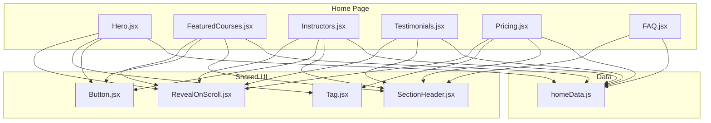
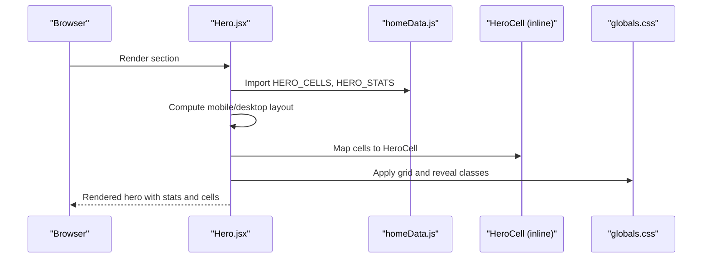
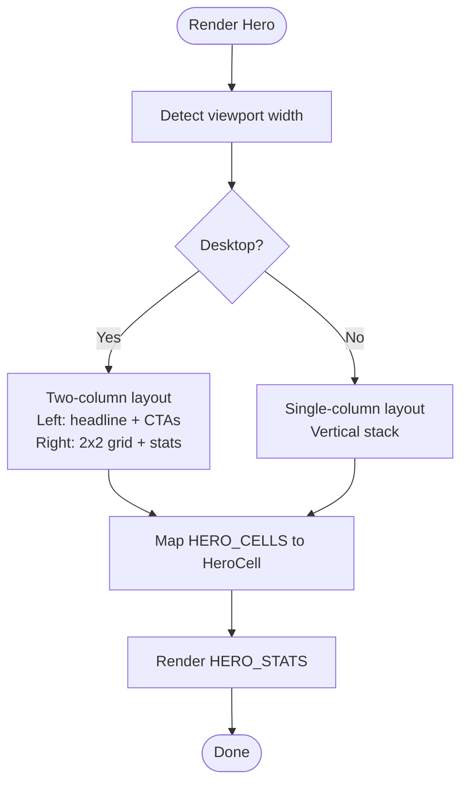
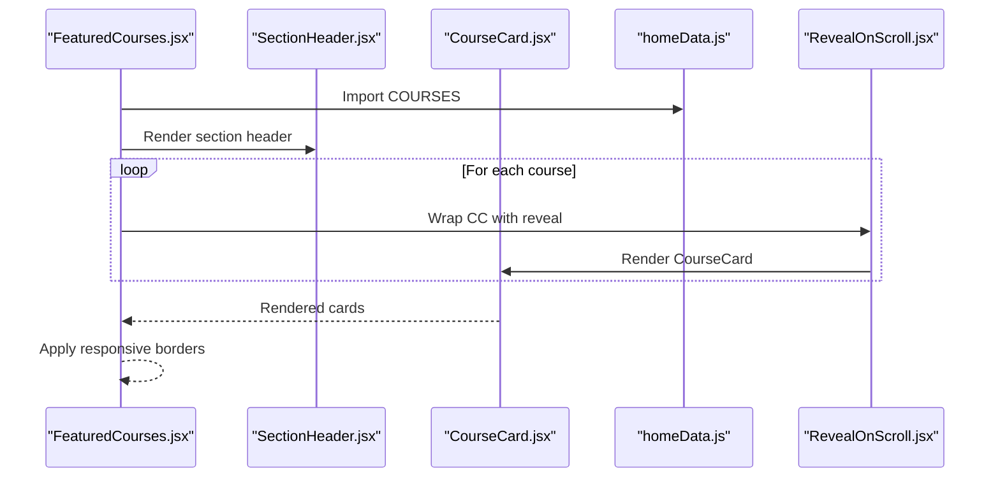
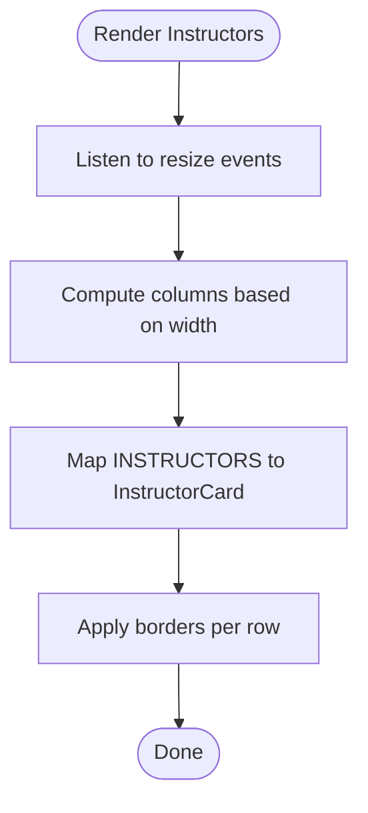
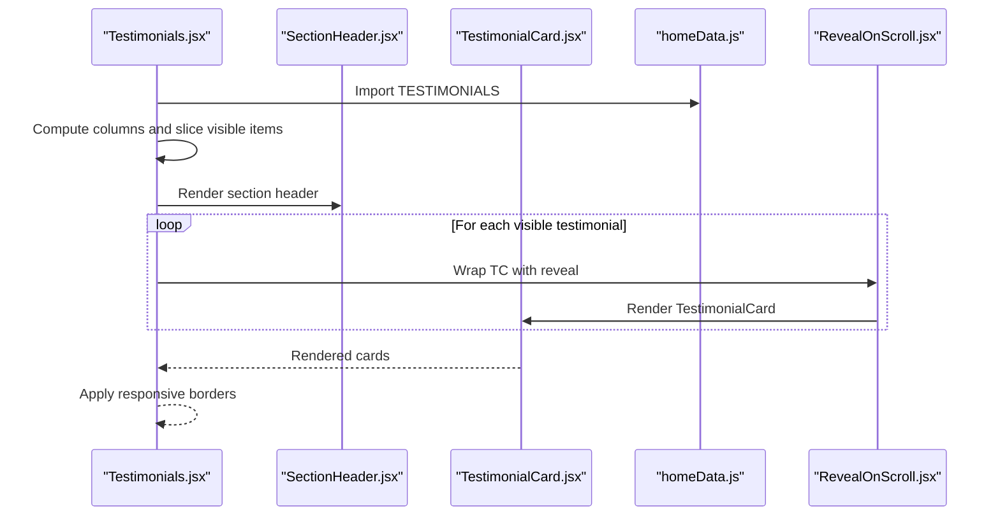
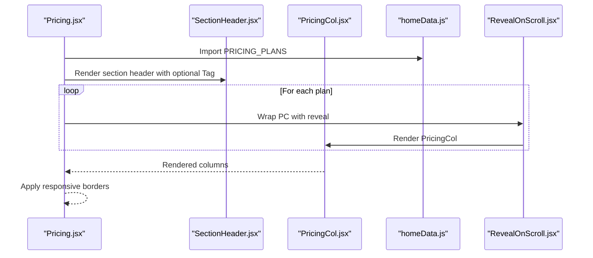
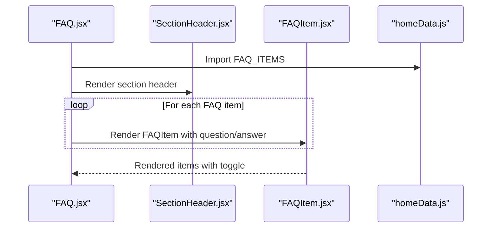
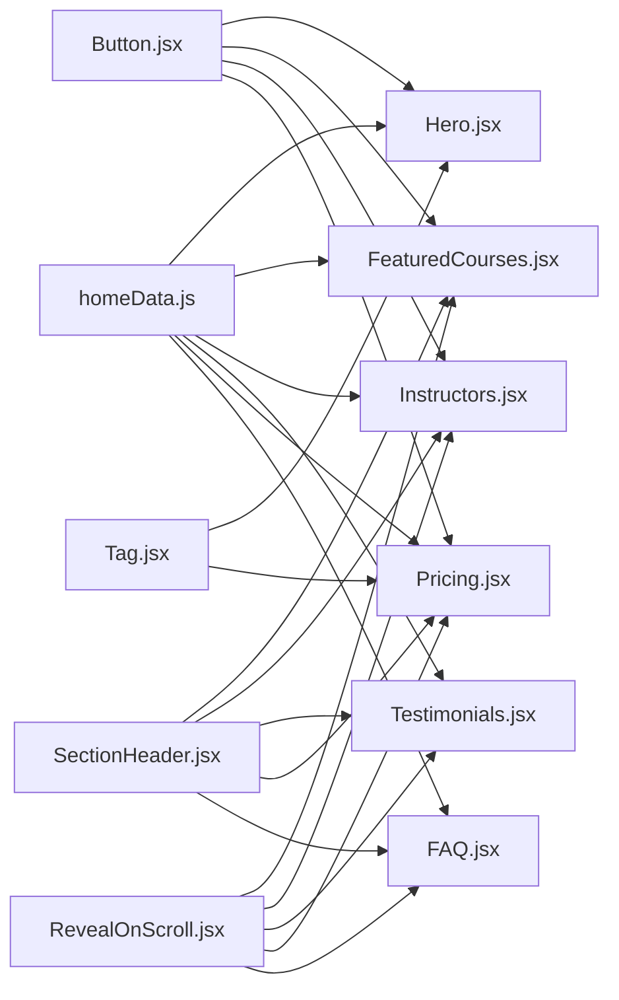

# Content Sections

<cite>
**Referenced Files in This Document**
- [Hero.jsx](file://src/pages/Home/Hero.jsx)
- [FeaturedCourses.jsx](file://src/pages/Home/FeaturedCourses.jsx)
- [Instructors.jsx](file://src/pages/Home/Instructors.jsx)
- [Testimonials.jsx](file://src/pages/Home/Testimonials.jsx)
- [Pricing.jsx](file://src/pages/Home/Pricing.jsx)
- [FAQ.jsx](file://src/pages/Home/FAQ.jsx)
- [homeData.js](file://src/pages/Home/homeData.js)
- [CourseCard.jsx](file://src/pages/Home/CourseCard.jsx)
- [InstructorCard.jsx](file://src/pages/Home/InstructorCard.jsx)
- [TestimonialCard.jsx](file://src/pages/Home/TestimonialCard.jsx)
- [PricingCol.jsx](file://src/pages/Home/PricingCol.jsx)
- [FAQItem.jsx](file://src/pages/Home/FAQItem.jsx)
- [SectionHeader.jsx](file://src/pages/Home/SectionHeader.jsx)
- [Tag.jsx](file://src/pages/Home/Tag.jsx)
- [Button.jsx](file://src/pages/Home/Button.jsx)
- [RevealOnScroll.jsx](file://src/pages/Home/RevealOnScroll.jsx)
- [globals.css](file://src/pages/Home/globals.css)
</cite>

## Table of Contents
1. [Introduction](#introduction)
2. [Project Structure](#project-structure)
3. [Core Components](#core-components)
4. [Architecture Overview](#architecture-overview)
5. [Detailed Component Analysis](#detailed-component-analysis)
6. [Dependency Analysis](#dependency-analysis)
7. [Performance Considerations](#performance-considerations)
8. [Troubleshooting Guide](#troubleshooting-guide)
9. [Conclusion](#conclusion)
10. [Appendices](#appendices)

## Introduction
This document provides comprehensive documentation for CourseCraft’s major content sections on the homepage. It covers the Hero section (course showcase and statistics), Featured Courses catalog, Instructors profiles, Student Testimonials, Pricing plans, and FAQ accordion. For each section, you will find data requirements, layout patterns, responsive behavior, integration with the overall page structure, customization examples, guidance for adding new sections, dynamic content loading strategies, and performance tips across screen sizes.

## Project Structure
The homepage is composed of modular React components under the Home page folder. Each content section is a standalone component that imports shared UI primitives (buttons, tags, section headers) and consumes centralized content from a single data module. Styles are defined via a global stylesheet with Tailwind-based theme tokens and custom animations.

**Diagram sources**
- [Hero.jsx](file://src/pages/Home/Hero.jsx)
- [FeaturedCourses.jsx](file://src/pages/Home/FeaturedCourses.jsx)
- [Instructors.jsx](file://src/pages/Home/Instructors.jsx)
- [Testimonials.jsx](file://src/pages/Home/Testimonials.jsx)
- [Pricing.jsx](file://src/pages/Home/Pricing.jsx)
- [FAQ.jsx](file://src/pages/Home/FAQ.jsx)
- [homeData.js](file://src/pages/Home/homeData.js)
- [SectionHeader.jsx](file://src/pages/Home/SectionHeader.jsx)
- [Button.jsx](file://src/pages/Home/Button.jsx)
- [Tag.jsx](file://src/pages/Home/Tag.jsx)
- [RevealOnScroll.jsx](file://src/pages/Home/RevealOnScroll.jsx)

**Section sources**
- [Hero.jsx](file://src/pages/Home/Hero.jsx)
- [FeaturedCourses.jsx](file://src/pages/Home/FeaturedCourses.jsx)
- [Instructors.jsx](file://src/pages/Home/Instructors.jsx)
- [Testimonials.jsx](file://src/pages/Home/Testimonials.jsx)
- [Pricing.jsx](file://src/pages/Home/Pricing.jsx)
- [FAQ.jsx](file://src/pages/Home/FAQ.jsx)
- [homeData.js](file://src/pages/Home/homeData.js)
- [globals.css](file://src/pages/Home/globals.css)

## Core Components
- Hero: Splits the viewport into two halves on desktop; stacks vertically on mobile. Left side contains headline, tag, and CTA buttons; right side displays a 2x2 course cell grid and a stats bar.
- FeaturedCourses: Grid of course cards with staggered reveal on scroll. Responsive column count adapts to viewport width.
- Instructors: Grid of instructor cards with responsive column counts and borders that adapt per row.
- Testimonials: Grid of testimonial cards with responsive columns and sliced content based on viewport.
- Pricing: Three-column pricing plan comparison with a highlighted featured plan and feature lists.
- FAQ: Accordion-style questions with animated open/close behavior.

**Section sources**
- [Hero.jsx](file://src/pages/Home/Hero.jsx)
- [FeaturedCourses.jsx](file://src/pages/Home/FeaturedCourses.jsx)
- [Instructors.jsx](file://src/pages/Home/Instructors.jsx)
- [Testimonials.jsx](file://src/pages/Home/Testimonials.jsx)
- [Pricing.jsx](file://src/pages/Home/Pricing.jsx)
- [FAQ.jsx](file://src/pages/Home/FAQ.jsx)

## Architecture Overview
Each content section follows a consistent pattern:
- Centralized data sourcing from a single module.
- Shared UI primitives for typography, CTAs, and section framing.
- Responsive breakpoints handled via window resize listeners inside each component.
- Scroll-triggered animations for above-the-fold and below-the-fold content.

**Diagram sources**
- [Hero.jsx](file://src/pages/Home/Hero.jsx)
- [homeData.js](file://src/pages/Home/homeData.js)
- [globals.css](file://src/pages/Home/globals.css)

## Detailed Component Analysis

### Hero.jsx
- Purpose: Primary landing area showcasing courses and platform statistics.
- Layout:
  - Desktop: Two-column grid (left content, right media/stats).
  - Mobile: Single column stacking vertically.
- Data requirements:
  - HERO_CELLS: Array of course cell objects with id, label, title, price, image.
  - HERO_STATS: Array of stat objects with value and label.
- Responsive behavior:
  - Uses a resize listener to toggle between layouts.
  - Dynamic grid rows/columns and borders adjust per breakpoint.
- Integration:
  - Imports shared components: Button, Tag, RevealOnScroll.
  - Consumes global styles for typography and spacing.
- Customization examples:
  - Add/remove cells by editing the HERO_CELLS array.
  - Change headline and tagline by updating the JSX content.
  - Modify stats by editing HERO_STATS.
- Dynamic content loading:
  - Cells render from imported data; swapping images or labels requires updating the data file.
- Performance tips:
  - Keep image sizes optimized; HeroCell applies opacity transitions on hover.
  - Minimize heavy animations for low-power devices.

**Diagram sources**
- [Hero.jsx](file://src/pages/Home/Hero.jsx)
- [homeData.js](file://src/pages/Home/homeData.js)

**Section sources**
- [Hero.jsx](file://src/pages/Home/Hero.jsx)
- [homeData.js](file://src/pages/Home/homeData.js)
- [globals.css](file://src/pages/Home/globals.css)

### FeaturedCourses.jsx
- Purpose: Present a curated selection of courses in a responsive grid.
- Layout:
  - Desktop: Three columns.
  - Mobile: Single column.
- Data requirements:
  - COURSES: Array of course objects with thumbnail, badges, title, instructor, ratings, pricing, and link.
- Responsive behavior:
  - Column count computed via resize listener.
  - Borders adapt per row to maintain visual rhythm.
- Integration:
  - Uses SectionHeader for section framing and Button for “All Courses” CTA.
  - RevealOnScroll animates cards as they come into view.
- Customization examples:
  - Add/remove courses by editing the COURSES array.
  - Adjust header tag/title/right slot via SectionHeader props.
- Dynamic content loading:
  - Swap course thumbnails and metadata by updating homeData.js.
- Performance tips:
  - Lazy-load images if the list grows large.
  - Consider virtualizing long lists.

**Diagram sources**
- [FeaturedCourses.jsx](file://src/pages/Home/FeaturedCourses.jsx)
- [SectionHeader.jsx](file://src/pages/Home/SectionHeader.jsx)
- [CourseCard.jsx](file://src/pages/Home/CourseCard.jsx)
- [homeData.js](file://src/pages/Home/homeData.js)
- [RevealOnScroll.jsx](file://src/pages/Home/RevealOnScroll.jsx)

**Section sources**
- [FeaturedCourses.jsx](file://src/pages/Home/FeaturedCourses.jsx)
- [CourseCard.jsx](file://src/pages/Home/CourseCard.jsx)
- [homeData.js](file://src/pages/Home/homeData.js)
- [SectionHeader.jsx](file://src/pages/Home/SectionHeader.jsx)
- [RevealOnScroll.jsx](file://src/pages/Home/RevealOnScroll.jsx)

### Instructors.jsx
- Purpose: Showcase instructors with professional profiles.
- Layout:
  - Desktop: Four columns.
  - Tablet: Two columns.
  - Mobile: One column.
- Data requirements:
  - INSTRUCTORS: Array of instructor objects with photo, name, field, course count, and rating.
- Responsive behavior:
  - Column count computed via resize listener.
  - Borders adapt to avoid double borders on edges.
- Integration:
  - Uses SectionHeader and Button for navigation.
  - RevealOnScroll animates cards.
- Customization examples:
  - Add/remove instructors by editing the INSTRUCTORS array.
  - Update header tag/title/right slot via SectionHeader props.
- Dynamic content loading:
  - Swap photos and bios by updating homeData.js.
- Performance tips:
  - Use appropriately sized images for portrait aspect ratio.
  - Debounce resize handler if performance becomes an issue.

**Diagram sources**
- [Instructors.jsx](file://src/pages/Home/Instructors.jsx)
- [homeData.js](file://src/pages/Home/homeData.js)
- [InstructorCard.jsx](file://src/pages/Home/InstructorCard.jsx)

**Section sources**
- [Instructors.jsx](file://src/pages/Home/Instructors.jsx)
- [InstructorCard.jsx](file://src/pages/Home/InstructorCard.jsx)
- [homeData.js](file://src/pages/Home/homeData.js)
- [SectionHeader.jsx](file://src/pages/Home/SectionHeader.jsx)
- [RevealOnScroll.jsx](file://src/pages/Home/RevealOnScroll.jsx)

### Testimonials.jsx
- Purpose: Display student testimonials with avatars and roles.
- Layout:
  - Desktop: Three columns.
  - Tablet: Two columns.
  - Mobile: One column.
- Data requirements:
  - TESTIMONIALS: Array of testimonial objects with avatar, name, role, and quote.
- Responsive behavior:
  - Column count computed via resize listener.
  - Slices visible testimonials to limit initial load on small screens.
- Integration:
  - Uses SectionHeader for framing.
  - RevealOnScroll animates cards.
- Customization examples:
  - Add/remove testimonials by editing the TESTIMONIALS array.
  - Update header tag/title via SectionHeader props.
- Dynamic content loading:
  - Extend the array to grow the testimonial pool.
- Performance tips:
  - Limit initial testimonials on narrow screens to reduce DOM nodes.
  - Lazy-load images if testimonials increase.

**Diagram sources**
- [Testimonials.jsx](file://src/pages/Home/Testimonials.jsx)
- [SectionHeader.jsx](file://src/pages/Home/SectionHeader.jsx)
- [TestimonialCard.jsx](file://src/pages/Home/TestimonialCard.jsx)
- [homeData.js](file://src/pages/Home/homeData.js)
- [RevealOnScroll.jsx](file://src/pages/Home/RevealOnScroll.jsx)

**Section sources**
- [Testimonials.jsx](file://src/pages/Home/Testimonials.jsx)
- [TestimonialCard.jsx](file://src/pages/Home/TestimonialCard.jsx)
- [homeData.js](file://src/pages/Home/homeData.js)
- [SectionHeader.jsx](file://src/pages/Home/SectionHeader.jsx)
- [RevealOnScroll.jsx](file://src/pages/Home/RevealOnScroll.jsx)

### Pricing.jsx
- Purpose: Compare pricing plans and highlight features.
- Layout:
  - Desktop: Three equal columns.
  - Mobile: Single column.
- Data requirements:
  - PRICING_PLANS: Array of plan objects with name, price, period, features, CTA, and featured flag.
- Responsive behavior:
  - Column count computed via resize listener.
  - Borders adapt per row to maintain visual rhythm.
- Integration:
  - Uses SectionHeader, Tag, and Button for CTAs.
  - RevealOnScroll animates columns.
- Customization examples:
  - Add/remove plans or features by editing the PRICING_PLANS array.
  - Update header tag/title/right slot via SectionHeader props.
- Dynamic content loading:
  - Swap plan details by updating homeData.js.
- Performance tips:
  - Keep feature lists concise to avoid long render times.
  - Avoid heavy animations on low-end devices.

**Diagram sources**
- [Pricing.jsx](file://src/pages/Home/Pricing.jsx)
- [SectionHeader.jsx](file://src/pages/Home/SectionHeader.jsx)
- [PricingCol.jsx](file://src/pages/Home/PricingCol.jsx)
- [homeData.js](file://src/pages/Home/homeData.js)
- [RevealOnScroll.jsx](file://src/pages/Home/RevealOnScroll.jsx)

**Section sources**
- [Pricing.jsx](file://src/pages/Home/Pricing.jsx)
- [PricingCol.jsx](file://src/pages/Home/PricingCol.jsx)
- [homeData.js](file://src/pages/Home/homeData.js)
- [SectionHeader.jsx](file://src/pages/Home/SectionHeader.jsx)
- [Tag.jsx](file://src/pages/Home/Tag.jsx)
- [RevealOnScroll.jsx](file://src/pages/Home/RevealOnScroll.jsx)

### FAQ.jsx
- Purpose: Provide an accordion interface for frequently asked questions.
- Layout:
  - Single column with stacked FAQ items.
- Data requirements:
  - FAQ_ITEMS: Array of question/answer objects.
- Responsive behavior:
  - No layout changes; accordion toggles per item.
- Integration:
  - Uses SectionHeader for framing.
  - FAQItem manages open/closed state and animation.
- Customization examples:
  - Add/remove FAQs by editing the FAQ_ITEMS array.
  - Update header tag/title via SectionHeader props.
- Dynamic content loading:
  - Extend the array to add more questions.
- Performance tips:
  - Keep answers concise to minimize layout thrash.
  - Avoid excessive DOM nesting in answers.

**Diagram sources**
- [FAQ.jsx](file://src/pages/Home/FAQ.jsx)
- [SectionHeader.jsx](file://src/pages/Home/SectionHeader.jsx)
- [FAQItem.jsx](file://src/pages/Home/FAQItem.jsx)
- [homeData.js](file://src/pages/Home/homeData.js)

**Section sources**
- [FAQ.jsx](file://src/pages/Home/FAQ.jsx)
- [FAQItem.jsx](file://src/pages/Home/FAQItem.jsx)
- [homeData.js](file://src/pages/Home/homeData.js)
- [SectionHeader.jsx](file://src/pages/Home/SectionHeader.jsx)

## Dependency Analysis
- Data dependency: All sections import content arrays from homeData.js, ensuring centralized content management.
- UI primitive dependency: Shared components (SectionHeader, Button, Tag, RevealOnScroll) are reused across sections.
- Style dependency: globals.css defines theme tokens, animations, and section wrappers used by all components.

**Diagram sources**
- [homeData.js](file://src/pages/Home/homeData.js)
- [Hero.jsx](file://src/pages/Home/Hero.jsx)
- [FeaturedCourses.jsx](file://src/pages/Home/FeaturedCourses.jsx)
- [Instructors.jsx](file://src/pages/Home/Instructors.jsx)
- [Testimonials.jsx](file://src/pages/Home/Testimonials.jsx)
- [Pricing.jsx](file://src/pages/Home/Pricing.jsx)
- [FAQ.jsx](file://src/pages/Home/FAQ.jsx)
- [SectionHeader.jsx](file://src/pages/Home/SectionHeader.jsx)
- [Button.jsx](file://src/pages/Home/Button.jsx)
- [Tag.jsx](file://src/pages/Home/Tag.jsx)
- [RevealOnScroll.jsx](file://src/pages/Home/RevealOnScroll.jsx)

**Section sources**
- [homeData.js](file://src/pages/Home/homeData.js)
- [globals.css](file://src/pages/Home/globals.css)

## Performance Considerations
- Image optimization: Ensure thumbnails and instructor/testimonial avatars are appropriately sized and compressed.
- Animation budget: RevealOnScroll and hover effects are lightweight; avoid stacking heavy CSS transforms.
- Responsive rendering: Resize listeners are efficient but consider throttling if adding many listeners across sections.
- Virtualization: For very long lists (courses/instructors/testimonials), consider virtualization to reduce DOM nodes.
- CSS variables: Theme tokens and animations are defined centrally; avoid duplicating styles to keep bundles small.

[No sources needed since this section provides general guidance]

## Troubleshooting Guide
- Content not updating:
  - Verify edits are made in homeData.js and not hardcoded in components.
- Layout glitches on mobile:
  - Confirm resize listeners are firing and responsive breakpoints match expectations.
- Animations not triggering:
  - Ensure RevealOnScroll is wrapping content and the intersection observer threshold is appropriate.
- Hover effects not working:
  - Check that interactive states are enabled and CSS classes are applied.

**Section sources**
- [homeData.js](file://src/pages/Home/homeData.js)
- [RevealOnScroll.jsx](file://src/pages/Home/RevealOnScroll.jsx)
- [globals.css](file://src/pages/Home/globals.css)

## Conclusion
CourseCraft’s homepage sections are designed around a clean separation of concerns: centralized content, reusable UI primitives, and responsive layouts. By following the patterns outlined here, you can customize existing sections, add new ones, manage dynamic content, and optimize performance across devices.

[No sources needed since this section summarizes without analyzing specific files]

## Appendices

### Adding a New Section
- Create a new component under the Home page folder.
- Import shared primitives (SectionHeader, Button, Tag, RevealOnScroll) as needed.
- Define a new data array in homeData.js and export it.
- Import the data array into your component and render it with responsive layout logic.
- Integrate with the page structure by placing the component in the desired order.

**Section sources**
- [SectionHeader.jsx](file://src/pages/Home/SectionHeader.jsx)
- [Button.jsx](file://src/pages/Home/Button.jsx)
- [Tag.jsx](file://src/pages/Home/Tag.jsx)
- [RevealOnScroll.jsx](file://src/pages/Home/RevealOnScroll.jsx)
- [homeData.js](file://src/pages/Home/homeData.js)

### Implementing Dynamic Content Loading
- Use the existing data arrays in homeData.js as the single source of truth.
- For runtime changes (e.g., fetching from an API), replace the static arrays with state-managed data while keeping the same component structure.
- Maintain the same prop shapes for child components (e.g., CourseCard, InstructorCard) to minimize refactoring.

**Section sources**
- [homeData.js](file://src/pages/Home/homeData.js)
- [CourseCard.jsx](file://src/pages/Home/CourseCard.jsx)
- [InstructorCard.jsx](file://src/pages/Home/InstructorCard.jsx)