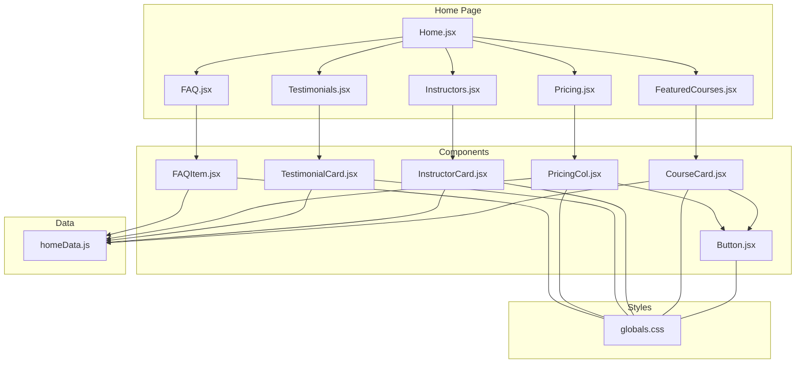
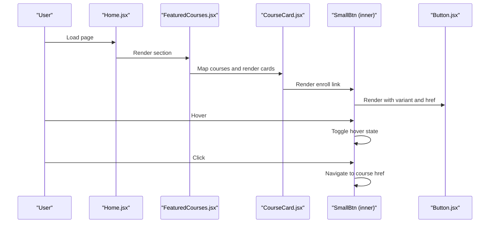
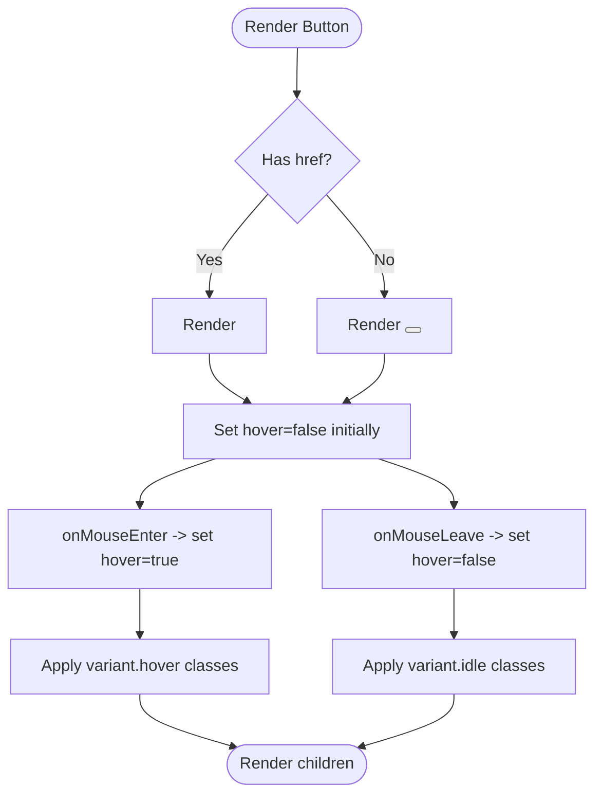
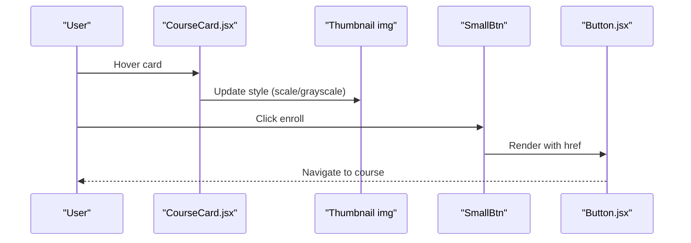
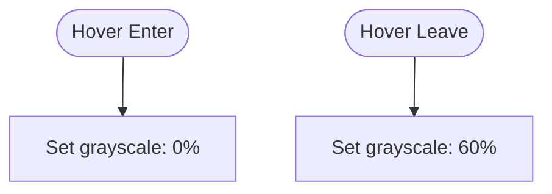
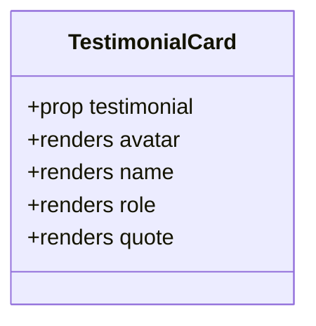
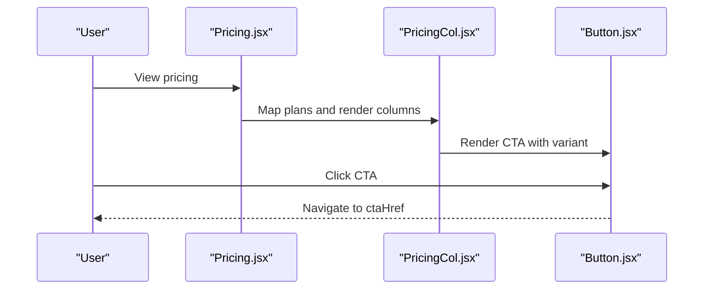
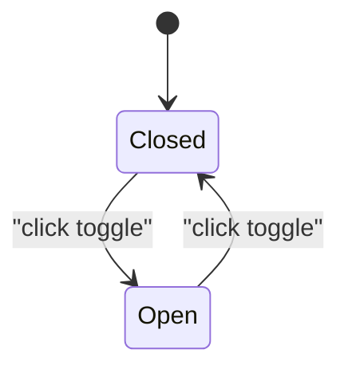
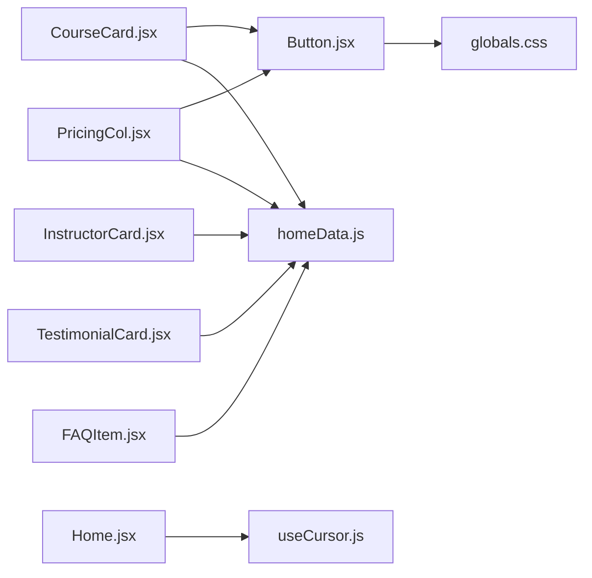

# Interactive Components

<cite>
**Referenced Files in This Document**
- [Button.jsx](file://src/pages/Home/Button.jsx)
- [CourseCard.jsx](file://src/pages/Home/CourseCard.jsx)
- [InstructorCard.jsx](file://src/pages/Home/InstructorCard.jsx)
- [TestimonialCard.jsx](file://src/pages/Home/TestimonialCard.jsx)
- [PricingCol.jsx](file://src/pages/Home/PricingCol.jsx)
- [FAQItem.jsx](file://src/pages/Home/FAQItem.jsx)
- [homeData.js](file://src/pages/Home/homeData.js)
- [globals.css](file://src/pages/Home/globals.css)
- [Home.jsx](file://src/pages/Home/Home.jsx)
- [Pricing.jsx](file://src/pages/Home/Pricing.jsx)
- [FAQ.jsx](file://src/pages/Home/FAQ.jsx)
- [FeaturedCourses.jsx](file://src/pages/Home/FeaturedCourses.jsx)
- [Instructors.jsx](file://src/pages/Home/Instructors.jsx)
- [Testimonials.jsx](file://src/pages/Home/Testimonials.jsx)
- [useCursor.js](file://src/pages/Home/useCursor.js)
</cite>

## Table of Contents
1. [Introduction](#introduction)
2. [Project Structure](#project-structure)
3. [Core Components](#core-components)
4. [Architecture Overview](#architecture-overview)
5. [Detailed Component Analysis](#detailed-component-analysis)
6. [Dependency Analysis](#dependency-analysis)
7. [Performance Considerations](#performance-considerations)
8. [Troubleshooting Guide](#troubleshooting-guide)
9. [Conclusion](#conclusion)
10. [Appendices](#appendices)

## Introduction
This document explains CourseCraft’s interactive UI components with a focus on Button.jsx and specialized cards: CourseCard.jsx, InstructorCard.jsx, TestimonialCard.jsx, PricingCol.jsx, and FAQItem.jsx. It covers component props, event handling, hover and click states, styling, accessibility, and how these components integrate into the Home page layout. Practical guidance is provided for customization, form interactions, user feedback, and maintaining consistent design patterns across interactive elements.

## Project Structure
The interactive components live under the Home page module and are composed into larger sections. They rely on shared design tokens defined in the global stylesheet and consume static content from homeData.js.

**Diagram sources**
- [Home.jsx:17-39](file://src/pages/Home/Home.jsx#L17-L39)
- [Pricing.jsx:9-40](file://src/pages/Home/Pricing.jsx#L9-L40)
- [FeaturedCourses.jsx:9-45](file://src/pages/Home/FeaturedCourses.jsx#L9-L45)
- [Instructors.jsx:9-41](file://src/pages/Home/Instructors.jsx#L9-L41)
- [Testimonials.jsx:8-41](file://src/pages/Home/Testimonials.jsx#L8-L41)
- [FAQ.jsx:6-18](file://src/pages/Home/FAQ.jsx#L6-L18)
- [Button.jsx:20-29](file://src/pages/Home/Button.jsx#L20-L29)
- [CourseCard.jsx:3-43](file://src/pages/Home/CourseCard.jsx#L3-L43)
- [InstructorCard.jsx:6-31](file://src/pages/Home/InstructorCard.jsx#L6-L31)
- [TestimonialCard.jsx:4-27](file://src/pages/Home/TestimonialCard.jsx#L4-L27)
- [PricingCol.jsx:7-44](file://src/pages/Home/PricingCol.jsx#L7-L44)
- [FAQItem.jsx:3-34](file://src/pages/Home/FAQItem.jsx#L3-L34)
- [homeData.js:56-142](file://src/pages/Home/homeData.js#L56-L142)
- [globals.css:1-146](file://src/pages/Home/globals.css#L1-L146)

**Section sources**
- [Home.jsx:17-39](file://src/pages/Home/Home.jsx#L17-L39)
- [globals.css:1-146](file://src/pages/Home/globals.css#L1-L146)

## Core Components
This section documents the interactive primitives and specialized cards, focusing on props, states, styling, and accessibility.

- Button.jsx
  - Purpose: A reusable button primitive supporting multiple variants and optional external links.
  - Props:
    - children: Node — content inside the button.
    - variant: Enum ["primary", "outline", "outline-light"] — visual style.
    - href: String | undefined — renders an anchor when present.
    - onClick: Function | undefined — click handler.
    - className: String — additional classes.
    - style: Object — inline styles merged with defaults.
  - States and Interactions:
    - Hover state toggled internally to switch idle vs hover styles.
    - Supports both button and anchor semantics via dynamic element selection.
  - Accessibility:
    - Uses a consistent monospace font and uppercase letter spacing for legibility.
    - Inherits cursor behavior from global styles.
  - Styling:
    - Base classes define typography, transitions, borders, and layout.
    - Variants map to idle and hover color combinations.
    - Padding and border widths are standardized.

- CourseCard.jsx
  - Purpose: Displays a course with thumbnail, metadata, ratings, pricing, and an enroll action.
  - Props:
    - course: Object — shape derived from homeData.COURSES.
  - Internal State:
    - Hover state controls thumbnail effects (scale and grayscale).
  - Subcomponent:
    - SmallBtn: A compact button variant used for “Enroll”.
  - Interactions:
    - Hover triggers thumbnail animation.
    - Enroll link navigates to course URL.
  - Accessibility:
    - Image alt uses course title.
    - Badge highlights hot courses distinctly.

- InstructorCard.jsx
  - Purpose: Presents an instructor’s photo, overlay, and stats.
  - Props:
    - instructor: Object — shape derived from homeData.INSTRUCTORS.
  - Interactions:
    - Hover adjusts image grayscale via filter.
  - Accessibility:
    - Image alt uses instructor name.
    - Overlay ensures readable text against image.

- TestimonialCard.jsx
  - Purpose: Displays a student review with avatar, name, role, and quote.
  - Props:
    - testimonial: Object — shape derived from homeData.TESTIMONIALS.
  - Accessibility:
    - Avatar image has alt text.
    - Quote is emphasized with typographic styling.

- PricingCol.jsx
  - Purpose: Renders a pricing plan with features and a call-to-action button.
  - Props:
    - plan: Object — shape derived from homeData.PRICING_PLANS.
  - Interactions:
    - Uses Button with variant selected based on plan prominence.
  - Styling:
    - Dark mode for featured plans via background and text color variations.
    - Feature list opacity indicates inclusion.

- FAQItem.jsx
  - Purpose: Collapsible question-answer item with animated chevron.
  - Props:
    - item: Object — shape derived from homeData.FAQ_ITEMS.
  - Internal State:
    - open: Boolean — toggles content visibility and chevron rotation.
  - Interactions:
    - Click toggles open state.
    - Animated chevron rotation indicates expanded/collapsed state.
  - Accessibility:
    - aria-expanded reflects open state.
    - aria-hidden hides collapsed content from assistive technologies.

**Section sources**
- [Button.jsx:20-29](file://src/pages/Home/Button.jsx#L20-L29)
- [CourseCard.jsx:3-43](file://src/pages/Home/CourseCard.jsx#L3-L43)
- [InstructorCard.jsx:6-31](file://src/pages/Home/InstructorCard.jsx#L6-L31)
- [TestimonialCard.jsx:4-27](file://src/pages/Home/TestimonialCard.jsx#L4-L27)
- [PricingCol.jsx:7-44](file://src/pages/Home/PricingCol.jsx#L7-L44)
- [FAQItem.jsx:3-34](file://src/pages/Home/FAQItem.jsx#L3-L34)

## Architecture Overview
The Home page composes multiple sections, each rendering a grid of specialized cards. Buttons are reused across components and sections to maintain consistent interactivity and styling.

**Diagram sources**
- [Home.jsx:17-39](file://src/pages/Home/Home.jsx#L17-L39)
- [FeaturedCourses.jsx:30-41](file://src/pages/Home/FeaturedCourses.jsx#L30-L41)
- [CourseCard.jsx:39-53](file://src/pages/Home/CourseCard.jsx#L39-L53)
- [Button.jsx:20-29](file://src/pages/Home/Button.jsx#L20-L29)

## Detailed Component Analysis

### Button.jsx
- Implementation pattern:
  - Centralized variant mapping with idle and hover states.
  - Dynamic element selection between anchor and button based on href prop.
  - Controlled hover state via useState and mouse events.
- Data structures:
  - variants: Object literal mapping variant keys to idle/hover classes.
  - base: String of shared base classes.
- Complexity:
  - Rendering cost is constant per button.
  - Event handlers are lightweight and memoized implicitly by React.
- Accessibility:
  - Inherits global typography and cursor behavior.
  - No explicit ARIA attributes; suitable for navigation and actions.
- Customization tips:
  - Extend variants by adding entries to the variants mapping.
  - Override defaults via className and style props.

**Diagram sources**
- [Button.jsx:20-29](file://src/pages/Home/Button.jsx#L20-L29)

**Section sources**
- [Button.jsx:20-29](file://src/pages/Home/Button.jsx#L20-L29)

### CourseCard.jsx
- Implementation pattern:
  - Internal hover state drives thumbnail animation (scale and grayscale).
  - SmallBtn is a compact variant of Button used for enroll actions.
- Data flow:
  - Receives course object from FeaturedCourses.jsx.
  - Uses course.thumb, title, instructor, rating, reviews, price, originalPrice, href.
- Accessibility:
  - Image alt uses course title.
  - Badge uses semantic border and color to indicate “hot” status.
- Interaction:
  - Hover toggles thumbnail scale and grayscale.
  - Enroll link navigates to course URL.

**Diagram sources**
- [CourseCard.jsx:3-43](file://src/pages/Home/CourseCard.jsx#L3-L43)
- [CourseCard.jsx:46-53](file://src/pages/Home/CourseCard.jsx#L46-L53)
- [Button.jsx:20-29](file://src/pages/Home/Button.jsx#L20-L29)

**Section sources**
- [CourseCard.jsx:3-43](file://src/pages/Home/CourseCard.jsx#L3-L43)
- [CourseCard.jsx:46-53](file://src/pages/Home/CourseCard.jsx#L46-L53)

### InstructorCard.jsx
- Implementation pattern:
  - Hover adjusts image grayscale for emphasis.
  - Overlay gradient ensures text readability.
- Data flow:
  - Receives instructor object from Instructors.jsx.
  - Uses photo, name, field, courses, rating.
- Accessibility:
  - Image alt uses instructor name.
- Interaction:
  - Hover toggles grayscale filter.

**Diagram sources**
- [InstructorCard.jsx:6-31](file://src/pages/Home/InstructorCard.jsx#L6-L31)

**Section sources**
- [InstructorCard.jsx:6-31](file://src/pages/Home/InstructorCard.jsx#L6-L31)

### TestimonialCard.jsx
- Implementation pattern:
  - Fixed layout with avatar, name, role, and quote.
  - Quote styled with typographic emphasis.
- Data flow:
  - Receives testimonial object from Testimonials.jsx.
  - Uses avatar, name, role, quote.
- Accessibility:
  - Avatar image has alt text.

**Diagram sources**
- [TestimonialCard.jsx:4-27](file://src/pages/Home/TestimonialCard.jsx#L4-L27)

**Section sources**
- [TestimonialCard.jsx:4-27](file://src/pages/Home/TestimonialCard.jsx#L4-L27)

### PricingCol.jsx
- Implementation pattern:
  - Renders plan name, price, period, and feature list.
  - Uses Button with variant chosen based on plan prominence.
- Data flow:
  - Receives plan object from Pricing.jsx.
  - Uses name, price, period, features, cta, ctaHref, featured.
- Styling:
  - Conditional dark background and text colors for featured plans.
  - Feature opacity indicates inclusion.

**Diagram sources**
- [Pricing.jsx:24-36](file://src/pages/Home/Pricing.jsx#L24-L36)
- [PricingCol.jsx:36-42](file://src/pages/Home/PricingCol.jsx#L36-L42)
- [Button.jsx:20-29](file://src/pages/Home/Button.jsx#L20-L29)

**Section sources**
- [PricingCol.jsx:7-44](file://src/pages/Home/PricingCol.jsx#L7-L44)

### FAQItem.jsx
- Implementation pattern:
  - Local state toggles open/closed.
  - Animated chevron rotation indicates state.
- Data flow:
  - Receives item object from FAQ.jsx.
  - Uses question and answer.
- Accessibility:
  - aria-expanded reflects open state.
  - aria-hidden hides collapsed content.

**Diagram sources**
- [FAQItem.jsx:3-34](file://src/pages/Home/FAQItem.jsx#L3-L34)

**Section sources**
- [FAQItem.jsx:3-34](file://src/pages/Home/FAQItem.jsx#L3-L34)

## Dependency Analysis
- Component coupling:
  - CourseCard depends on Button (via SmallBtn) and homeData.COURSES.
  - PricingCol depends on Button and homeData.PRICING_PLANS.
  - FAQItem depends on homeData.FAQ_ITEMS.
  - InstructorCard and TestimonialCard depend on homeData.INSTRUCTORS and homeData.TESTIMONIALS respectively.
- Cohesion:
  - Each component encapsulates its own interactivity and styling concerns.
- External dependencies:
  - Global design tokens from globals.css.
  - Cursor effect from useCursor.js integrated in Home.jsx.

**Diagram sources**
- [Button.jsx:20-29](file://src/pages/Home/Button.jsx#L20-L29)
- [CourseCard.jsx:3-43](file://src/pages/Home/CourseCard.jsx#L3-L43)
- [PricingCol.jsx:7-44](file://src/pages/Home/PricingCol.jsx#L7-L44)
- [InstructorCard.jsx:6-31](file://src/pages/Home/InstructorCard.jsx#L6-L31)
- [TestimonialCard.jsx:4-27](file://src/pages/Home/TestimonialCard.jsx#L4-L27)
- [FAQItem.jsx:3-34](file://src/pages/Home/FAQItem.jsx#L3-L34)
- [homeData.js:56-142](file://src/pages/Home/homeData.js#L56-L142)
- [globals.css:1-146](file://src/pages/Home/globals.css#L1-L146)
- [Home.jsx:17-39](file://src/pages/Home/Home.jsx#L17-L39)
- [useCursor.js:4-28](file://src/pages/Home/useCursor.js#L4-L28)

**Section sources**
- [globals.css:1-146](file://src/pages/Home/globals.css#L1-L146)
- [homeData.js:56-142](file://src/pages/Home/homeData.js#L56-L142)

## Performance Considerations
- Event handlers:
  - Hover state updates are minimal and fast; avoid heavy computations in mouse handlers.
- Rendering:
  - Components use simple state toggles; consider memoization for large lists if needed.
- Animations:
  - CSS transitions are hardware-accelerated; keep transforms and opacity changes for smoothness.
- Accessibility:
  - aria-expanded and aria-hidden improve screen reader experience without performance cost.
- Cursor:
  - useCursor.js attaches listeners to many nodes; ensure cleanup on unmount (already handled).

[No sources needed since this section provides general guidance]

## Troubleshooting Guide
- Button does not respond to hover:
  - Verify that the component receives a variant and that className does not override hover classes.
  - Confirm that the parent container does not block pointer events.
- Course thumbnail not animating:
  - Ensure the course object provides a valid thumb URL and that hover state toggles correctly.
- Pricing CTA not linking:
  - Check that plan.ctaHref is set and that Button receives the href prop.
- FAQ item not expanding:
  - Confirm that onClick toggles open state and that aria-expanded reflects the current state.
- Cursor not visible:
  - On small screens, the global cursor is disabled; verify media queries and ensure the cursor element is mounted.

**Section sources**
- [Button.jsx:20-29](file://src/pages/Home/Button.jsx#L20-L29)
- [CourseCard.jsx:3-43](file://src/pages/Home/CourseCard.jsx#L3-L43)
- [PricingCol.jsx:36-42](file://src/pages/Home/PricingCol.jsx#L36-L42)
- [FAQItem.jsx:3-34](file://src/pages/Home/FAQItem.jsx#L3-L34)
- [globals.css:68-72](file://src/pages/Home/globals.css#L68-L72)

## Conclusion
These interactive components form a cohesive design system for CourseCraft’s Home page. By centralizing variant definitions, leveraging shared styling tokens, and encapsulating local state, the components remain maintainable and consistent. Extending variants, adding new props, or integrating additional interactions follows established patterns.

[No sources needed since this section summarizes without analyzing specific files]

## Appendices

### Props Reference
- Button
  - variant: "primary" | "outline" | "outline-light"
  - href: string | undefined
  - onClick: function | undefined
  - className: string
  - style: object
- CourseCard
  - course: { thumb, title, instructor, rating, reviews, price, originalPrice, href, badge, badgeHot }
- InstructorCard
  - instructor: { photo, name, field, courses, rating }
- TestimonialCard
  - testimonial: { avatar, name, role, quote }
- PricingCol
  - plan: { name, price, period, features[], cta, ctaHref, featured }
- FAQItem
  - item: { question, answer }

**Section sources**
- [Button.jsx:20-29](file://src/pages/Home/Button.jsx#L20-L29)
- [CourseCard.jsx:3-43](file://src/pages/Home/CourseCard.jsx#L3-L43)
- [InstructorCard.jsx:6-31](file://src/pages/Home/InstructorCard.jsx#L6-L31)
- [TestimonialCard.jsx:4-27](file://src/pages/Home/TestimonialCard.jsx#L4-L27)
- [PricingCol.jsx:7-44](file://src/pages/Home/PricingCol.jsx#L7-L44)
- [FAQItem.jsx:3-34](file://src/pages/Home/FAQItem.jsx#L3-L34)
- [homeData.js:56-142](file://src/pages/Home/homeData.js#L56-L142)

### Accessibility Checklist
- Buttons and links:
  - Provide clear labels; use href for navigation, onClick for actions.
- Images:
  - Always include descriptive alt text.
- Interactive elements:
  - Use aria-expanded for expandable regions; aria-hidden for collapsed content.
- Focus and keyboard:
  - Ensure keyboard operability for buttons and FAQ toggles.

[No sources needed since this section provides general guidance]