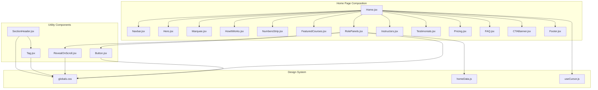
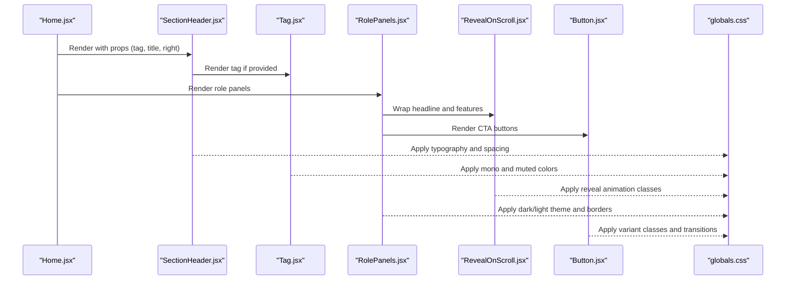
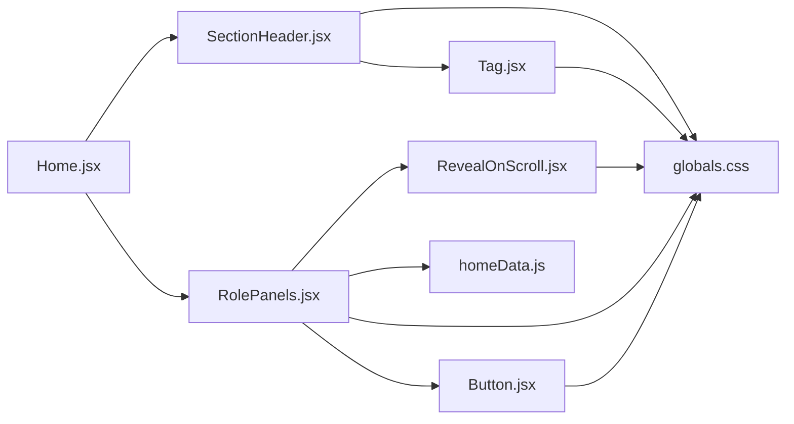

# Layout Components

<cite>
**Referenced Files in This Document**
- [SectionHeader.jsx](file://src/pages/Home/SectionHeader.jsx)
- [Tag.jsx](file://src/pages/Home/Tag.jsx)
- [RevealOnScroll.jsx](file://src/pages/Home/RevealOnScroll.jsx)
- [RolePanels.jsx](file://src/pages/Home/RolePanels.jsx)
- [Button.jsx](file://src/pages/Home/Button.jsx)
- [homeData.js](file://src/pages/Home/homeData.js)
- [globals.css](file://src/pages/Home/globals.css)
- [Home.jsx](file://src/pages/Home/Home.jsx)
- [useCursor.js](file://src/pages/Home/useCursor.js)
</cite>

## Table of Contents
1. [Introduction](#introduction)
2. [Project Structure](#project-structure)
3. [Core Components](#core-components)
4. [Architecture Overview](#architecture-overview)
5. [Detailed Component Analysis](#detailed-component-analysis)
6. [Dependency Analysis](#dependency-analysis)
7. [Performance Considerations](#performance-considerations)
8. [Troubleshooting Guide](#troubleshooting-guide)
9. [Conclusion](#conclusion)
10. [Appendices](#appendices)

## Introduction
This document explains CourseCraft’s layout and utility components that define page structure and content organization. It focuses on:
- SectionHeader.jsx for consistent section headings with typography and optional right-side slots
- Tag.jsx for badges and labels with color variations
- RevealOnScroll.jsx for scroll-triggered animations and transitions
- RolePanels.jsx for comparing student vs instructor perspectives

You will learn component props, styling customization, animation parameters, and integration patterns with other page elements. Practical examples demonstrate consistent design, custom animations, responsive layouts, and maintaining design system coherence.

## Project Structure
The layout components live under src/pages/Home and are integrated into the main Home page composition. They rely on a shared design system defined in globals.css and content constants in homeData.js.

**Diagram sources**
- [Home.jsx:17-39](file://src/pages/Home/Home.jsx#L17-L39)
- [SectionHeader.jsx:7-20](file://src/pages/Home/SectionHeader.jsx#L7-L20)
- [Tag.jsx:4-10](file://src/pages/Home/Tag.jsx#L4-L10)
- [RevealOnScroll.jsx:7-27](file://src/pages/Home/RevealOnScroll.jsx#L7-L27)
- [RolePanels.jsx:7-72](file://src/pages/Home/RolePanels.jsx#L7-L72)
- [Button.jsx:20-29](file://src/pages/Home/Button.jsx#L20-L29)
- [globals.css:1-146](file://src/pages/Home/globals.css#L1-L146)
- [homeData.js:63-78](file://src/pages/Home/homeData.js#L63-L78)
- [useCursor.js:4-28](file://src/pages/Home/useCursor.js#L4-L28)

**Section sources**
- [Home.jsx:17-39](file://src/pages/Home/Home.jsx#L17-L39)
- [globals.css:1-146](file://src/pages/Home/globals.css#L1-L146)

## Core Components
This section introduces the four components and their roles in structuring content and enabling animations.

- SectionHeader.jsx: Provides a consistent section header with a small tag, a large serif title, and an optional right-side slot for CTAs or controls.
- Tag.jsx: Renders a small, uppercase, monospaced label in a muted tone, suitable for section identifiers.
- RevealOnScroll.jsx: A scroll-triggered reveal wrapper that fades and lifts content into view when it enters the viewport.
- RolePanels.jsx: Presents two side-by-side panels (student vs instructor) with responsive stacking, distinct color schemes, and feature lists.

**Section sources**
- [SectionHeader.jsx:7-20](file://src/pages/Home/SectionHeader.jsx#L7-L20)
- [Tag.jsx:4-10](file://src/pages/Home/Tag.jsx#L4-L10)
- [RevealOnScroll.jsx:7-27](file://src/pages/Home/RevealOnScroll.jsx#L7-L27)
- [RolePanels.jsx:7-72](file://src/pages/Home/RolePanels.jsx#L7-L72)

## Architecture Overview
The components integrate with the design system and each other to form cohesive page sections. SectionHeader.jsx composes Tag.jsx to anchor headings. RolePanels.jsx uses RevealOnScroll.jsx to animate content and Button.jsx for calls to action. All components rely on shared tokens and styles from globals.css.

**Diagram sources**
- [Home.jsx:17-39](file://src/pages/Home/Home.jsx#L17-L39)
- [SectionHeader.jsx:7-20](file://src/pages/Home/SectionHeader.jsx#L7-L20)
- [Tag.jsx:4-10](file://src/pages/Home/Tag.jsx#L4-L10)
- [RolePanels.jsx:7-72](file://src/pages/Home/RolePanels.jsx#L7-L72)
- [RevealOnScroll.jsx:7-27](file://src/pages/Home/RevealOnScroll.jsx#L7-L27)
- [Button.jsx:20-29](file://src/pages/Home/Button.jsx#L20-L29)
- [globals.css:107-128](file://src/pages/Home/globals.css#L107-L128)

## Detailed Component Analysis

### SectionHeader.jsx
Purpose:
- Standardizes section headings with a small tag, large serif title, and optional right-side slot.

Props:
- tag: Optional text for the tag label rendered via Tag.jsx
- title: HTML-capable string for the heading; supports raw HTML for accent words
- right: Optional React node for a right-side control (e.g., CTA)

Styling and typography:
- Uses a clamp-based font size for the heading and tracking adjustments for readability
- Applies a subtle border-bottom and responsive spacing
- Integrates Tag.jsx for consistent labeling

Integration:
- Used across multiple sections to maintain visual rhythm and hierarchy

Customization tips:
- Replace the tag with a localized or dynamic value
- Use HTML in title for emphasis (e.g., italicized accent words)
- Place a CTA or filter control in the right slot for contextual actions

**Section sources**
- [SectionHeader.jsx:7-20](file://src/pages/Home/SectionHeader.jsx#L7-L20)
- [Tag.jsx:4-10](file://src/pages/Home/Tag.jsx#L4-L10)
- [globals.css:135-144](file://src/pages/Home/globals.css#L135-L144)

### Tag.jsx
Purpose:
- Renders a small, uppercase, monospaced label used as section identifiers.

Props:
- children: Label text
- className: Optional extra classes for fine-tuning

Styling:
- Uses a monospaced font, uppercase letter-spacing, and a muted color token
- Designed to be lightweight and non-intrusive

Customization:
- Combine with SectionHeader.jsx for consistent section labeling
- Override className for special cases (e.g., highlighting a tag)

**Section sources**
- [Tag.jsx:4-10](file://src/pages/Home/Tag.jsx#L4-L10)
- [globals.css:107-128](file://src/pages/Home/globals.css#L107-L128)

### RevealOnScroll.jsx
Purpose:
- Animates child content into view when it enters the viewport.

Props:
- children: Content to reveal
- delay: Optional delay level (1–3) to stagger reveals
- instant: If true, bypasses animation and shows content immediately
- className: Additional wrapper classes

Animation behavior:
- Uses IntersectionObserver with a root margin to trigger at ~50px before entering
- Adds an is-visible class to reveal content with opacity and translateY
- Supports staggered delays via reveal--delay-* classes

Performance:
- Disconnects observer on unmount
- Skips intersection logic when instant is true

Customization:
- Use delay to create cascading reveals
- Use instant for above-the-fold content to avoid unnecessary animation
- Combine with typography and layout components for consistent motion

**Section sources**
- [RevealOnScroll.jsx:7-27](file://src/pages/Home/RevealOnScroll.jsx#L7-L27)
- [globals.css:107-128](file://src/pages/Home/globals.css#L107-L128)

### RolePanels.jsx
Purpose:
- Compares student and instructor perspectives side-by-side with responsive stacking.

Props:
- None (uses internal state and content from homeData.js)

Behavior:
- Detects mobile width and switches from two columns to stacked layout
- Renders two Panels with distinct themes (light vs dark)
- Uses RevealOnScroll.jsx for headline and feature list animations
- Uses Button.jsx for calls to action

Content:
- Pulls feature lists from homeData.js (STUDENT_FEATURES and INSTRUCTOR_FEATURES)

Responsive design:
- Grid template columns switch based on mobile state
- Borders adapt to stacked layout on mobile

Customization:
- Modify content arrays in homeData.js to update features
- Adjust Button variants to match panel theme
- Extend to add more roles or columns

**Section sources**
- [RolePanels.jsx:7-72](file://src/pages/Home/RolePanels.jsx#L7-L72)
- [homeData.js:63-78](file://src/pages/Home/homeData.js#L63-L78)
- [Button.jsx:20-29](file://src/pages/Home/Button.jsx#L20-L29)
- [RevealOnScroll.jsx:7-27](file://src/pages/Home/RevealOnScroll.jsx#L7-L27)

## Dependency Analysis
The components depend on the design system and each other to maintain consistency.

**Diagram sources**
- [SectionHeader.jsx:5](file://src/pages/Home/SectionHeader.jsx#L5)
- [RolePanels.jsx:3-4](file://src/pages/Home/RolePanels.jsx#L3-L4)
- [Home.jsx:17-39](file://src/pages/Home/Home.jsx#L17-L39)
- [globals.css:1-146](file://src/pages/Home/globals.css#L1-146)

**Section sources**
- [SectionHeader.jsx:5](file://src/pages/Home/SectionHeader.jsx#L5)
- [RolePanels.jsx:3-4](file://src/pages/Home/RolePanels.jsx#L3-L4)
- [Home.jsx:17-39](file://src/pages/Home/Home.jsx#L17-L39)
- [globals.css:1-146](file://src/pages/Home/globals.css#L1-L146)

## Performance Considerations
- RevealOnScroll.jsx uses IntersectionObserver for efficient viewport detection and disconnects on unmount to prevent memory leaks.
- RolePanels.jsx computes mobile state once on mount and listens to resize events sparingly.
- globals.css defines CSS animations and transitions with optimized easing curves.
- Avoid excessive use of instant=true for above-the-fold content to preserve perceived motion.

[No sources needed since this section provides general guidance]

## Troubleshooting Guide
Common issues and resolutions:
- Reveal not triggering:
  - Ensure the element is within the viewport or close to it; IntersectionObserver threshold and root margin are tuned for near-entry triggers.
  - Verify the reveal wrapper is present and not removed by conditional rendering.
- Staggered delays not applying:
  - Confirm delay prop is set to 1, 2, or 3; higher values are not supported by the delay classes.
- Mobile layout not switching:
  - Check that the window resize listener is attached and that the mobile state reflects the intended breakpoint.
- Tag or typography mismatch:
  - Confirm globals.css tokens and font families are correctly defined and applied.

**Section sources**
- [RevealOnScroll.jsx:14-20](file://src/pages/Home/RevealOnScroll.jsx#L14-L20)
- [RolePanels.jsx:8-12](file://src/pages/Home/RolePanels.jsx#L8-L12)
- [globals.css:107-128](file://src/pages/Home/globals.css#L107-L128)

## Conclusion
These layout and utility components form the backbone of CourseCraft’s page structure. SectionHeader.jsx and Tag.jsx establish consistent headings and labels. RevealOnScroll.jsx adds smooth, accessible motion. RolePanels.jsx compares perspectives with responsive design and a cohesive theme. Together with the design system in globals.css and content in homeData.js, they enable rapid iteration while preserving visual coherence.

[No sources needed since this section summarizes without analyzing specific files]

## Appendices

### Component Prop Reference
- SectionHeader
  - tag: string | null
  - title: string (HTML-capable)
  - right: ReactNode | null
- Tag
  - children: ReactNode
  - className: string
- RevealOnScroll
  - children: ReactNode
  - delay: 0 | 1 | 2 | 3
  - instant: boolean
  - className: string
- RolePanels
  - none (uses internal state and homeData.js)

**Section sources**
- [SectionHeader.jsx:7](file://src/pages/Home/SectionHeader.jsx#L7)
- [Tag.jsx:4](file://src/pages/Home/Tag.jsx#L4)
- [RevealOnScroll.jsx:7](file://src/pages/Home/RevealOnScroll.jsx#L7)
- [RolePanels.jsx:7](file://src/pages/Home/RolePanels.jsx#L7)

### Styling Customization Patterns
- Typography:
  - Serif headings: use font-serif on headings; combine with clamp sizing for responsiveness.
  - Monospaced labels: use font-mono for tags and badges.
- Colors:
  - Ink/paper palette with opacity-derived tints; invert roles in dark sections.
  - Accent red for highlights and interactive elements.
- Borders:
  - Structural 2px borders for section separation; subtle dividers for content groups.
- Animations:
  - Use reveal classes; adjust delay levels to create rhythm.

**Section sources**
- [globals.css:107-128](file://src/pages/Home/globals.css#L107-L128)
- [globals.css:135-144](file://src/pages/Home/globals.css#L135-L144)

### Integration Examples
- Consistent section headings:
  - Compose SectionHeader with Tag for subsections; place a CTA in the right slot.
- Implementing custom animations:
  - Wrap content with RevealOnScroll; use delay to stagger entries; set instant for above-the-fold content.
- Creating responsive layouts:
  - Use RolePanels for dual perspectives; it automatically stacks on smaller screens.
- Maintaining design system coherence:
  - Use Button variants aligned with panel themes; leverage globals.css tokens for colors and fonts.

**Section sources**
- [SectionHeader.jsx:7-20](file://src/pages/Home/SectionHeader.jsx#L7-L20)
- [RevealOnScroll.jsx:7-27](file://src/pages/Home/RevealOnScroll.jsx#L7-L27)
- [RolePanels.jsx:7-72](file://src/pages/Home/RolePanels.jsx#L7-L72)
- [Button.jsx:20-29](file://src/pages/Home/Button.jsx#L20-L29)
- [globals.css:1-146](file://src/pages/Home/globals.css#L1-L146)