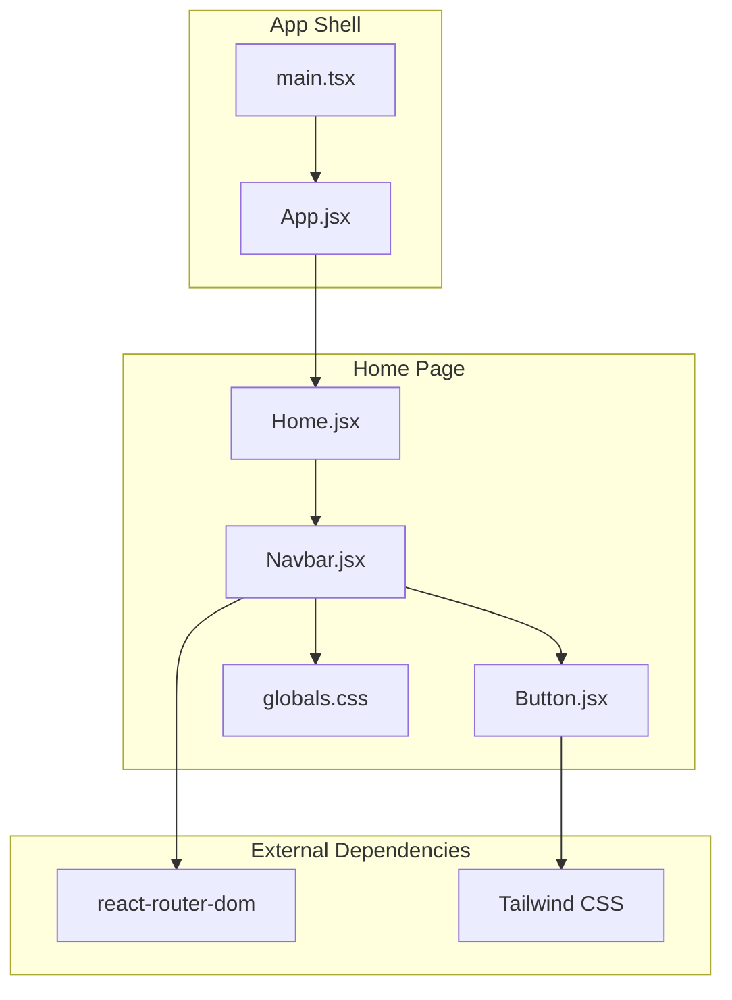
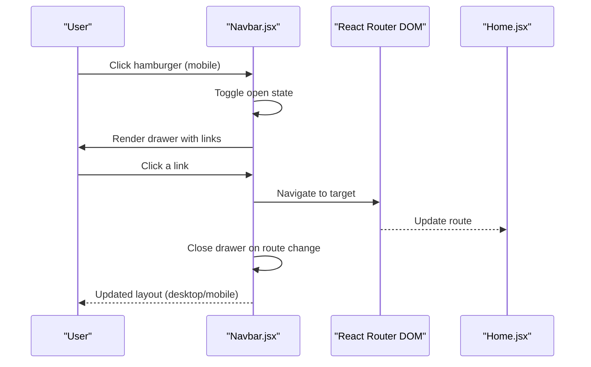
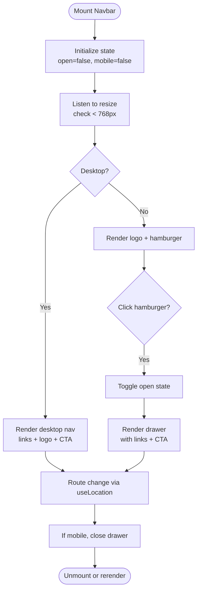
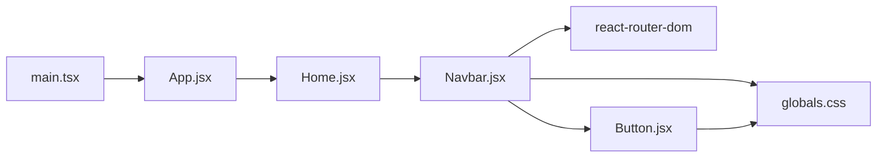

# Navigation Components

<cite>
**Referenced Files in This Document**
- [Navbar.jsx](file://src/pages/Home/Navbar.jsx)
- [homeData.js](file://src/pages/Home/homeData.js)
- [Home.jsx](file://src/pages/Home/Home.jsx)
- [globals.css](file://src/pages/Home/globals.css)
- [Button.jsx](file://src/pages/Home/Button.jsx)
- [App.jsx](file://src/App.jsx)
- [main.tsx](file://src/main.tsx)
- [package.json](file://package.json)
</cite>

## Table of Contents
1. [Introduction](#introduction)
2. [Project Structure](#project-structure)
3. [Core Components](#core-components)
4. [Architecture Overview](#architecture-overview)
5. [Detailed Component Analysis](#detailed-component-analysis)
6. [Dependency Analysis](#dependency-analysis)
7. [Performance Considerations](#performance-considerations)
8. [Troubleshooting Guide](#troubleshooting-guide)
9. [Conclusion](#conclusion)
10. [Appendices](#appendices)

## Introduction
This document provides comprehensive documentation for CourseCraft’s navigation components, focusing on the Navbar.jsx component that manages both desktop and mobile navigation with responsive behavior, animated mobile drawer, dropdown-free navigation, and active-state considerations. It also documents the navigation data structure from homeData.js, the component’s props interface, state management for mobile drawer functionality, and integration with React Router DOM. Practical guidance is included for customizing appearance, adding new menu items, implementing authentication-aware navigation, handling navigation events, responsive breakpoints, accessibility features, and mobile-first design patterns.

## Project Structure
The navigation system is centered around the Navbar component located under the Home page. It integrates with shared styles, a reusable Button component, and the Home page layout. The global theme defines color tokens and typography used across the navigation.

**Diagram sources**
- [Home.jsx:17-39](file://src/pages/Home/Home.jsx#L17-L39)
- [Navbar.jsx:5-136](file://src/pages/Home/Navbar.jsx#L5-L136)
- [Button.jsx:20-29](file://src/pages/Home/Button.jsx#L20-L29)
- [globals.css:3-19](file://src/pages/Home/globals.css#L3-L19)
- [App.jsx:1-9](file://src/App.jsx#L1-L9)
- [main.tsx:1-10](file://src/main.tsx#L1-L10)
- [package.json:12-18](file://package.json#L12-L18)

**Section sources**
- [Home.jsx:17-39](file://src/pages/Home/Home.jsx#L17-L39)
- [Navbar.jsx:5-136](file://src/pages/Home/Navbar.jsx#L5-L136)
- [globals.css:3-19](file://src/pages/Home/globals.css#L3-L19)
- [App.jsx:1-9](file://src/App.jsx#L1-L9)
- [main.tsx:1-10](file://src/main.tsx#L1-L10)
- [package.json:12-18](file://package.json#L12-L18)

## Core Components
- Navbar.jsx: Implements responsive navigation with:
  - Desktop layout: left links, center logo, right links + CTA
  - Mobile layout: logo on the left, hamburger on the right, animated slide-down drawer
  - State management for drawer open/closed and mobile breakpoint detection
  - Integration with React Router DOM via Link and useLocation
  - Accessibility via aria-label on the hamburger button
- homeData.js: Provides navigation link collections for reuse across components (left/right links, hero cells, pricing plans, etc.). While Navbar currently constructs its own list, the data structure supports centralized navigation definitions.
- Button.jsx: Reusable primary/outlined buttons used in the desktop CTA and mobile drawer CTA.
- globals.css: Defines theme tokens (colors, fonts, spacing) consumed by Navbar and Button.

Key props and behavior:
- Props: None for Navbar; uses internal state and router hooks.
- Drawer state: open/close toggled by the hamburger button.
- Responsive behavior: Breakpoint at 768px; mobile drawer collapses to a slide-down animation.
- Active state: Uses router hooks to close the drawer on route changes; hover effects on desktop links.

**Section sources**
- [Navbar.jsx:9-136](file://src/pages/Home/Navbar.jsx#L9-L136)
- [homeData.js:8-17](file://src/pages/Home/homeData.js#L8-L17)
- [Button.jsx:20-29](file://src/pages/Home/Button.jsx#L20-L29)
- [globals.css:3-19](file://src/pages/Home/globals.css#L3-L19)

## Architecture Overview
The Navbar participates in the Home page composition and relies on React Router DOM for navigation. It uses Tailwind utility classes for styling and theme tokens for consistent visuals.

**Diagram sources**
- [Navbar.jsx:14-26](file://src/pages/Home/Navbar.jsx#L14-L26)
- [Navbar.jsx:71-90](file://src/pages/Home/Navbar.jsx#L71-L90)
- [Navbar.jsx:104-124](file://src/pages/Home/Navbar.jsx#L104-L124)
- [Home.jsx:17-39](file://src/pages/Home/Home.jsx#L17-L39)

## Detailed Component Analysis

### Navbar.jsx
Responsibilities:
- Detect viewport width to switch between desktop and mobile layouts.
- Manage mobile drawer state and close it on route changes.
- Render desktop navigation links and a centered logo.
- Render a mobile drawer with a list of links and a CTA.
- Provide a styled Link component for desktop hover states.

State and lifecycle:
- open: Controls drawer visibility.
- mobile: Tracks whether the viewport is below the 768px breakpoint.
- useLocation: Triggers drawer closure on route changes.

Responsive behavior:
- Desktop: Left links, center logo, right links + CTA.
- Mobile: Hamburger button triggers a slide-down drawer with a list of links and a CTA.

Accessibility:
- The hamburger button includes aria-label that reflects the current state (open vs closed).

Integration with React Router DOM:
- Uses Link for navigation and useLocation for route change detection.

Customization examples (paths only):
- Change desktop link labels or destinations: [Navbar.jsx:28-33](file://src/pages/Home/Navbar.jsx#L28-L33)
- Add a new desktop link: [Navbar.jsx:41-47](file://src/pages/Home/Navbar.jsx#L41-L47)
- Modify mobile drawer links: [Navbar.jsx:104-124](file://src/pages/Home/Navbar.jsx#L104-L124)
- Adjust drawer animation timing: [Navbar.jsx:97-101](file://src/pages/Home/Navbar.jsx#L97-L101)
- Customize logo placement and styling: [Navbar.jsx:50-55](file://src/pages/Home/Navbar.jsx#L50-L55)
- Modify desktop link hover effect: [Navbar.jsx:138-152](file://src/pages/Home/Navbar.jsx#L138-L152)

**Diagram sources**
- [Navbar.jsx:14-26](file://src/pages/Home/Navbar.jsx#L14-L26)
- [Navbar.jsx:35-91](file://src/pages/Home/Navbar.jsx#L35-L91)
- [Navbar.jsx:94-133](file://src/pages/Home/Navbar.jsx#L94-L133)

**Section sources**
- [Navbar.jsx:9-136](file://src/pages/Home/Navbar.jsx#L9-L136)

### Navigation Data Structure (homeData.js)
The homeData.js module centralizes content and navigation definitions. For navigation, the following arrays define link groups:
- NAV_LINKS_LEFT: Desktop left-side links.
- NAV_LINKS_RIGHT: Desktop right-side links.

These structures can be leveraged to populate Navbar.jsx dynamically, reducing duplication and enabling centralized maintenance.

Usage examples (paths only):
- Import NAV_LINKS_LEFT and NAV_LINKS_RIGHT into Navbar.jsx to render desktop links.
- Extend NAV_LINKS_RIGHT to add “Sign in” or “Dashboard” entries depending on authentication state.

Note: Navbar.jsx currently constructs its own list for desktop and mobile. Adopting homeData.js would improve maintainability and consistency.

**Section sources**
- [homeData.js:8-17](file://src/pages/Home/homeData.js#L8-L17)

### Button.jsx Integration
The Navbar uses Button.jsx for CTA rendering in both desktop and mobile contexts:
- Desktop: Primary variant for the “Get started” CTA.
- Mobile: Primary variant for the drawer’s “Get started” CTA.

Customization examples (paths only):
- Change button variant: [Button.jsx:5-18](file://src/pages/Home/Button.jsx#L5-L18)
- Adjust button sizing or padding: [Navbar.jsx:63-66](file://src/pages/Home/Navbar.jsx#L63-L66), [Navbar.jsx:127-129](file://src/pages/Home/Navbar.jsx#L127-L129)

**Section sources**
- [Button.jsx:20-29](file://src/pages/Home/Button.jsx#L20-L29)
- [Navbar.jsx:63-66](file://src/pages/Home/Navbar.jsx#L63-L66)
- [Navbar.jsx:127-129](file://src/pages/Home/Navbar.jsx#L127-L129)

### Theme Tokens and Styling (globals.css)
Navbar.jsx and Button.jsx rely on Tailwind tokens defined in globals.css:
- Color tokens: ink, paper, red
- Typography tokens: serif and sans fonts
- Spacing token: nav height (54px)

Customization examples (paths only):
- Adjust brand colors: [globals.css:4-8](file://src/pages/Home/globals.css#L4-L8)
- Change font families: [globals.css:10-12](file://src/pages/Home/globals.css#L10-L12)
- Modify navbar height token: [globals.css:14-15](file://src/pages/Home/globals.css#L14-L15)

**Section sources**
- [globals.css:3-19](file://src/pages/Home/globals.css#L3-L19)

### Authentication-Aware Navigation
Current state:
- Navbar.jsx renders static “Sign in” and “Get started” links regardless of authentication status.

Recommended approach:
- Introduce an authentication context/provider to derive user state.
- Conditionally render “Sign in”, “Get started”, or “Dashboard” based on authentication status.
- Example paths for implementation:
  - Wrap Home with an auth provider: [Home.jsx:17-39](file://src/pages/Home/Home.jsx#L17-L39)
  - Add conditional rendering inside Navbar.jsx for authentication-aware links.

[No sources needed since this section provides general guidance]

### Handling Navigation Events
- Drawer toggle: Controlled by the hamburger button click handler.
- Route change: Drawer closes automatically via useLocation.
- Hover states: Desktop links toggle hover state for visual feedback.

Paths for customization:
- Drawer toggle handler: [Navbar.jsx:72-76](file://src/pages/Home/Navbar.jsx#L72-L76)
- Route change effect: [Navbar.jsx:24-26](file://src/pages/Home/Navbar.jsx#L24-L26)
- Hover effect: [Navbar.jsx:138-152](file://src/pages/Home/Navbar.jsx#L138-L152)

**Section sources**
- [Navbar.jsx:72-76](file://src/pages/Home/Navbar.jsx#L72-L76)
- [Navbar.jsx:24-26](file://src/pages/Home/Navbar.jsx#L24-L26)
- [Navbar.jsx:138-152](file://src/pages/Home/Navbar.jsx#L138-L152)

## Dependency Analysis
External dependencies:
- react-router-dom: Enables client-side routing and navigation.
- Tailwind CSS: Provides utility classes for responsive layout and theming.

Internal dependencies:
- Navbar.jsx depends on Button.jsx for CTA rendering.
- Home.jsx composes Navbar.jsx within the page layout.

**Diagram sources**
- [Navbar.jsx:5-136](file://src/pages/Home/Navbar.jsx#L5-L136)
- [Button.jsx:20-29](file://src/pages/Home/Button.jsx#L20-L29)
- [Home.jsx:17-39](file://src/pages/Home/Home.jsx#L17-L39)
- [App.jsx:1-9](file://src/App.jsx#L1-L9)
- [main.tsx:1-10](file://src/main.tsx#L1-L10)
- [package.json:12-18](file://package.json#L12-L18)

**Section sources**
- [package.json:12-18](file://package.json#L12-L18)
- [Navbar.jsx:5-136](file://src/pages/Home/Navbar.jsx#L5-L136)
- [Button.jsx:20-29](file://src/pages/Home/Button.jsx#L20-L29)
- [Home.jsx:17-39](file://src/pages/Home/Home.jsx#L17-L39)
- [App.jsx:1-9](file://src/App.jsx#L1-L9)
- [main.tsx:1-10](file://src/main.tsx#L1-L10)

## Performance Considerations
- Event listeners: The resize listener is attached and cleaned up on mount/unmount to avoid leaks.
- Drawer animation: Uses transform and opacity with a cubic-bezier timing function for smooth transitions.
- Conditional rendering: Desktop and mobile layouts are mutually exclusive, minimizing unnecessary DOM nodes.
- Hover states: Local state toggles are lightweight and scoped to individual links.

Recommendations:
- Debounce resize handler if needed for heavy computations.
- Consider memoizing link lists if they become dynamic and expensive to compute.
- Keep drawer content minimal to reduce layout thrashing during animation.

**Section sources**
- [Navbar.jsx:14-19](file://src/pages/Home/Navbar.jsx#L14-L19)
- [Navbar.jsx:97-101](file://src/pages/Home/Navbar.jsx#L97-L101)

## Troubleshooting Guide
Common issues and resolutions:
- Drawer does not close on navigation:
  - Ensure useLocation is imported and the effect is active.
  - Verify the effect runs on location changes.
  - Reference: [Navbar.jsx:24-26](file://src/pages/Home/Navbar.jsx#L24-L26)
- Hamburger button not accessible:
  - Confirm aria-label updates based on open state.
  - Reference: [Navbar.jsx:75-76](file://src/pages/Home/Navbar.jsx#L75-L76)
- Links not styled consistently:
  - Check globals.css token usage and Tailwind utilities.
  - Reference: [globals.css:3-19](file://src/pages/Home/globals.css#L3-L19)
- CTA button misalignment:
  - Adjust Button props and inline styles.
  - References: [Navbar.jsx:63-66](file://src/pages/Home/Navbar.jsx#L63-L66), [Navbar.jsx:127-129](file://src/pages/Home/Navbar.jsx#L127-L129)

**Section sources**
- [Navbar.jsx:24-26](file://src/pages/Home/Navbar.jsx#L24-L26)
- [Navbar.jsx:75-76](file://src/pages/Home/Navbar.jsx#L75-L76)
- [globals.css:3-19](file://src/pages/Home/globals.css#L3-L19)
- [Navbar.jsx:63-66](file://src/pages/Home/Navbar.jsx#L63-L66)
- [Navbar.jsx:127-129](file://src/pages/Home/Navbar.jsx#L127-L129)

## Conclusion
The Navbar component delivers a robust, mobile-first navigation experience with clear separation of concerns, responsive behavior, and accessibility. By adopting the navigation data structure from homeData.js, centralizing authentication-aware logic, and leveraging the existing Button and theme tokens, teams can scale the navigation while maintaining consistency and performance.

## Appendices

### Responsive Breakpoints and Mobile-First Patterns
- Breakpoint: 768px; below this threshold, mobile drawer activates.
- Mobile-first layout: Drawer appears only on small screens; desktop layout is the default for larger screens.
- Animation: Slide-down drawer uses transform and opacity with a custom timing function.

**Section sources**
- [Navbar.jsx:14-19](file://src/pages/Home/Navbar.jsx#L14-L19)
- [Navbar.jsx:94-133](file://src/pages/Home/Navbar.jsx#L94-L133)

### Accessibility Checklist
- Hamburger button includes aria-label reflecting current state.
- Keyboard navigable via native Link semantics.
- Sufficient color contrast using theme tokens.

**Section sources**
- [Navbar.jsx:75-76](file://src/pages/Home/Navbar.jsx#L75-L76)
- [globals.css:4-8](file://src/pages/Home/globals.css#L4-L8)