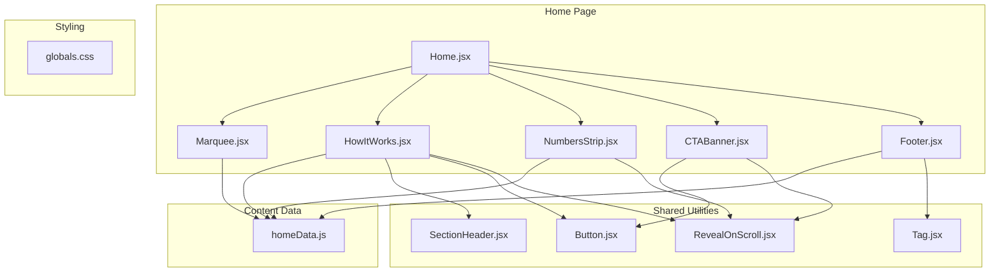
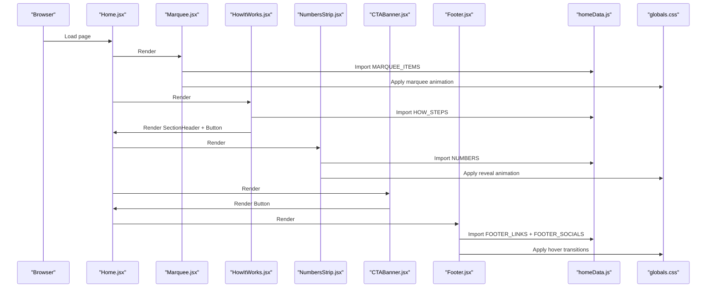
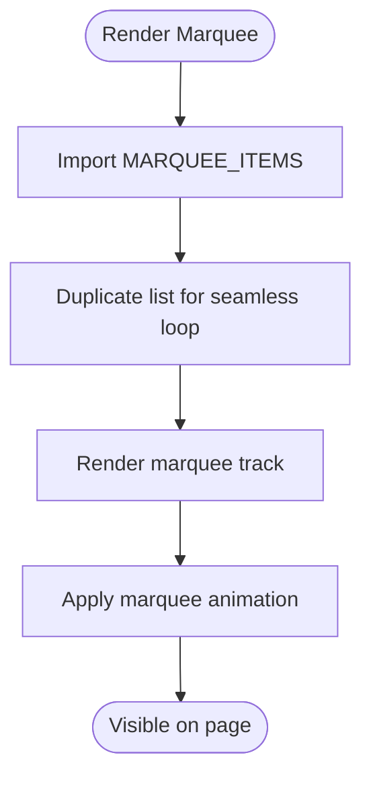
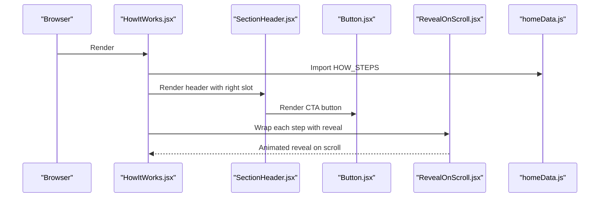
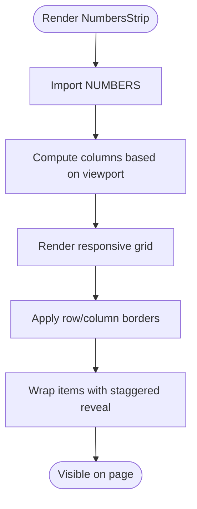
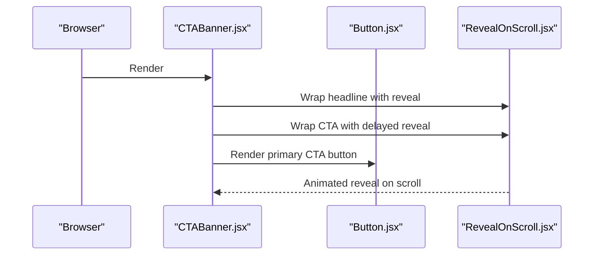
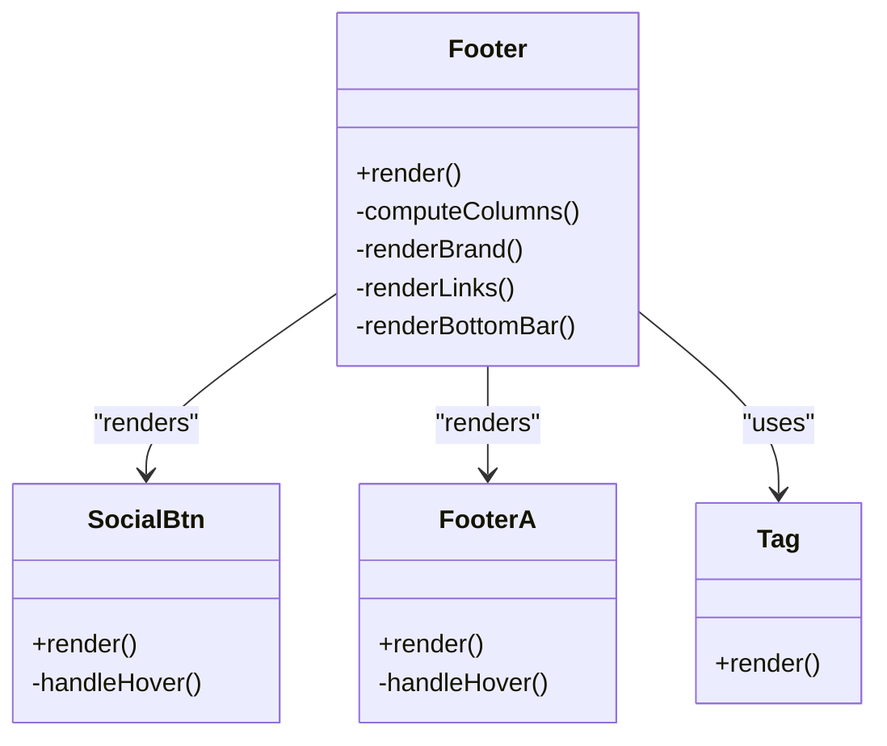
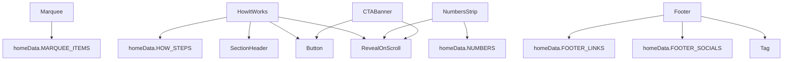

# Specialized Components

<cite>
**Referenced Files in This Document**
- [Marquee.jsx](file://src/pages/Home/Marquee.jsx)
- [HowItWorks.jsx](file://src/pages/Home/HowItWorks.jsx)
- [NumbersStrip.jsx](file://src/pages/Home/NumbersStrip.jsx)
- [CTABanner.jsx](file://src/pages/Home/CTABanner.jsx)
- [Footer.jsx](file://src/pages/Home/Footer.jsx)
- [homeData.js](file://src/pages/Home/homeData.js)
- [Button.jsx](file://src/pages/Home/Button.jsx)
- [RevealOnScroll.jsx](file://src/pages/Home/RevealOnScroll.jsx)
- [SectionHeader.jsx](file://src/pages/Home/SectionHeader.jsx)
- [Tag.jsx](file://src/pages/Home/Tag.jsx)
- [Home.jsx](file://src/pages/Home/Home.jsx)
- [globals.css](file://src/pages/Home/globals.css)
</cite>

## Table of Contents
1. [Introduction](#introduction)
2. [Project Structure](#project-structure)
3. [Core Components](#core-components)
4. [Architecture Overview](#architecture-overview)
5. [Detailed Component Analysis](#detailed-component-analysis)
6. [Dependency Analysis](#dependency-analysis)
7. [Performance Considerations](#performance-considerations)
8. [Troubleshooting Guide](#troubleshooting-guide)
9. [Conclusion](#conclusion)
10. [Appendices](#appendices)

## Introduction
This document provides comprehensive documentation for CourseCraft’s specialized UI components that define the home page experience. It focuses on five components with unique functionality:
- Marquee.jsx: Infinite scrolling topic strip for dynamic content display
- HowItWorks.jsx: Step-by-step process explanation with responsive grid layout
- NumbersStrip.jsx: Statistics display with responsive grid and animated reveals
- CTABanner.jsx: Final call-to-action element with dark theme and responsive layout
- Footer.jsx: Site-wide navigation and information with adaptive column layouts

Each component’s implementation, data requirements, animation behaviors, and integration with the page flow are explained. Practical customization examples are included for adapting specialized behaviors, creating custom marquee content, designing effective call-to-action elements, and structuring comprehensive footer layouts.

## Project Structure
The specialized components reside under the Home page module and are orchestrated by the Home page container. They rely on shared data definitions and utility components for consistent behavior and styling.

**Diagram sources**
- [Home.jsx:17-39](file://src/pages/Home/Home.jsx#L17-L39)
- [Marquee.jsx:1-19](file://src/pages/Home/Marquee.jsx#L1-L19)
- [HowItWorks.jsx:1-54](file://src/pages/Home/HowItWorks.jsx#L1-L54)
- [NumbersStrip.jsx:1-39](file://src/pages/Home/NumbersStrip.jsx#L1-L39)
- [CTABanner.jsx:1-36](file://src/pages/Home/CTABanner.jsx#L1-L36)
- [Footer.jsx:1-81](file://src/pages/Home/Footer.jsx#L1-L81)
- [homeData.js:19-54](file://src/pages/Home/homeData.js#L19-L54)
- [Button.jsx:1-30](file://src/pages/Home/Button.jsx#L1-L30)
- [RevealOnScroll.jsx:1-28](file://src/pages/Home/RevealOnScroll.jsx#L1-L28)
- [SectionHeader.jsx:1-21](file://src/pages/Home/SectionHeader.jsx#L1-L21)
- [Tag.jsx:1-11](file://src/pages/Home/Tag.jsx#L1-L11)
- [globals.css:17-29](file://src/pages/Home/globals.css#L17-L29)

**Section sources**
- [Home.jsx:17-39](file://src/pages/Home/Home.jsx#L17-L39)

## Core Components
This section outlines the purpose, data requirements, and behavior of each specialized component.

- Marquee.jsx
  - Purpose: Infinite horizontal scrolling strip of topics to draw attention and communicate breadth of offerings.
  - Data requirement: An array of topic strings loaded from homeData.MARQUEE_ITEMS.
  - Behavior: Duplicates the list to create seamless looping animation; relies on CSS keyframes and a dedicated marquee animation variable.
  - Integration: Placed after the hero section to establish momentum and context for the learning journey.

- HowItWorks.jsx
  - Purpose: Present a three-step process explanation with responsive grid layout and animated reveals.
  - Data requirement: An array of step objects from homeData.HOW_STEPS, each containing id, icon, title, titleItalic, and description.
  - Behavior: Responsive grid switching from 3 columns on desktop to 1 column on mobile; animated reveals with staggered delays; borders adjust based on orientation and position.
  - Integration: Positioned after statistics and before featured content to guide the visitor toward action.

- NumbersStrip.jsx
  - Purpose: Display key statistics with ghost-number indices and responsive grid layout.
  - Data requirement: An array of number objects from homeData.NUMBERS, each with value, suffix, label, and index.
  - Behavior: Responsive column count (4 on wide screens, 2 on smaller screens); borders adapt to row and column positions; animated reveals with staggered delays.
  - Integration: Acts as a bridge between the hero and the step-by-step process, reinforcing credibility and scale.

- CTABanner.jsx
  - Purpose: Deliver a strong final call-to-action with a dark theme and prominent emphasis.
  - Data requirement: Minimal; uses hardcoded headline and subtext; integrates a Button component for the primary action.
  - Behavior: Responsive layout (stacked on mobile, two-column on desktop); animated reveals with staggered delays; dark theme with red accents.
  - Integration: Positioned near the end of the main content to maximize conversion before reaching the footer.

- Footer.jsx
  - Purpose: Provide site-wide navigation and information with adaptive column layouts.
  - Data requirement: Links grouped by category from homeData.FOOTER_LINKS and social media entries from homeData.FOOTER_SOCIALS.
  - Behavior: Column count adapts to screen size (4→2→1); brand identity, description, and social links; interactive hover states for links and buttons.
  - Integration: Rendered at the bottom of the page to anchor navigation and legal information.

**Section sources**
- [Marquee.jsx:1-19](file://src/pages/Home/Marquee.jsx#L1-L19)
- [HowItWorks.jsx:1-54](file://src/pages/Home/HowItWorks.jsx#L1-L54)
- [NumbersStrip.jsx:1-39](file://src/pages/Home/NumbersStrip.jsx#L1-L39)
- [CTABanner.jsx:1-36](file://src/pages/Home/CTABanner.jsx#L1-L36)
- [Footer.jsx:1-81](file://src/pages/Home/Footer.jsx#L1-L81)
- [homeData.js:19-54](file://src/pages/Home/homeData.js#L19-L54)

## Architecture Overview
The specialized components are composed of reusable utilities and share a consistent data layer. The Home page orchestrates the order and placement of these components.

**Diagram sources**
- [Home.jsx:17-39](file://src/pages/Home/Home.jsx#L17-L39)
- [Marquee.jsx:1-19](file://src/pages/Home/Marquee.jsx#L1-L19)
- [HowItWorks.jsx:1-54](file://src/pages/Home/HowItWorks.jsx#L1-L54)
- [NumbersStrip.jsx:1-39](file://src/pages/Home/NumbersStrip.jsx#L1-L39)
- [CTABanner.jsx:1-36](file://src/pages/Home/CTABanner.jsx#L1-L36)
- [Footer.jsx:1-81](file://src/pages/Home/Footer.jsx#L1-L81)
- [homeData.js:19-54](file://src/pages/Home/homeData.js#L19-L54)
- [globals.css:17-29](file://src/pages/Home/globals.css#L17-L29)

## Detailed Component Analysis

### Marquee.jsx
- Implementation highlights
  - Uses a duplicated list to ensure seamless looping during animation.
  - Applies a border-based divider between items and a monospace typography for a techy feel.
  - Leverages a CSS animation variable for smooth horizontal movement.
- Data requirements
  - Consumes homeData.MARQUEE_ITEMS for the list of topics.
- Animation behavior
  - CSS keyframes move the track horizontally by half its width to achieve continuous looping.
- Integration with page flow
  - Appears after the hero to establish context and momentum for the learning journey.

**Diagram sources**
- [Marquee.jsx:4-18](file://src/pages/Home/Marquee.jsx#L4-L18)
- [homeData.js:20-25](file://src/pages/Home/homeData.js#L20-L25)
- [globals.css:17-29](file://src/pages/Home/globals.css#L17-L29)

**Section sources**
- [Marquee.jsx:1-19](file://src/pages/Home/Marquee.jsx#L1-L19)
- [homeData.js:20-25](file://src/pages/Home/homeData.js#L20-L25)
- [globals.css:17-29](file://src/pages/Home/globals.css#L17-L29)

### HowItWorks.jsx
- Implementation highlights
  - Responsive grid layout switches from 3 columns on desktop to 1 column on mobile.
  - Uses RevealOnScroll for staggered animated reveals; borders adapt to orientation and position.
  - Integrates SectionHeader for the section title and a Button for navigation.
- Data requirements
  - Consumes homeData.HOW_STEPS for step definitions.
- Animation behavior
  - Staggered delays on desktop; immediate reveal on mobile to optimize perceived performance.
- Integration with page flow
  - Positioned after statistics and before featured content to guide the visitor toward action.

**Diagram sources**
- [HowItWorks.jsx:8-53](file://src/pages/Home/HowItWorks.jsx#L8-L53)
- [SectionHeader.jsx:7-20](file://src/pages/Home/SectionHeader.jsx#L7-L20)
- [Button.jsx:20-29](file://src/pages/Home/Button.jsx#L20-L29)
- [RevealOnScroll.jsx:7-27](file://src/pages/Home/RevealOnScroll.jsx#L7-L27)
- [homeData.js:42-46](file://src/pages/Home/homeData.js#L42-L46)

**Section sources**
- [HowItWorks.jsx:1-54](file://src/pages/Home/HowItWorks.jsx#L1-L54)
- [homeData.js:42-46](file://src/pages/Home/homeData.js#L42-L46)
- [SectionHeader.jsx:1-21](file://src/pages/Home/SectionHeader.jsx#L1-L21)
- [Button.jsx:1-30](file://src/pages/Home/Button.jsx#L1-L30)
- [RevealOnScroll.jsx:1-28](file://src/pages/Home/RevealOnScroll.jsx#L1-L28)

### NumbersStrip.jsx
- Implementation highlights
  - Responsive column count adjusts from 4 to 2 based on viewport width.
  - Borders adapt to row and column positions to visually separate items.
  - Uses RevealOnScroll for staggered animated reveals with a consistent delay pattern.
- Data requirements
  - Consumes homeData.NUMBERS for numeric statistics.
- Animation behavior
  - Staggered delays enhance perceived performance and focus attention.
- Integration with page flow
  - Sits between the hero and the step-by-step process to reinforce credibility and scale.

**Diagram sources**
- [NumbersStrip.jsx:6-38](file://src/pages/Home/NumbersStrip.jsx#L6-L38)
- [homeData.js:49-54](file://src/pages/Home/homeData.js#L49-L54)
- [RevealOnScroll.jsx:7-27](file://src/pages/Home/RevealOnScroll.jsx#L7-L27)

**Section sources**
- [NumbersStrip.jsx:1-39](file://src/pages/Home/NumbersStrip.jsx#L1-L39)
- [homeData.js:49-54](file://src/pages/Home/homeData.js#L49-L54)
- [RevealOnScroll.jsx:1-28](file://src/pages/Home/RevealOnScroll.jsx#L1-L28)

### CTABanner.jsx
- Implementation highlights
  - Dark theme with red accents and responsive layout (stacked on mobile, two-column on desktop).
  - Animated reveals with staggered delays; integrates a Button component for the primary action.
- Data requirements
  - Minimal; uses hardcoded headline and subtext; integrates Button for the CTA.
- Animation behavior
  - Staggered reveals to draw attention progressively.
- Integration with page flow
  - Positioned near the end of the main content to maximize conversion before reaching the footer.

**Diagram sources**
- [CTABanner.jsx:6-35](file://src/pages/Home/CTABanner.jsx#L6-L35)
- [Button.jsx:20-29](file://src/pages/Home/Button.jsx#L20-L29)
- [RevealOnScroll.jsx:7-27](file://src/pages/Home/RevealOnScroll.jsx#L7-L27)

**Section sources**
- [CTABanner.jsx:1-36](file://src/pages/Home/CTABanner.jsx#L1-L36)
- [Button.jsx:1-30](file://src/pages/Home/Button.jsx#L1-L30)
- [RevealOnScroll.jsx:1-28](file://src/pages/Home/RevealOnScroll.jsx#L1-L28)

### Footer.jsx
- Implementation highlights
  - Adaptive column layout (4→2→1) based on viewport width.
  - Brand identity, description, and social links; interactive hover states for links and buttons.
  - Uses Tag for section labels and FooterA/SocialBtn for link rendering.
- Data requirements
  - Consumes homeData.FOOTER_LINKS and homeData.FOOTER_SOCIALS for navigation and social links.
- Animation behavior
  - Hover effects provide immediate feedback; no scroll-based animation.
- Integration with page flow
  - Rendered at the bottom of the page to anchor navigation and legal information.

**Diagram sources**
- [Footer.jsx:5-51](file://src/pages/Home/Footer.jsx#L5-L51)
- [Footer.jsx:54-80](file://src/pages/Home/Footer.jsx#L54-L80)
- [Tag.jsx:4-10](file://src/pages/Home/Tag.jsx#L4-L10)

**Section sources**
- [Footer.jsx:1-81](file://src/pages/Home/Footer.jsx#L1-L81)
- [homeData.js:144-156](file://src/pages/Home/homeData.js#L144-L156)
- [Tag.jsx:1-11](file://src/pages/Home/Tag.jsx#L1-L11)

## Dependency Analysis
The specialized components depend on shared utilities and data definitions. The following diagram illustrates these relationships.

**Diagram sources**
- [Marquee.jsx:2](file://src/pages/Home/Marquee.jsx#L2)
- [HowItWorks.jsx:6](file://src/pages/Home/HowItWorks.jsx#L6)
- [NumbersStrip.jsx:4](file://src/pages/Home/NumbersStrip.jsx#L4)
- [Footer.jsx:3](file://src/pages/Home/Footer.jsx#L3)
- [homeData.js:19-54](file://src/pages/Home/homeData.js#L19-L54)
- [SectionHeader.jsx:5](file://src/pages/Home/SectionHeader.jsx#L5)
- [Button.jsx:20](file://src/pages/Home/Button.jsx#L20)
- [RevealOnScroll.jsx:7](file://src/pages/Home/RevealOnScroll.jsx#L7)
- [Tag.jsx:4](file://src/pages/Home/Tag.jsx#L4)

**Section sources**
- [homeData.js:19-54](file://src/pages/Home/homeData.js#L19-L54)

## Performance Considerations
- Animation performance
  - Marquee uses hardware-accelerated transforms; ensure minimal repaints by avoiding layout-affecting properties.
  - RevealOnScroll uses IntersectionObserver for efficient scroll-based animations; delays reduce cumulative effect on slower devices.
- Responsive behavior
  - Components compute layout based on viewport width; avoid excessive reflows by batching DOM reads/writes.
  - Mobile-first adjustments reduce complexity and improve perceived performance.
- Data access
  - Centralized data definitions minimize duplication and enable easy updates without changing component logic.

[No sources needed since this section provides general guidance]

## Troubleshooting Guide
- Marquee not looping smoothly
  - Verify the duplicated list length equals the original list length plus itself.
  - Confirm the CSS animation variable aligns with the track width to achieve seamless looping.
- Steps not revealing on scroll
  - Ensure the RevealOnScroll component is wrapped around each step and that the intersection observer thresholds match the viewport.
  - Check for overlapping styles that might prevent intersection detection.
- Numbers not aligned correctly
  - Validate the column computation logic and border conditions for row and column positions.
  - Confirm the staggered delay pattern matches the intended visual rhythm.
- Footer columns incorrect
  - Review the column computation based on viewport width and the grid template column configuration.
  - Ensure social and link lists render correctly with the computed column layout.
- Button hover states not applying
  - Confirm the variant mapping and hover state toggling logic.
  - Verify that the hover events are attached and that the CSS classes update as expected.

**Section sources**
- [Marquee.jsx:4-18](file://src/pages/Home/Marquee.jsx#L4-L18)
- [RevealOnScroll.jsx:7-27](file://src/pages/Home/RevealOnScroll.jsx#L7-L27)
- [NumbersStrip.jsx:6-38](file://src/pages/Home/NumbersStrip.jsx#L6-L38)
- [Footer.jsx:5-51](file://src/pages/Home/Footer.jsx#L5-L51)
- [Button.jsx:20-29](file://src/pages/Home/Button.jsx#L20-L29)

## Conclusion
These specialized components form the backbone of CourseCraft’s home page experience. They combine responsive design, thoughtful animations, and centralized content management to deliver a cohesive and engaging user journey. By understanding their implementation, data requirements, and integration points, teams can confidently customize and extend the components while maintaining consistency and performance.

[No sources needed since this section summarizes without analyzing specific files]

## Appendices

### Customization Examples

- Customizing specialized behaviors
  - Marquee: Add or remove items in homeData.MARQUEE_ITEMS to reflect current offerings; ensure the duplicated list remains synchronized.
  - HowItWorks: Extend homeData.HOW_STEPS with additional steps; adjust border logic and reveal delays as needed.
  - NumbersStrip: Modify homeData.NUMBERS to reflect new metrics; adjust column logic and border conditions for different layouts.
  - CTABanner: Adjust the headline and subtext; modify Button variant and styling to fit campaign goals.
  - Footer: Expand homeData.FOOTER_LINKS and homeData.FOOTER_SOCIALS to cover new sections and platforms.

- Implementing custom marquee content
  - Define new topics in homeData.MARQUEE_ITEMS.
  - Ensure the marquee track renders all items in a single row to enable seamless looping.
  - Verify the animation duration and timing to match the desired speed.

- Designing effective call-to-action elements
  - Choose a Button variant that aligns with the page’s theme and the CTA’s prominence.
  - Use staggered reveals to guide attention to the primary action.
  - Keep the CTA text concise and action-oriented.

- Creating comprehensive footer layouts
  - Organize links in homeData.FOOTER_LINKS by logical categories.
  - Use homeData.FOOTER_SOCIALS to include relevant social channels.
  - Adjust column counts and spacing to ensure readability across breakpoints.

**Section sources**
- [homeData.js:19-54](file://src/pages/Home/homeData.js#L19-L54)
- [homeData.js:144-156](file://src/pages/Home/homeData.js#L144-L156)
- [Button.jsx:5-18](file://src/pages/Home/Button.jsx#L5-L18)
- [globals.css:17-29](file://src/pages/Home/globals.css#L17-L29)