# Data Management

<cite>
**Referenced Files in This Document**
- [homeData.js](file://src/pages/Home/homeData.js)
- [Home.jsx](file://src/pages/Home/Home.jsx)
- [Hero.jsx](file://src/pages/Home/Hero.jsx)
- [FeaturedCourses.jsx](file://src/pages/Home/FeaturedCourses.jsx)
- [CourseCard.jsx](file://src/pages/Home/CourseCard.jsx)
- [Instructors.jsx](file://src/pages/Home/Instructors.jsx)
- [InstructorCard.jsx](file://src/pages/Home/InstructorCard.jsx)
- [Pricing.jsx](file://src/pages/Home/Pricing.jsx)
- [PricingCol.jsx](file://src/pages/Home/PricingCol.jsx)
- [Testimonials.jsx](file://src/pages/Home/Testimonials.jsx)
- [TestimonialCard.jsx](file://src/pages/Home/TestimonialCard.jsx)
- [FAQ.jsx](file://src/pages/Home/FAQ.jsx)
- [FAQItem.jsx](file://src/pages/Home/FAQItem.jsx)
- [HowItWorks.jsx](file://src/pages/Home/HowItWorks.jsx)
- [RolePanels.jsx](file://src/pages/Home/RolePanels.jsx)
- [Marquee.jsx](file://src/pages/Home/Marquee.jsx)
</cite>

## Table of Contents
1. [Introduction](#introduction)
2. [Project Structure](#project-structure)
3. [Core Components](#core-components)
4. [Architecture Overview](#architecture-overview)
5. [Detailed Component Analysis](#detailed-component-analysis)
6. [Dependency Analysis](#dependency-analysis)
7. [Performance Considerations](#performance-considerations)
8. [Troubleshooting Guide](#troubleshooting-guide)
9. [Conclusion](#conclusion)
10. [Appendices](#appendices)

## Introduction
This document describes CourseCraft’s centralized content system focused on the Home page. It explains the data model structure in homeData.js, how components consume and render this data, and the patterns used for content updates, validation, localization, dynamic loading, caching, and performance optimization. It also outlines content management workflows and versioning considerations for maintaining large datasets efficiently.

## Project Structure
The Home page is composed of a single orchestrator component that renders a series of specialized sections. Each section imports data from the central homeData.js module and renders lists of cards, grids, or panels. The data is organized into named exports for navigation, hero content, courses, instructors, testimonials, pricing plans, FAQs, and footer metadata.

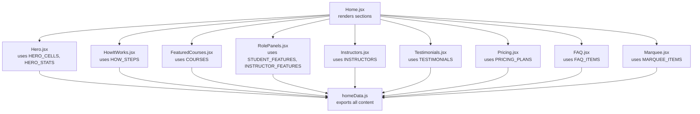

**Diagram sources**
- [Home.jsx:17-39](file://src/pages/Home/Home.jsx#L17-L39)
- [Hero.jsx:8](file://src/pages/Home/Hero.jsx#L8)
- [FeaturedCourses.jsx:7](file://src/pages/Home/FeaturedCourses.jsx#L7)
- [Instructors.jsx:7](file://src/pages/Home/Instructors.jsx#L7)
- [Pricing.jsx:7](file://src/pages/Home/Pricing.jsx#L7)
- [Testimonials.jsx:6](file://src/pages/Home/Testimonials.jsx#L6)
- [FAQ.jsx:4](file://src/pages/Home/FAQ.jsx#L4)
- [HowItWorks.jsx:6](file://src/pages/Home/HowItWorks.jsx#L6)
- [RolePanels.jsx:5](file://src/pages/Home/RolePanels.jsx#L5)
- [Marquee.jsx:2](file://src/pages/Home/Marquee.jsx#L2)
- [homeData.js:8-157](file://src/pages/Home/homeData.js#L8-L157)

**Section sources**
- [Home.jsx:17-39](file://src/pages/Home/Home.jsx#L17-L39)
- [homeData.js:8-157](file://src/pages/Home/homeData.js#L8-L157)

## Core Components
This section documents the primary data structures and their roles in the content system.

- Navigation
  - Left navigation links: array of objects with label and href.
  - Right navigation links: array of objects with label and href.
  - Footer links: grouped object map of categories to arrays of link objects.
  - Footer social links: array of link objects.

- Hero content
  - Hero cells: array of course preview objects with id, label, title, price, image.
  - Hero stats: array of value/label pairs for prominent metrics.

- How it works
  - Steps: array of step objects with id, icon, title, titleItalic, description.

- Numbers strip
  - Numbers: array of value/suffix/label/index tuples for highlights.

- Courses catalog
  - Courses: array of course objects with id, thumb, badge, badgeHot, title, instructor, rating, reviews, price, originalPrice, href.

- Role panels
  - Student features: array of feature objects with text/detail.
  - Instructor features: array of feature objects with text/detail.

- Instructors
  - Instructors: array of instructor objects with id, photo, name, field, courses, rating.

- Testimonials
  - Testimonials: array of testimonial objects with id, avatar, name, role, quote.

- Pricing plans
  - Pricing plans: array of plan objects with id, name, price, period, featured, cta, ctaHref, features array of feature objects with text/included.

- FAQ
  - FAQ items: array of question/answer objects with id, question, answer.

- Marquee
  - Marquee items: array of topic strings.

- Footer socials
  - Footer socials: array of social link objects with label and href.

**Section sources**
- [homeData.js:8-157](file://src/pages/Home/homeData.js#L8-L157)

## Architecture Overview
The data architecture follows a unidirectional flow:
- Centralized data module exports typed arrays and objects.
- Stateless functional components import and map over data to render UI.
- Responsive layout logic is handled inside components via window resize listeners.
- Dynamic content is rendered without hardcoding values in components.

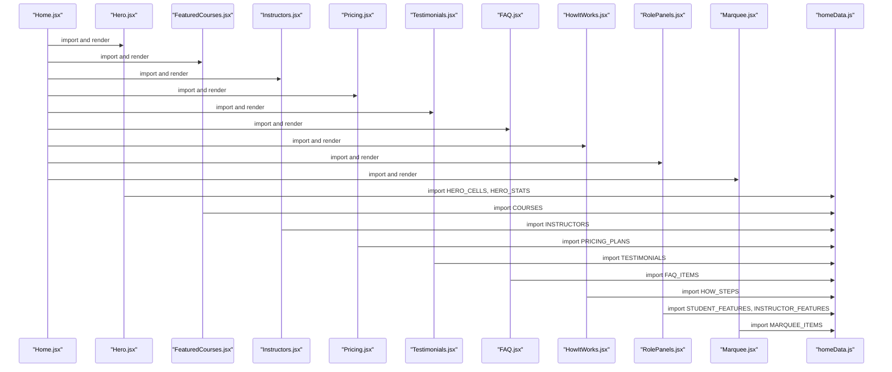

**Diagram sources**
- [Home.jsx:17-39](file://src/pages/Home/Home.jsx#L17-L39)
- [Hero.jsx:8](file://src/pages/Home/Hero.jsx#L8)
- [FeaturedCourses.jsx:7](file://src/pages/Home/FeaturedCourses.jsx#L7)
- [Instructors.jsx:7](file://src/pages/Home/Instructors.jsx#L7)
- [Pricing.jsx:7](file://src/pages/Home/Pricing.jsx#L7)
- [Testimonials.jsx:6](file://src/pages/Home/Testimonials.jsx#L6)
- [FAQ.jsx:4](file://src/pages/Home/FAQ.jsx#L4)
- [HowItWorks.jsx:6](file://src/pages/Home/HowItWorks.jsx#L6)
- [RolePanels.jsx:5](file://src/pages/Home/RolePanels.jsx#L5)
- [Marquee.jsx:2](file://src/pages/Home/Marquee.jsx#L2)
- [homeData.js:8-157](file://src/pages/Home/homeData.js#L8-L157)

## Detailed Component Analysis

### Data Model Overview
The data model is a flat, declarative structure with minimal nesting. Each dataset is an array of objects with consistent keys. This enables:
- Easy iteration and mapping in components.
- Straightforward pagination or slicing for responsive layouts.
- Minimal coupling between components and data.

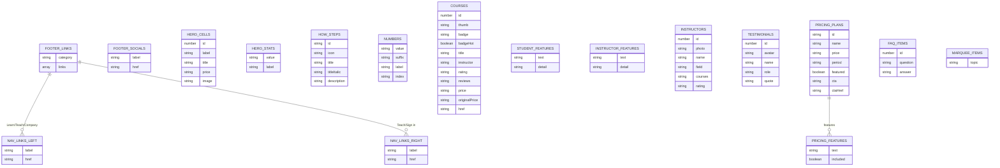

**Diagram sources**
- [homeData.js:8-157](file://src/pages/Home/homeData.js#L8-L157)

### Navigation and Footer Data
- Left/right nav arrays define anchor-based navigation.
- Footer links are grouped by category; socials provide external links.
- These structures enable consistent header/footer rendering across pages.

**Section sources**
- [homeData.js:8-17](file://src/pages/Home/homeData.js#L8-L17)
- [homeData.js:145-157](file://src/pages/Home/homeData.js#L145-L157)

### Hero Content
- Hero cells provide course previews with optional badges and pricing.
- Hero stats present high-level metrics.
- Hero.jsx composes a responsive two-column layout on desktop and a stacked layout on mobile.

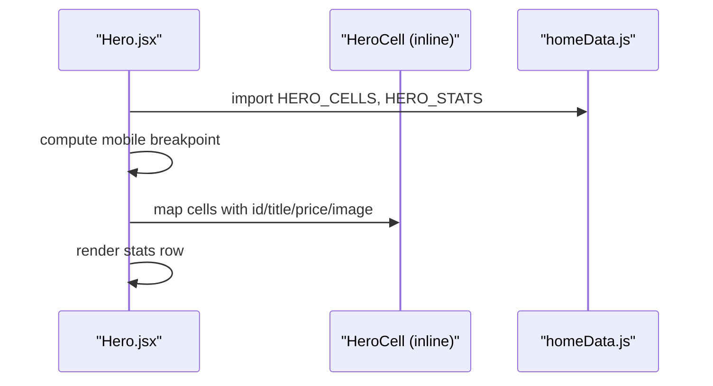

**Diagram sources**
- [Hero.jsx:8](file://src/pages/Home/Hero.jsx#L8)
- [Hero.jsx:67-86](file://src/pages/Home/Hero.jsx#L67-L86)
- [homeData.js:28-39](file://src/pages/Home/homeData.js#L28-L39)

**Section sources**
- [Hero.jsx:8-105](file://src/pages/Home/Hero.jsx#L8-L105)
- [homeData.js:28-39](file://src/pages/Home/homeData.js#L28-L39)

### Courses Catalog
- Courses are rendered as cards with thumbnail, rating, pricing, and enrollment CTA.
- FeaturedCourses.jsx controls responsive grid and reveals content progressively.

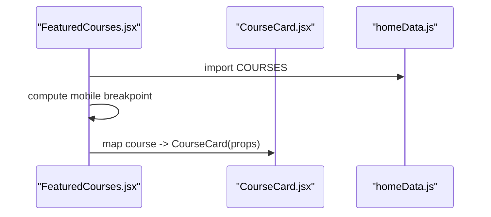

**Diagram sources**
- [FeaturedCourses.jsx:7](file://src/pages/Home/FeaturedCourses.jsx#L7)
- [FeaturedCourses.jsx:30-42](file://src/pages/Home/FeaturedCourses.jsx#L30-L42)
- [CourseCard.jsx:3](file://src/pages/Home/CourseCard.jsx#L3)
- [homeData.js:57-61](file://src/pages/Home/homeData.js#L57-L61)

**Section sources**
- [FeaturedCourses.jsx:9-46](file://src/pages/Home/FeaturedCourses.jsx#L9-L46)
- [CourseCard.jsx:3-54](file://src/pages/Home/CourseCard.jsx#L3-L54)
- [homeData.js:57-61](file://src/pages/Home/homeData.js#L57-L61)

### Instructors
- Instructors are displayed in a responsive grid with overlay text.
- Instructors.jsx dynamically adjusts columns based on viewport width.

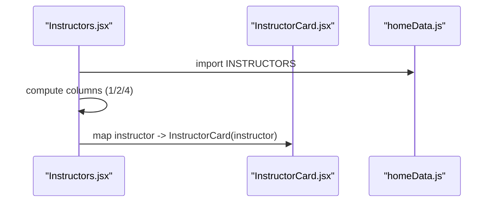

**Diagram sources**
- [Instructors.jsx:7](file://src/pages/Home/Instructors.jsx#L7)
- [Instructors.jsx:24-37](file://src/pages/Home/Instructors.jsx#L24-L37)
- [InstructorCard.jsx:6](file://src/pages/Home/InstructorCard.jsx#L6)
- [homeData.js:80-86](file://src/pages/Home/homeData.js#L80-L86)

**Section sources**
- [Instructors.jsx:9-42](file://src/pages/Home/Instructors.jsx#L9-L42)
- [InstructorCard.jsx:6-32](file://src/pages/Home/InstructorCard.jsx#L6-L32)
- [homeData.js:80-86](file://src/pages/Home/homeData.js#L80-L86)

### Testimonials
- Testimonials are rendered in a responsive grid with a slice for visible items.
- Testimonials.jsx computes visible count based on columns.

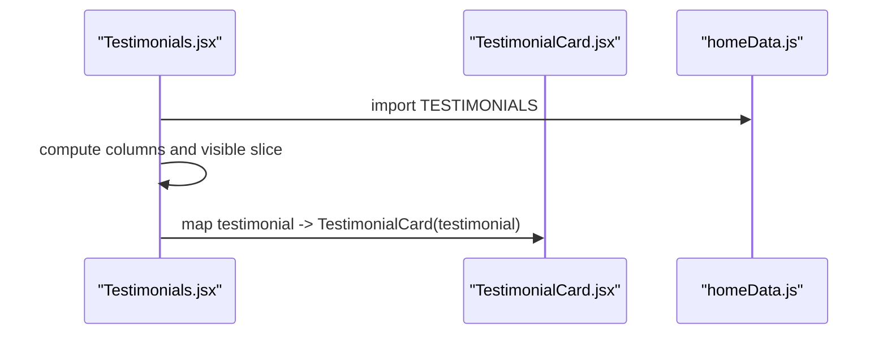

**Diagram sources**
- [Testimonials.jsx:6](file://src/pages/Home/Testimonials.jsx#L6)
- [Testimonials.jsx:15](file://src/pages/Home/Testimonials.jsx#L15)
- [TestimonialCard.jsx:4](file://src/pages/Home/TestimonialCard.jsx#L4)
- [homeData.js:88-96](file://src/pages/Home/homeData.js#L88-L96)

**Section sources**
- [Testimonials.jsx:8-42](file://src/pages/Home/Testimonials.jsx#L8-L42)
- [TestimonialCard.jsx:4-28](file://src/pages/Home/TestimonialCard.jsx#L4-L28)
- [homeData.js:88-96](file://src/pages/Home/homeData.js#L88-L96)

### Pricing Plans
- Pricing plans are rendered as columns with feature lists and CTAs.
- Pricing.jsx controls responsive grid and highlights the featured plan.

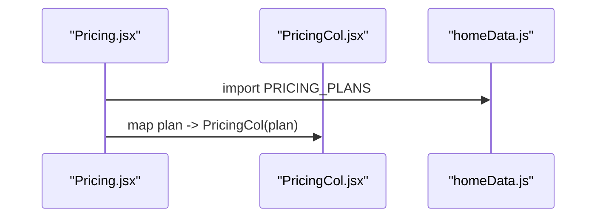

**Diagram sources**
- [Pricing.jsx:7](file://src/pages/Home/Pricing.jsx#L7)
- [Pricing.jsx:24-37](file://src/pages/Home/Pricing.jsx#L24-L37)
- [PricingCol.jsx:7](file://src/pages/Home/PricingCol.jsx#L7)
- [homeData.js:98-133](file://src/pages/Home/homeData.js#L98-L133)

**Section sources**
- [Pricing.jsx:9-41](file://src/pages/Home/Pricing.jsx#L9-L41)
- [PricingCol.jsx:7-46](file://src/pages/Home/PricingCol.jsx#L7-L46)
- [homeData.js:98-133](file://src/pages/Home/homeData.js#L98-L133)

### FAQ
- FAQ items are rendered as collapsible entries with animated chevrons.
- FAQ.jsx iterates over FAQ items and delegates to FAQItem.jsx.

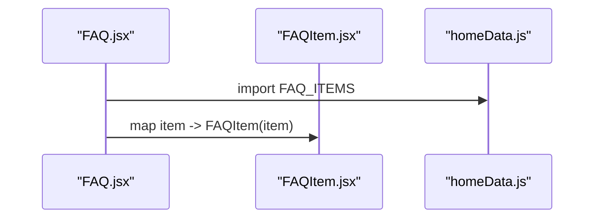

**Diagram sources**
- [FAQ.jsx:4](file://src/pages/Home/FAQ.jsx#L4)
- [FAQ.jsx:14](file://src/pages/Home/FAQ.jsx#L14)
- [FAQItem.jsx:3](file://src/pages/Home/FAQItem.jsx#L3)
- [homeData.js:135-142](file://src/pages/Home/homeData.js#L135-L142)

**Section sources**
- [FAQ.jsx:6-19](file://src/pages/Home/FAQ.jsx#L6-L19)
- [FAQItem.jsx:3-35](file://src/pages/Home/FAQItem.jsx#L3-L35)
- [homeData.js:135-142](file://src/pages/Home/homeData.js#L135-L142)

### How It Works
- Three-step process with icons, titles, and descriptions.
- HowItWorks.jsx renders a responsive grid with ghost numbering.

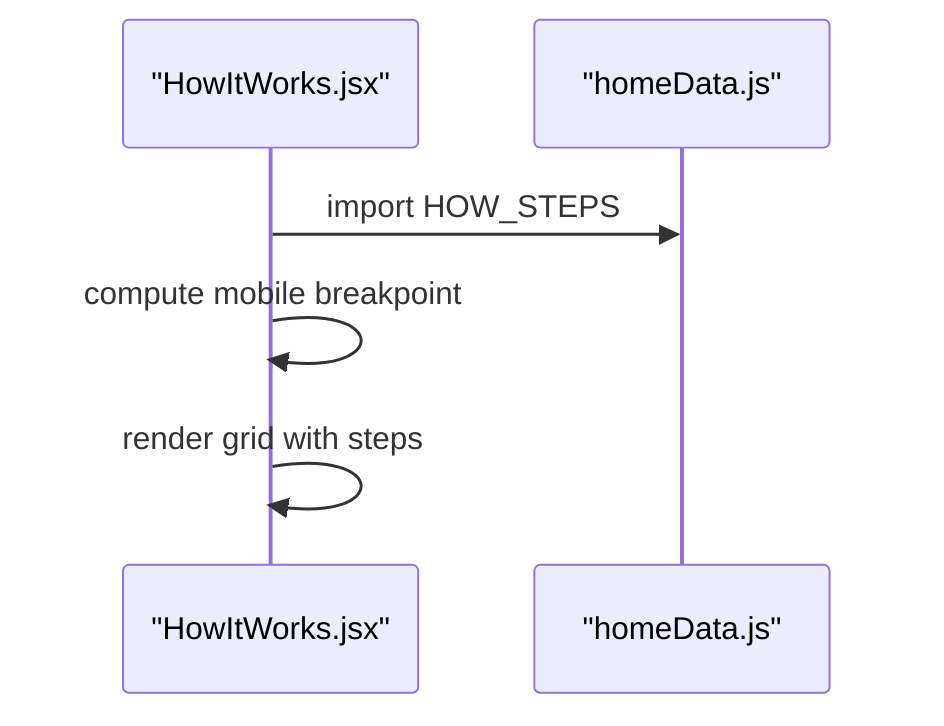

**Diagram sources**
- [HowItWorks.jsx:6](file://src/pages/Home/HowItWorks.jsx#L6)
- [HowItWorks.jsx:26-50](file://src/pages/Home/HowItWorks.jsx#L26-L50)
- [homeData.js:42-46](file://src/pages/Home/homeData.js#L42-L46)

**Section sources**
- [HowItWorks.jsx:8-54](file://src/pages/Home/HowItWorks.jsx#L8-L54)
- [homeData.js:42-46](file://src/pages/Home/homeData.js#L42-L46)

### Role Panels
- Two side-by-side panels for students and instructors with contrasting themes.
- RolePanels.jsx imports feature arrays and renders them as lists.

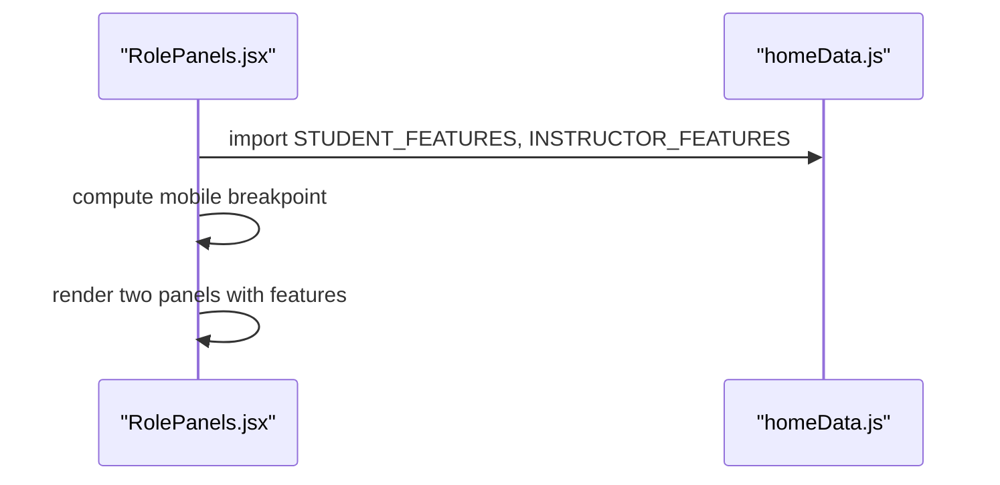

**Diagram sources**
- [RolePanels.jsx:5](file://src/pages/Home/RolePanels.jsx#L5)
- [RolePanels.jsx:34-72](file://src/pages/Home/RolePanels.jsx#L34-L72)
- [homeData.js:64-78](file://src/pages/Home/homeData.js#L64-L78)

**Section sources**
- [RolePanels.jsx:7-73](file://src/pages/Home/RolePanels.jsx#L7-L73)
- [homeData.js:64-78](file://src/pages/Home/homeData.js#L64-L78)

### Marquee
- Infinite horizontal scroller of topics using duplicated items for seamless looping.

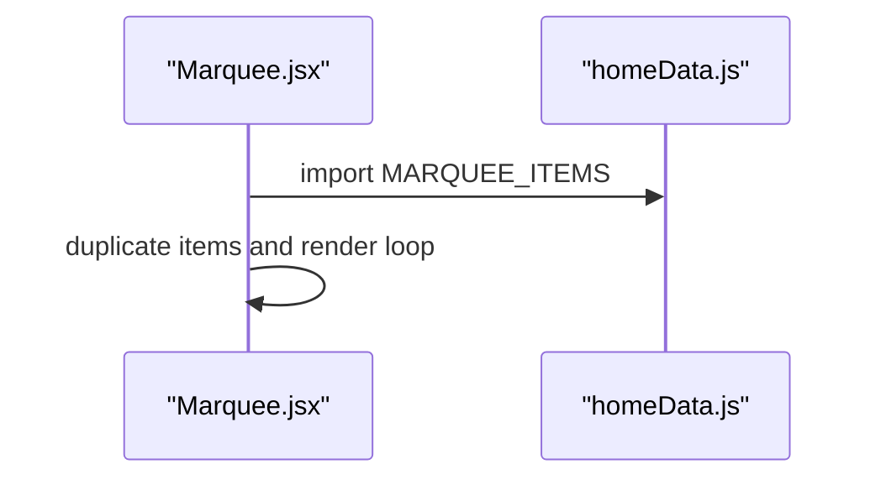

**Diagram sources**
- [Marquee.jsx:2](file://src/pages/Home/Marquee.jsx#L2)
- [Marquee.jsx:5](file://src/pages/Home/Marquee.jsx#L5)
- [homeData.js:20-25](file://src/pages/Home/homeData.js#L20-L25)

**Section sources**
- [Marquee.jsx:4-19](file://src/pages/Home/Marquee.jsx#L4-L19)
- [homeData.js:20-25](file://src/pages/Home/homeData.js#L20-L25)

## Dependency Analysis
- Cohesion: Each component imports only the data it needs, keeping modules cohesive.
- Coupling: Components depend on stable prop contracts defined by homeData.js exports.
- Data flow: One-way data flow from homeData.js to components; no reverse binding is implemented.
- External dependencies: None for data; images are referenced via URLs.

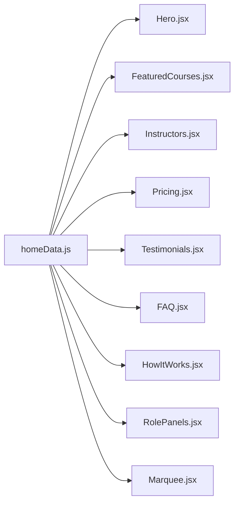

**Diagram sources**
- [homeData.js:8-157](file://src/pages/Home/homeData.js#L8-L157)
- [Hero.jsx:8](file://src/pages/Home/Hero.jsx#L8)
- [FeaturedCourses.jsx:7](file://src/pages/Home/FeaturedCourses.jsx#L7)
- [Instructors.jsx:7](file://src/pages/Home/Instructors.jsx#L7)
- [Pricing.jsx:7](file://src/pages/Home/Pricing.jsx#L7)
- [Testimonials.jsx:6](file://src/pages/Home/Testimonials.jsx#L6)
- [FAQ.jsx:4](file://src/pages/Home/FAQ.jsx#L4)
- [HowItWorks.jsx:6](file://src/pages/Home/HowItWorks.jsx#L6)
- [RolePanels.jsx:5](file://src/pages/Home/RolePanels.jsx#L5)
- [Marquee.jsx:2](file://src/pages/Home/Marquee.jsx#L2)

**Section sources**
- [Hero.jsx:8](file://src/pages/Home/Hero.jsx#L8)
- [FeaturedCourses.jsx:7](file://src/pages/Home/FeaturedCourses.jsx#L7)
- [Instructors.jsx:7](file://src/pages/Home/Instructors.jsx#L7)
- [Pricing.jsx:7](file://src/pages/Home/Pricing.jsx#L7)
- [Testimonials.jsx:6](file://src/pages/Home/Testimonials.jsx#L6)
- [FAQ.jsx:4](file://src/pages/Home/FAQ.jsx#L4)
- [HowItWorks.jsx:6](file://src/pages/Home/HowItWorks.jsx#L6)
- [RolePanels.jsx:5](file://src/pages/Home/RolePanels.jsx#L5)
- [Marquee.jsx:2](file://src/pages/Home/Marquee.jsx#L2)
- [homeData.js:8-157](file://src/pages/Home/homeData.js#L8-L157)

## Performance Considerations
- Rendering large lists
  - Use component-level responsive slicing and reveal patterns to avoid rendering unnecessary DOM nodes on small screens.
  - Example: Testimonials.jsx slices visible items based on column count.

- Image optimization
  - Pre-sized images with compression hints are used; ensure lazy loading is considered for offscreen images.

- Memory and re-renders
  - Keep data arrays immutable; pass stable keys (ids) to map to minimize re-renders.
  - Avoid anonymous functions in props; reuse memoized callbacks when adding interactivity.

- Dynamic breakpoints
  - Components compute breakpoints on mount and on resize; ensure cleanup of event listeners to prevent leaks.

- Feature flags and toggles
  - Boolean flags (e.g., badgeHot, featured) are used to toggle styles; keep these flags minimal and explicit.

[No sources needed since this section provides general guidance]

## Troubleshooting Guide
- Data shape mismatches
  - Verify that each exported array contains objects with required keys. For example, courses require id, thumb, title, instructor, rating, reviews, price, originalPrice, href.

- Missing assets
  - If images do not load, confirm image URLs are reachable and CORS allows embedding.

- Layout glitches
  - If borders or spacing appear incorrect, check computed grid styles and responsive breakpoints in components.

- Accessibility
  - Ensure interactive elements (buttons, FAQ toggles) are keyboard accessible and have proper ARIA attributes.

**Section sources**
- [homeData.js:57-61](file://src/pages/Home/homeData.js#L57-L61)
- [homeData.js:80-86](file://src/pages/Home/homeData.js#L80-L86)
- [homeData.js:98-133](file://src/pages/Home/homeData.js#L98-L133)
- [homeData.js:135-142](file://src/pages/Home/homeData.js#L135-L142)

## Conclusion
CourseCraft’s Home page employs a centralized, declarative data model that cleanly separates content from presentation. Components import specific datasets and render responsive, accessible UI. The approach supports straightforward content updates, predictable rendering, and scalable growth. Extending or modifying content requires updating homeData.js and ensuring component props remain aligned.

[No sources needed since this section summarizes without analyzing specific files]

## Appendices

### Data Validation Approaches
- Runtime checks: Validate presence of required keys before rendering.
- Type checks: Confirm numeric fields (rating, reviews) and boolean flags (badgeHot, featured) are correctly typed.
- Defaults: Provide fallbacks for missing optional fields to avoid undefined rendering.

### Content Localization Strategies
- Extract strings into locale-specific modules while preserving key contracts.
- Keep keys stable across locales to simplify translations.
- Separate static strings from dynamic values (e.g., prices) to avoid translation errors.

### Dynamic Content Loading Mechanisms
- Current implementation loads all data statically at build time.
- For large datasets, consider:
  - Pagination or virtualization for long lists.
  - On-demand fetching for frequently changing content (e.g., testimonials).
  - Client-side caching with cache keys derived from timestamps or version numbers.

### Caching Strategies
- Browser cache: Leverage ETags or cache-control headers for static assets.
- Application cache: Store fetched content keyed by dataset id and version.
- Invalidate stale content by bumping a content version flag.

### Content Management Workflows
- Editors modify homeData.js exports directly.
- Review and approval: Use pull requests to review changes to data structures and values.
- Rollout: Merge approved changes; monitor rendering across devices.

### Editing Procedures
- Identify the export to edit (e.g., COURSES, INSTRUCTORS).
- Add or update objects with required keys.
- Verify component rendering and responsiveness.
- Run accessibility checks and cross-browser tests.

### Versioning Considerations
- Introduce a content version field in homeData.js.
- Components can opt-in to version-aware rendering.
- Increment version on breaking changes to force refreshes.

[No sources needed since this section provides general guidance]