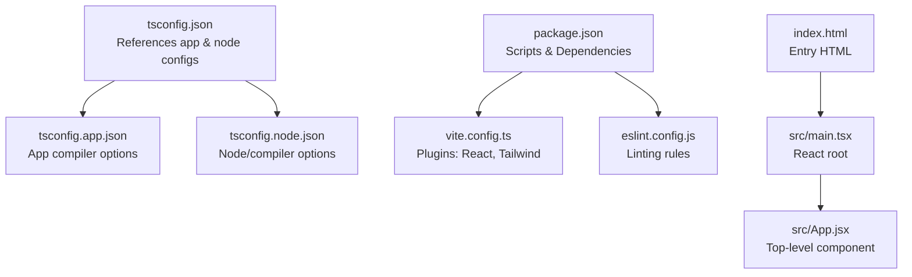
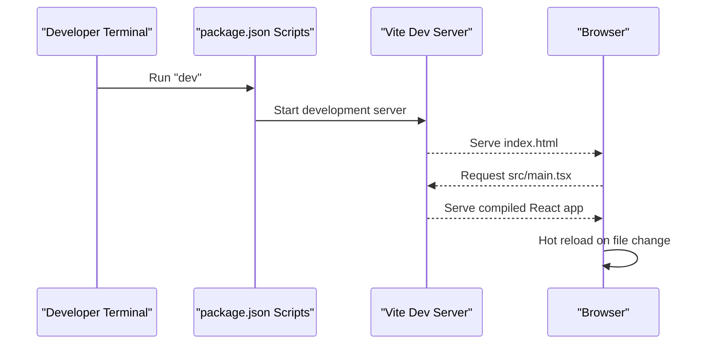
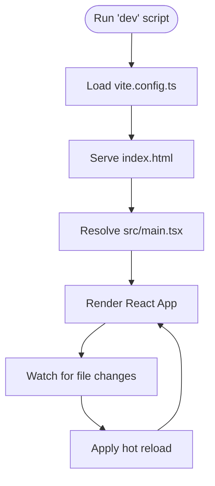
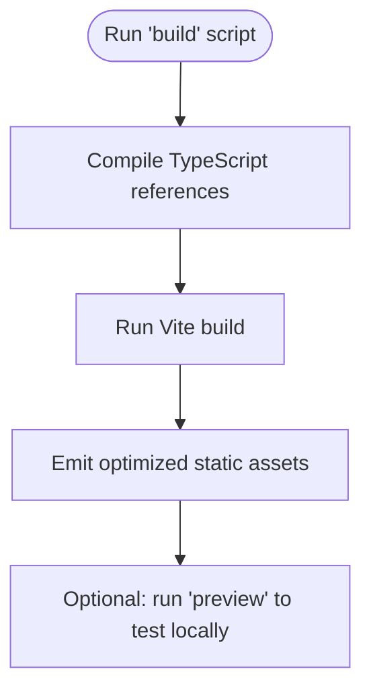
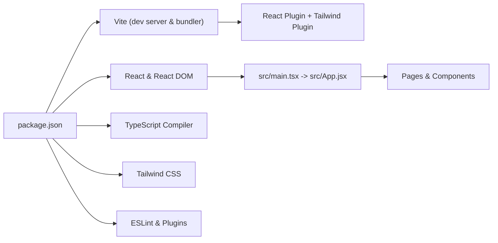

# Getting Started

<cite>
**Referenced Files in This Document**
- [package.json](file://package.json)
- [vite.config.ts](file://vite.config.ts)
- [tsconfig.json](file://tsconfig.json)
- [tsconfig.app.json](file://tsconfig.app.json)
- [tsconfig.node.json](file://tsconfig.node.json)
- [eslint.config.js](file://eslint.config.js)
- [src/main.tsx](file://src/main.tsx)
- [src/App.jsx](file://src/App.jsx)
- [index.html](file://index.html)
</cite>

## Table of Contents
1. [Introduction](#introduction)
2. [Project Structure](#project-structure)
3. [Core Components](#core-components)
4. [Architecture Overview](#architecture-overview)
5. [Detailed Component Analysis](#detailed-component-analysis)
6. [Dependency Analysis](#dependency-analysis)
7. [Performance Considerations](#performance-considerations)
8. [Troubleshooting Guide](#troubleshooting-guide)
9. [Conclusion](#conclusion)
10. [Appendices](#appendices)

## Introduction
This guide helps you set up the CourseCraft development environment from scratch. It covers prerequisites, installation steps, running the development server with hot reload, building for production, configuring environment variables, and troubleshooting common issues. The project uses Vite for fast builds and React with TypeScript for the frontend.

## Project Structure
The repository is a modern React + TypeScript single-page application configured with Vite. Key files and roles:
- package.json defines scripts, dependencies, and devDependencies.
- vite.config.ts configures Vite with React and Tailwind CSS plugins.
- tsconfig.json orchestrates app and node TypeScript projects.
- src/main.tsx is the React root entry point.
- index.html bootstraps the app in the browser.
- eslint.config.js configures linting for TypeScript and React.

**Diagram sources**
- [package.json:1-38](file://package.json#L1-L38)
- [vite.config.ts:1-8](file://vite.config.ts#L1-L8)
- [tsconfig.json:1-8](file://tsconfig.json#L1-L8)
- [tsconfig.app.json:1-29](file://tsconfig.app.json#L1-L29)
- [tsconfig.node.json:1-27](file://tsconfig.node.json#L1-L27)
- [index.html:1-15](file://index.html#L1-L15)
- [src/main.tsx:1-11](file://src/main.tsx#L1-L11)
- [src/App.jsx:1-10](file://src/App.jsx#L1-L10)
- [eslint.config.js:1-19](file://eslint.config.js#L1-L19)

**Section sources**
- [package.json:1-38](file://package.json#L1-L38)
- [vite.config.ts:1-8](file://vite.config.ts#L1-L8)
- [tsconfig.json:1-8](file://tsconfig.json#L1-L8)
- [tsconfig.app.json:1-29](file://tsconfig.app.json#L1-L29)
- [tsconfig.node.json:1-27](file://tsconfig.node.json#L1-L27)
- [index.html:1-15](file://index.html#L1-L15)
- [src/main.tsx:1-11](file://src/main.tsx#L1-L11)
- [src/App.jsx:1-10](file://src/App.jsx#L1-L10)
- [eslint.config.js:1-19](file://eslint.config.js#L1-L19)

## Core Components
- Build and Dev Scripts
  - Development server: runs Vite with hot module replacement.
  - Production build: compiles TypeScript declarations and bundles assets via Vite.
  - Preview: serves built assets locally for testing.
  - Lint: runs ESLint across the project.
- Plugins and Tools
  - React plugin for Vite.
  - Tailwind CSS integration via a dedicated Vite plugin.
  - TypeScript compiler and type checking for the app.
  - ESLint with TypeScript, React hooks, and React Refresh presets.
- Entry Points
  - index.html mounts the React root.
  - src/main.tsx renders the App component.
  - src/App.jsx composes page-level components.

Practical commands (described):
- Install dependencies using your package manager.
- Start the dev server.
- Build for production.
- Preview the production build locally.
- Run linter checks.

**Section sources**
- [package.json:6-11](file://package.json#L6-L11)
- [vite.config.ts:5-7](file://vite.config.ts#L5-L7)
- [tsconfig.app.json:11-17](file://tsconfig.app.json#L11-L17)
- [eslint.config.js:8-18](file://eslint.config.js#L8-L18)
- [src/main.tsx:1-11](file://src/main.tsx#L1-L11)
- [src/App.jsx:1-10](file://src/App.jsx#L1-L10)
- [index.html:10-12](file://index.html#L10-L12)

## Architecture Overview
The runtime architecture is a browser-based React application initialized by Vite. The development server injects modules with hot reload, while the production build bundles static assets.

**Diagram sources**
- [package.json:7](file://package.json#L7)
- [index.html:10-12](file://index.html#L10-L12)
- [src/main.tsx:1-11](file://src/main.tsx#L1-L11)

## Detailed Component Analysis

### Development Server and Hot Reload
- Start the dev server using the script defined in package.json.
- Vite serves index.html and resolves module requests.
- Hot reload updates occur automatically when source files change.

**Diagram sources**
- [package.json:7](file://package.json#L7)
- [vite.config.ts:5-7](file://vite.config.ts#L5-L7)
- [index.html:10-12](file://index.html#L10-L12)
- [src/main.tsx:1-11](file://src/main.tsx#L1-L11)

**Section sources**
- [package.json:7](file://package.json#L7)
- [vite.config.ts:5-7](file://vite.config.ts#L5-L7)
- [index.html:10-12](file://index.html#L10-L12)
- [src/main.tsx:1-11](file://src/main.tsx#L1-L11)

### Build Process for Production
- The build script compiles TypeScript project references and then bundles assets with Vite.
- After building, you can preview the production bundle locally to validate.

**Diagram sources**
- [package.json:8](file://package.json#L8)
- [tsconfig.json:3-6](file://tsconfig.json#L3-L6)

**Section sources**
- [package.json:8](file://package.json#L8)
- [tsconfig.json:3-6](file://tsconfig.json#L3-L6)

### Environment Variables and Configuration
- No explicit environment variable files are present in the repository snapshot.
- Vite supports environment variables loaded from files named with a VITE_ prefix in specific locations recognized by Vite.
- Configure environment variables per Vite’s convention if your project requires them.

[No sources needed since this section provides general guidance]

### Local Development Workflow
- Clone the repository and install dependencies.
- Start the dev server and open the browser to the Vite dev address.
- Edit files to see hot reload in action.
- Use the preview command to test production-like behavior locally.

[No sources needed since this section provides general guidance]

## Dependency Analysis
The project relies on Vite, React, TypeScript, and Tailwind CSS. The dependency graph below reflects the primary runtime and build-time relationships.

**Diagram sources**
- [package.json:12-36](file://package.json#L12-L36)
- [vite.config.ts:5-7](file://vite.config.ts#L5-L7)
- [src/main.tsx:1-11](file://src/main.tsx#L1-L11)
- [src/App.jsx:1-10](file://src/App.jsx#L1-L10)

**Section sources**
- [package.json:12-36](file://package.json#L12-L36)
- [vite.config.ts:5-7](file://vite.config.ts#L5-L7)
- [src/main.tsx:1-11](file://src/main.tsx#L1-L11)
- [src/App.jsx:1-10](file://src/App.jsx#L1-L10)

## Performance Considerations
- Keep dependencies minimal and aligned with the project’s plugin stack.
- Prefer tree-shaking by importing only what you need.
- Use the preview command after building to catch performance regressions early.

[No sources needed since this section provides general guidance]

## Troubleshooting Guide
- Node.js and Package Manager
  - Ensure you are using a current LTS or recent stable Node.js version compatible with the project’s toolchain.
  - Use a package manager compatible with the lockfile (as indicated by the presence of a lockfile).
- Installing Dependencies
  - Run your package manager’s install command to populate node_modules.
- Vite Dev Server Issues
  - Verify the dev script exists and Vite is installed.
  - Confirm index.html is served and the root element exists.
- React Runtime Errors
  - Ensure the React and ReactDOM versions match the project’s expectations.
  - Verify the React root is rendering the App component.
- TypeScript Errors
  - Check that TypeScript references are configured correctly and the app/tsconfig aligns with bundler mode.
- ESLint Errors
  - Run the lint script to identify and fix issues flagged by the configured rules.
- Tailwind CSS Not Applied
  - Confirm Tailwind plugin is enabled in Vite and Tailwind directives are present in your CSS.

**Section sources**
- [package.json:6-11](file://package.json#L6-L11)
- [index.html:10-12](file://index.html#L10-L12)
- [src/main.tsx:1-11](file://src/main.tsx#L1-L11)
- [src/App.jsx:1-10](file://src/App.jsx#L1-L10)
- [tsconfig.app.json:11-17](file://tsconfig.app.json#L11-L17)
- [eslint.config.js:8-18](file://eslint.config.js#L8-L18)

## Conclusion
You now have the essentials to set up CourseCraft locally, run the development server with hot reload, build for production, and troubleshoot common issues. Continue iterating on the React and TypeScript foundation, and leverage Vite’s fast rebuilds for a smooth development experience.

## Appendices

### Prerequisites Checklist
- Node.js: Use a current LTS or recent stable version compatible with the project’s toolchain.
- Package Manager: Use the same package manager as the lockfile indicates.
- Text Editor or IDE: Recommended extensions for React, TypeScript, and Tailwind CSS.

[No sources needed since this section provides general guidance]

### Step-by-Step Setup
- Clone the repository.
- Install dependencies using your package manager.
- Start the development server.
- Open the application in your browser.
- Build for production and preview locally if needed.
- Run the linter to keep code quality consistent.

[No sources needed since this section provides general guidance]

### IDE Configuration Recommendations
- Enable TypeScript checking in your editor.
- Install React and Tailwind CSS extensions.
- Configure ESLint integration to surface issues during editing.
- Set up format-on-save with Prettier if configured by your team.

[No sources needed since this section provides general guidance]