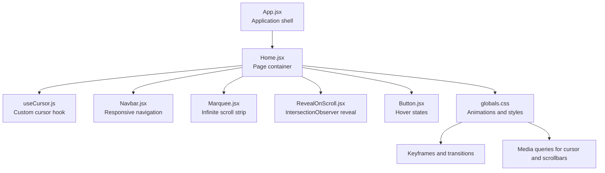
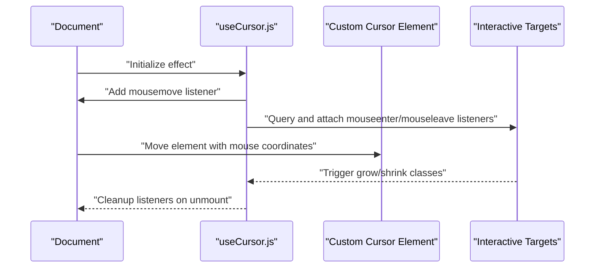
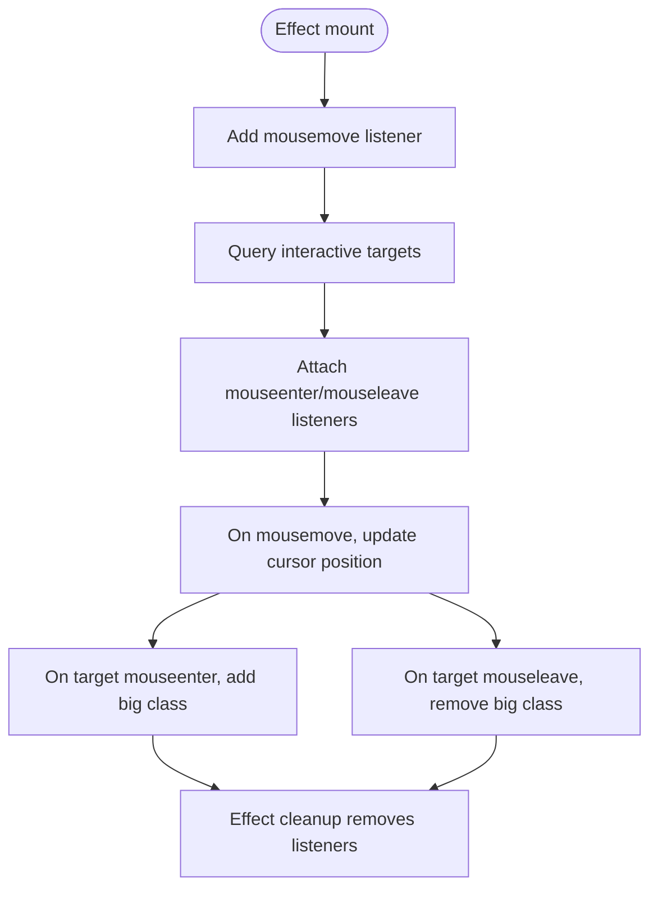
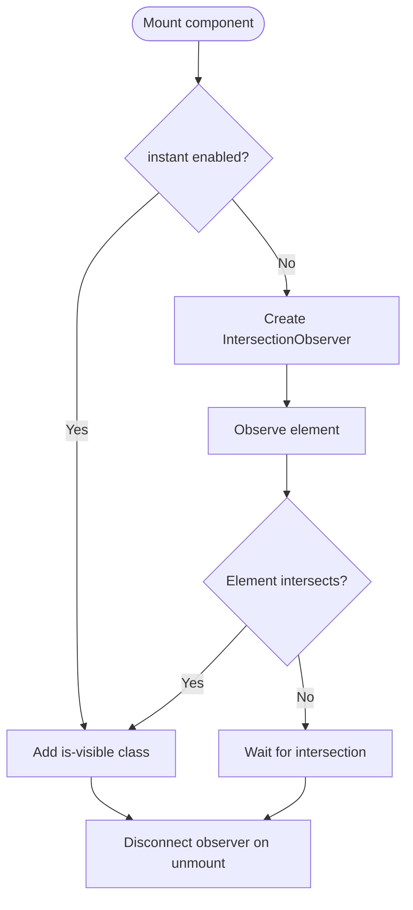
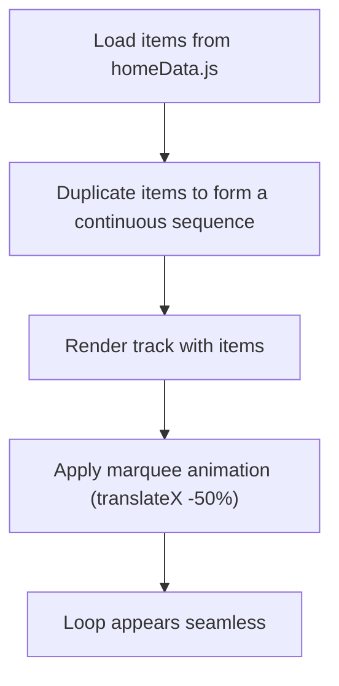
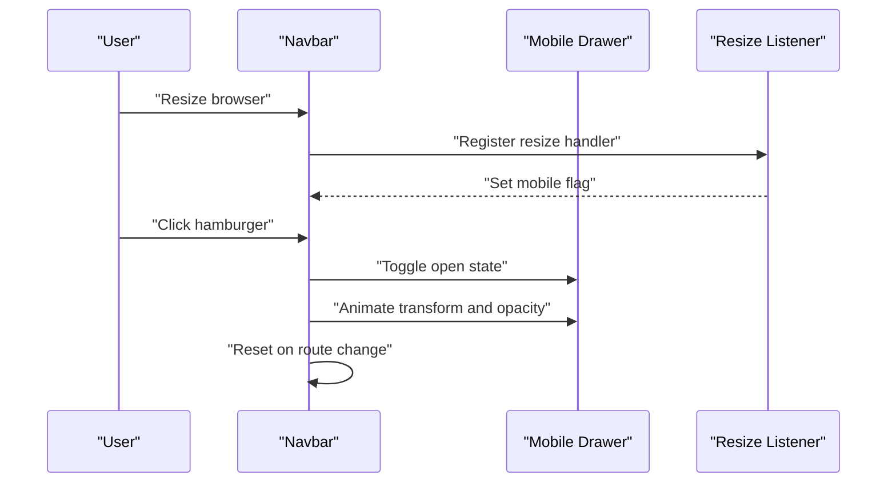
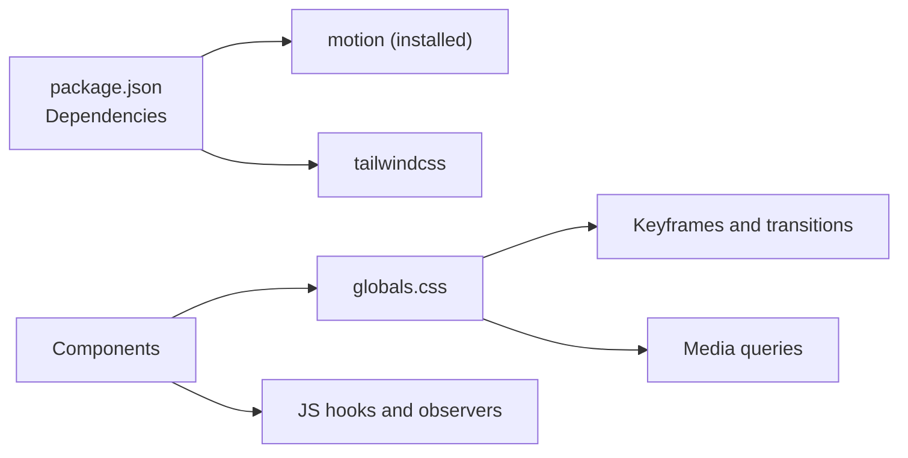

# Interactive Features

<cite>
**Referenced Files in This Document**
- [useCursor.js](file://src/pages/Home/useCursor.js)
- [Marquee.jsx](file://src/pages/Home/Marquee.jsx)
- [RevealOnScroll.jsx](file://src/pages/Home/RevealOnScroll.jsx)
- [Navbar.jsx](file://src/pages/Home/Navbar.jsx)
- [Button.jsx](file://src/pages/Home/Button.jsx)
- [globals.css](file://src/pages/Home/globals.css)
- [homeData.js](file://src/pages/Home/homeData.js)
- [Home.jsx](file://src/pages/Home/Home.jsx)
- [App.jsx](file://src/App.jsx)
- [main.tsx](file://src/main.tsx)
- [package.json](file://package.json)
</cite>

## Table of Contents
1. [Introduction](#introduction)
2. [Project Structure](#project-structure)
3. [Core Components](#core-components)
4. [Architecture Overview](#architecture-overview)
5. [Detailed Component Analysis](#detailed-component-analysis)
6. [Dependency Analysis](#dependency-analysis)
7. [Performance Considerations](#performance-considerations)
8. [Accessibility and Progressive Enhancement](#accessibility-and-progressive-enhancement)
9. [Mobile and Touch Interactions](#mobile-and-touch-interactions)
10. [Troubleshooting Guide](#troubleshooting-guide)
11. [Conclusion](#conclusion)
12. [Appendices](#appendices)

## Introduction
This document explains CourseCraft’s interactive and animated features with a focus on:
- Custom cursor behavior via a React hook and CSS
- Scroll-reveal animations using IntersectionObserver
- Infinite marquee scrolling
- Responsive navigation with mobile drawer behavior
- Animation library integration and performance optimization
- Cross-browser compatibility and accessibility
- Progressive enhancement strategies
- Mobile touch interactions and performance monitoring guidance

## Project Structure
The interactive features are primarily implemented in the Home page and its supporting components. The Home page composes the interactive elements and wires them into the application shell.

**Diagram sources**
- [App.jsx:1-10](file://src/App.jsx#L1-L10)
- [Home.jsx:1-40](file://src/pages/Home/Home.jsx#L1-L40)
- [useCursor.js:1-29](file://src/pages/Home/useCursor.js#L1-L29)
- [Navbar.jsx:1-153](file://src/pages/Home/Navbar.jsx#L1-L153)
- [Marquee.jsx:1-19](file://src/pages/Home/Marquee.jsx#L1-L19)
- [RevealOnScroll.jsx:1-28](file://src/pages/Home/RevealOnScroll.jsx#L1-L28)
- [Button.jsx:1-30](file://src/pages/Home/Button.jsx#L1-L30)
- [globals.css:1-146](file://src/pages/Home/globals.css#L1-L146)

**Section sources**
- [App.jsx:1-10](file://src/App.jsx#L1-L10)
- [Home.jsx:1-40](file://src/pages/Home/Home.jsx#L1-L40)

## Core Components
- Custom cursor hook: Tracks mouse movement and toggles hover states on interactive targets.
- Scroll-reveal component: Uses IntersectionObserver to animate elements into view.
- Marquee component: Renders a duplicated list to achieve seamless infinite loop.
- Navigation: Desktop vs. mobile behavior with animated drawer and hover states.
- Buttons: Hover-driven visual feedback with variant styling.

**Section sources**
- [useCursor.js:1-29](file://src/pages/Home/useCursor.js#L1-L29)
- [RevealOnScroll.jsx:1-28](file://src/pages/Home/RevealOnScroll.jsx#L1-L28)
- [Marquee.jsx:1-19](file://src/pages/Home/Marquee.jsx#L1-L19)
- [Navbar.jsx:1-153](file://src/pages/Home/Navbar.jsx#L1-L153)
- [Button.jsx:1-30](file://src/pages/Home/Button.jsx#L1-L30)

## Architecture Overview
The interactive features are composed at the Home page level and styled via a centralized stylesheet. The cursor hook is attached to the root of the Home page, while other components rely on CSS animations and IntersectionObserver.

**Diagram sources**
- [useCursor.js:7-25](file://src/pages/Home/useCursor.js#L7-L25)
- [globals.css:80-105](file://src/pages/Home/globals.css#L80-L105)

**Section sources**
- [Home.jsx:17-22](file://src/pages/Home/Home.jsx#L17-L22)
- [useCursor.js:1-29](file://src/pages/Home/useCursor.js#L1-L29)
- [globals.css:17-146](file://src/pages/Home/globals.css#L17-L146)

## Detailed Component Analysis

### Custom Cursor Implementation (useCursor.js)
- Purpose: Replace the default OS cursor with a custom red dot that grows on hover over interactive elements.
- Behavior:
  - Listens to mousemove on the document to position the custom cursor element.
  - Adds/removes a “big” class on interactive targets (links, buttons, articles, role="button") to scale the cursor.
  - Cleans up event listeners on component unmount.
- Styling:
  - Cursor element is positioned absolutely, pointer-events-none to avoid interfering with interactions.
  - Transitions for width, height, and background provide smooth scaling and color blending.
  - Disabled on small screens to preserve usability.

**Diagram sources**
- [useCursor.js:7-25](file://src/pages/Home/useCursor.js#L7-L25)
- [globals.css:80-105](file://src/pages/Home/globals.css#L80-L105)

**Section sources**
- [useCursor.js:1-29](file://src/pages/Home/useCursor.js#L1-L29)
- [globals.css:80-105](file://src/pages/Home/globals.css#L80-L105)

### Scroll-Reveal Animations (RevealOnScroll.jsx)
- Purpose: Fade and lift elements into view when they enter the viewport.
- Behavior:
  - Uses IntersectionObserver with a root margin to trigger when elements are above the bottom of the viewport.
  - Adds an “is-visible” class to reveal the element.
  - Supports optional instant mode for above-the-fold content.
  - Provides delay variants via className suffixes.

**Diagram sources**
- [RevealOnScroll.jsx:10-20](file://src/pages/Home/RevealOnScroll.jsx#L10-L20)
- [globals.css:107-128](file://src/pages/Home/globals.css#L107-L128)

**Section sources**
- [RevealOnScroll.jsx:1-28](file://src/pages/Home/RevealOnScroll.jsx#L1-L28)
- [globals.css:107-128](file://src/pages/Home/globals.css#L107-L128)

### Infinite Marquee Scrolling (Marquee.jsx)
- Purpose: Display a horizontal strip of topics that loops seamlessly.
- Behavior:
  - Doubles the list of items to create a continuous loop.
  - Applies a CSS animation with a named keyframes to translate the track.
  - Uses a mono font and tight spacing for readability.

**Diagram sources**
- [Marquee.jsx:4-18](file://src/pages/Home/Marquee.jsx#L4-L18)
- [homeData.js:20-25](file://src/pages/Home/homeData.js#L20-L25)
- [globals.css:17-29](file://src/pages/Home/globals.css#L17-L29)
- [globals.css:129-133](file://src/pages/Home/globals.css#L129-L133)

**Section sources**
- [Marquee.jsx:1-19](file://src/pages/Home/Marquee.jsx#L1-L19)
- [homeData.js:19-25](file://src/pages/Home/homeData.js#L19-L25)
- [globals.css:17-29](file://src/pages/Home/globals.css#L17-L29)
- [globals.css:129-133](file://src/pages/Home/globals.css#L129-L133)

### Responsive Navigation (Navbar.jsx)
- Desktop:
  - Left and right groups of links with a centered logo.
  - Links toggle hover backgrounds with transitions.
- Mobile (<768px):
  - Hamburger menu opens a slide-down drawer with animated transform and opacity.
  - Drawer closes on route change and on resize to desktop.
- Accessibility:
  - Button includes aria-label that reflects open/close state.
  - Focus-friendly transitions and clear visual states.

**Diagram sources**
- [Navbar.jsx:14-26](file://src/pages/Home/Navbar.jsx#L14-L26)
- [Navbar.jsx:70-133](file://src/pages/Home/Navbar.jsx#L70-L133)

**Section sources**
- [Navbar.jsx:1-153](file://src/pages/Home/Navbar.jsx#L1-L153)

### Button Hover Feedback (Button.jsx)
- Purpose: Provide immediate visual feedback on hover for primary, outline, and light-outline variants.
- Behavior:
  - Tracks hover state internally.
  - Switches between idle and hover classes based on variant.
  - Uses transitions for smooth color and border changes.

**Section sources**
- [Button.jsx:1-30](file://src/pages/Home/Button.jsx#L1-L30)

## Dependency Analysis
- Animation libraries:
  - The project includes a motion library dependency but does not appear to use it in the interactive components documented here.
- CSS animations:
  - Marquee relies on a named keyframes animation.
  - RevealOnScroll relies on CSS transitions controlled by a class.
  - Custom cursor relies on CSS transitions and blend modes.
- Browser compatibility:
  - Uses IntersectionObserver for scroll-reveal.
  - Uses CSS transforms and keyframes for animations.
  - Includes media queries for cursor and scrollbar behavior.

**Diagram sources**
- [package.json:12-18](file://package.json#L12-L18)
- [globals.css:17-29](file://src/pages/Home/globals.css#L17-L29)
- [globals.css:107-133](file://src/pages/Home/globals.css#L107-L133)

**Section sources**
- [package.json:12-18](file://package.json#L12-L18)
- [globals.css:17-133](file://src/pages/Home/globals.css#L17-L133)

## Performance Considerations
- Event throttling:
  - Mousemove events can be frequent; consider debouncing cursor movement if performance issues arise on low-end devices.
- IntersectionObserver:
  - Already used efficiently; ensure thresholds and margins are tuned to reduce unnecessary reflows.
- CSS animations:
  - Prefer transform and opacity for GPU acceleration.
  - Keep keyframes simple; avoid expensive properties like “filter”.
- Cleanup:
  - Ensure event listeners and observers are removed on unmount to prevent memory leaks.
- Motion library:
  - If adopted, use it for complex animations and leverage its built-in optimizations.

[No sources needed since this section provides general guidance]

## Accessibility and Progressive Enhancement
- Reduced motion:
  - Consider adding a prefers-reduced-motion check to disable or shorten animations.
- Keyboard navigation:
  - Ensure hover-only states are complemented by focus-visible states for keyboard users.
- Semantic markup:
  - Use role="button" consistently for non-native buttons.
- Graceful degradation:
  - Remove custom cursor on small screens and ensure core interactions remain functional without JS.
- ARIA:
  - Use aria-expanded on the mobile drawer button to reflect open/closed state.

[No sources needed since this section provides general guidance]

## Mobile and Touch Interactions
- Touch cursor:
  - Custom cursor is disabled on small screens to avoid conflicts with native touch interactions.
- Touch-friendly targets:
  - Ensure interactive elements meet minimum touch target sizes.
- Gesture handling:
  - No explicit gesture handlers are present; consider adding tap/click handlers for mobile-specific actions.
- Drawer behavior:
  - Slide-down drawer uses CSS transforms and timing functions for smoothness.

**Section sources**
- [globals.css:68-72](file://src/pages/Home/globals.css#L68-L72)
- [Navbar.jsx:70-133](file://src/pages/Home/Navbar.jsx#L70-L133)

## Troubleshooting Guide
- Cursor not moving:
  - Verify the cursor element is mounted and the effect runs.
  - Confirm that interactive targets exist and listeners are attached.
- Hover scaling not working:
  - Ensure the “cursor--big” class is defined and applied on mouseenter/mouseleave.
- Reveal not triggering:
  - Check IntersectionObserver thresholds and rootMargin.
  - Ensure the element has layout and is not hidden.
- Marquee not animating:
  - Confirm the keyframes are defined and the track applies the animation property.
- Drawer not closing:
  - Verify route and resize listeners are registered and cleaned up.

**Section sources**
- [useCursor.js:7-25](file://src/pages/Home/useCursor.js#L7-L25)
- [RevealOnScroll.jsx:10-20](file://src/pages/Home/RevealOnScroll.jsx#L10-L20)
- [globals.css:17-29](file://src/pages/Home/globals.css#L17-L29)
- [globals.css:129-133](file://src/pages/Home/globals.css#L129-L133)
- [Navbar.jsx:14-26](file://src/pages/Home/Navbar.jsx#L14-L26)

## Conclusion
CourseCraft’s interactive features combine a lightweight custom cursor, efficient scroll-reveal animations, and a seamless marquee with thoughtful responsive behavior. The implementation emphasizes clean separation of concerns, CSS-driven animations, and robust cleanup. Extending these features should maintain performance and accessibility, leveraging existing patterns and ensuring graceful fallbacks.

[No sources needed since this section summarizes without analyzing specific files]

## Appendices

### Animation Libraries Integration Notes
- The project includes a motion library dependency. If adopted, integrate it for complex animations and consider:
  - Using motion primitives for staggered reveals.
  - Leveraging built-in performance features like reduced motion support.
  - Ensuring consistent easing and timing across components.

**Section sources**
- [package.json:14](file://package.json#L14)

### Cross-Browser Compatibility Checklist
- IntersectionObserver: Supported in modern browsers; consider a polyfill for legacy environments.
- CSS transforms and keyframes: Well supported; test vendor prefixes if targeting older browsers.
- Pointer events and blend modes: Verify support and provide fallbacks if needed.
- Media queries: Confirm behavior across screen sizes and orientations.

[No sources needed since this section provides general guidance]