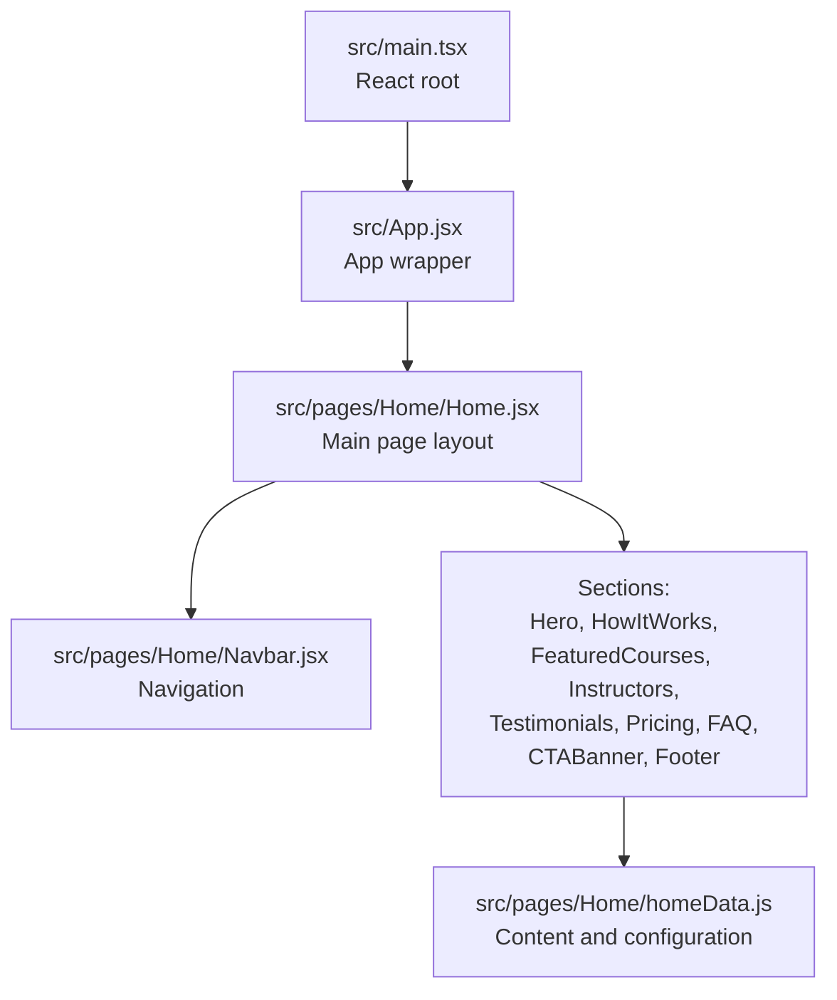
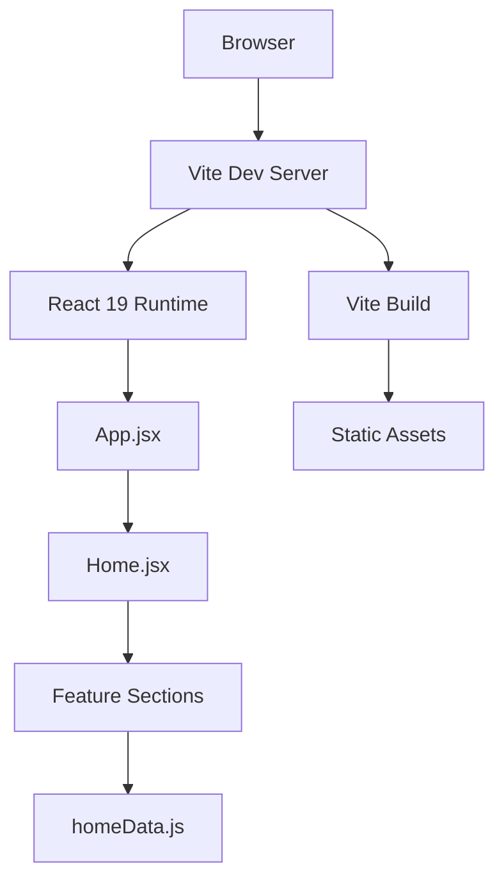
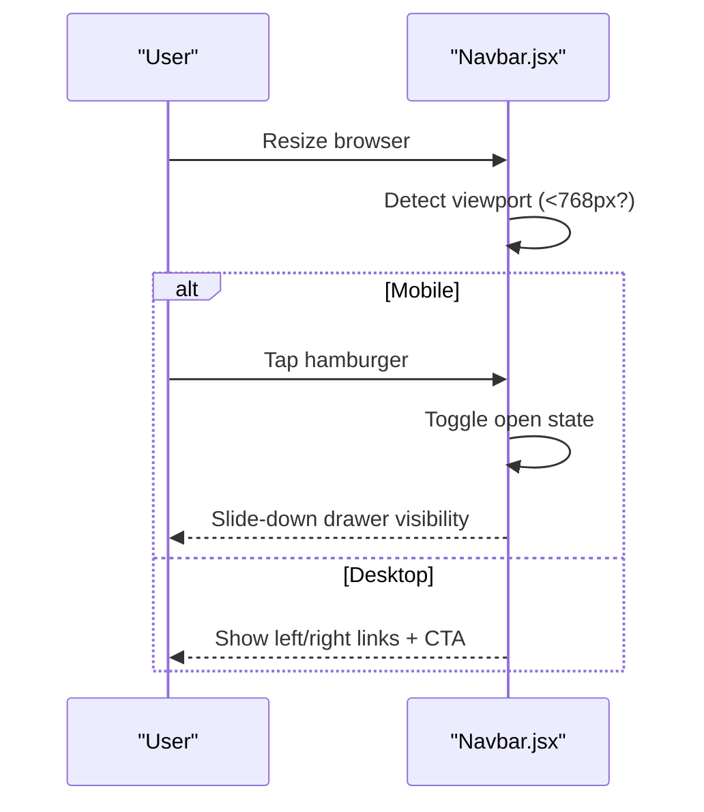
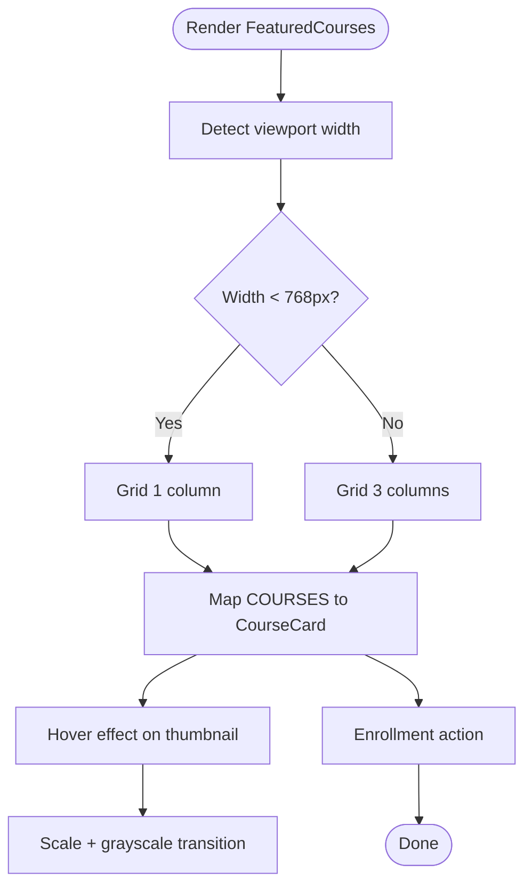
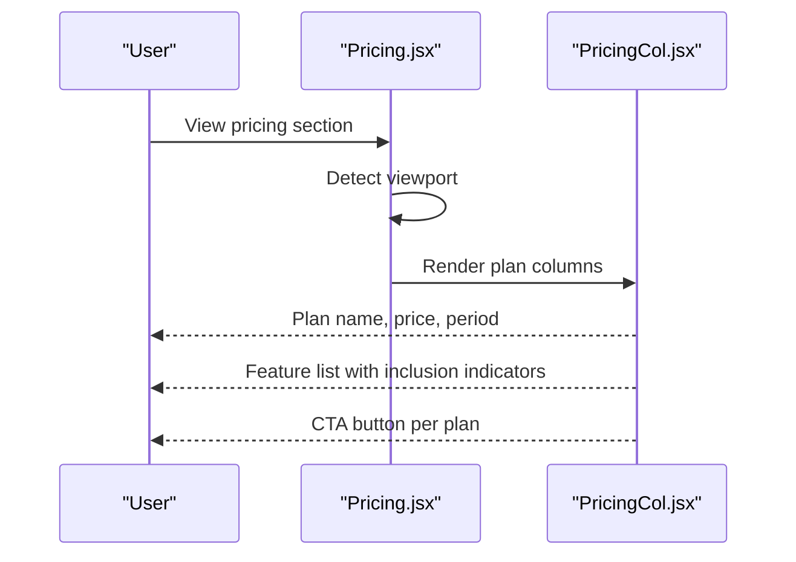
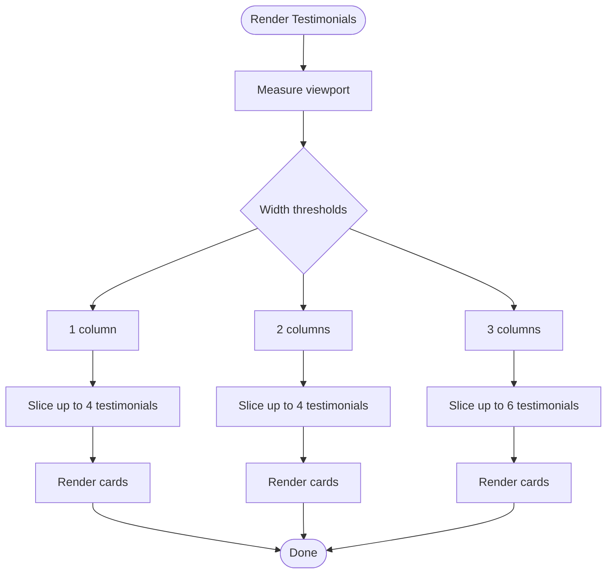
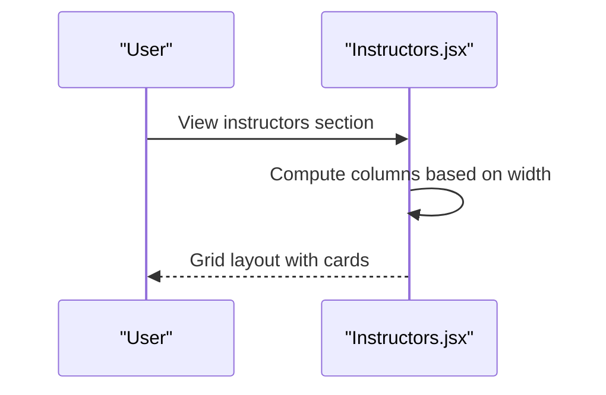
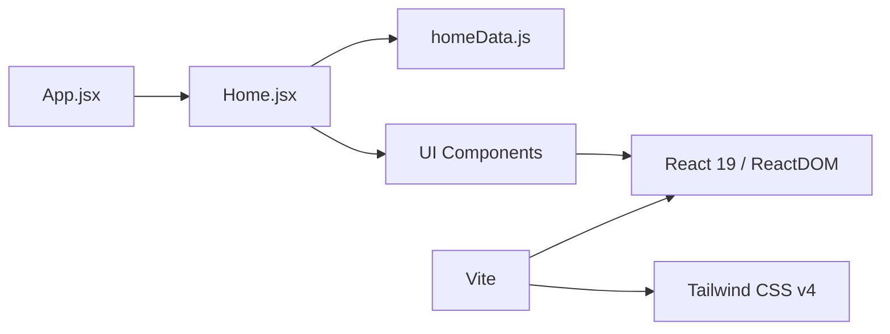

# Project Overview

<cite>
**Referenced Files in This Document**
- [README.md](file://README.md)
- [package.json](file://package.json)
- [vite.config.ts](file://vite.config.ts)
- [src/main.tsx](file://src/main.tsx)
- [src/App.jsx](file://src/App.jsx)
- [src/pages/Home/Home.jsx](file://src/pages/Home/Home.jsx)
- [src/pages/Home/homeData.js](file://src/pages/Home/homeData.js)
- [src/pages/Home/Navbar.jsx](file://src/pages/Home/Navbar.jsx)
- [src/pages/Home/FeaturedCourses.jsx](file://src/pages/Home/FeaturedCourses.jsx)
- [src/pages/Home/CourseCard.jsx](file://src/pages/Home/CourseCard.jsx)
- [src/pages/Home/Pricing.jsx](file://src/pages/Home/Pricing.jsx)
- [src/pages/Home/PricingCol.jsx](file://src/pages/Home/PricingCol.jsx)
- [src/pages/Home/Testimonials.jsx](file://src/pages/Home/Testimonials.jsx)
- [src/pages/Home/TestimonialCard.jsx](file://src/pages/Home/TestimonialCard.jsx)
- [src/pages/Home/Instructors.jsx](file://src/pages/Home/Instructors.jsx)
</cite>

## Table of Contents
1. [Introduction](#introduction)
2. [Project Structure](#project-structure)
3. [Core Components](#core-components)
4. [Architecture Overview](#architecture-overview)
5. [Detailed Component Analysis](#detailed-component-analysis)
6. [Dependency Analysis](#dependency-analysis)
7. [Performance Considerations](#performance-considerations)
8. [Troubleshooting Guide](#troubleshooting-guide)
9. [Conclusion](#conclusion)
10. [Appendices](#appendices)

## Introduction
CourseCraft is a modern educational technology landing page designed to showcase an online learning platform focused on practical, project-based courses. Its primary goal is to demonstrate a compelling value proposition for students seeking lifetime access to high-quality courses and for educators looking to monetize their expertise with fair revenue sharing and minimal overhead. The platform emphasizes transparency, lifetime ownership, and real-world outcomes, positioning itself as an alternative to subscription-based models.

Key audiences:
- Students: Learners seeking portable, practical skills with lifetime access and portfolio-ready deliverables.
- Educators: Practicing professionals who want to teach, retain a significant revenue share, and reach learners globally.

Core value propositions:
- Lifetime access to purchased courses with no recurring fees.
- Real projects and certificates to accelerate career transitions.
- Transparent pricing and refund guarantees.
- Educator-friendly tools and fair revenue distribution.

## Project Structure
The client is a React 19 Single Page Application (SPA) built with TypeScript and Vite. It follows a feature-based organization under src/pages/Home, with shared components and centralized content in a dedicated data module. The application initializes via a strict React root and renders a single-page Home route that composes modular sections.

**Diagram sources**
- [src/main.tsx:1-11](file://src/main.tsx#L1-L11)
- [src/App.jsx:1-10](file://src/App.jsx#L1-L10)
- [src/pages/Home/Home.jsx:1-40](file://src/pages/Home/Home.jsx#L1-L40)
- [src/pages/Home/homeData.js:1-157](file://src/pages/Home/homeData.js#L1-L157)

**Section sources**
- [src/main.tsx:1-11](file://src/main.tsx#L1-L11)
- [src/App.jsx:1-10](file://src/App.jsx#L1-L10)
- [src/pages/Home/Home.jsx:1-40](file://src/pages/Home/Home.jsx#L1-L40)
- [src/pages/Home/homeData.js:1-157](file://src/pages/Home/homeData.js#L1-L157)

## Core Components
- Navigation: A responsive navbar with desktop and mobile drawer modes, supporting hover states and smooth animations.
- Content sections: Hero, How It Works, Featured Courses, Role Panels, Instructors, Testimonials, Pricing, FAQ, CTA Banner, and Footer.
- Data layer: A centralized homeData module defines navigation, hero cells, stats, steps, numbers, courses, roles, instructors, testimonials, pricing plans, FAQs, and footer links.

These components collectively present a modern, content-driven landing page optimized for conversion and trust-building.

**Section sources**
- [src/pages/Home/Navbar.jsx:1-125](file://src/pages/Home/Navbar.jsx#L1-L125)
- [src/pages/Home/Home.jsx:1-40](file://src/pages/Home/Home.jsx#L1-L40)
- [src/pages/Home/homeData.js:1-157](file://src/pages/Home/homeData.js#L1-L157)

## Architecture Overview
The application architecture is intentionally lightweight and content-centric:
- Entry point: React root bootstraps the app and mounts App.
- Routing: The current implementation routes to a single Home page; routing libraries are present but not actively configured in the provided files.
- Styling: Tailwind CSS v4 integrates via a Vite plugin for utility-first styling.
- Build toolchain: Vite orchestrates development and production builds with React Fast Refresh and TypeScript compilation.

**Diagram sources**
- [src/main.tsx:1-11](file://src/main.tsx#L1-L11)
- [src/App.jsx:1-10](file://src/App.jsx#L1-L10)
- [src/pages/Home/Home.jsx:1-40](file://src/pages/Home/Home.jsx#L1-L40)
- [src/pages/Home/homeData.js:1-157](file://src/pages/Home/homeData.js#L1-L157)
- [vite.config.ts:1-8](file://vite.config.ts#L1-L8)
- [package.json:1-38](file://package.json#L1-L38)

**Section sources**
- [vite.config.ts:1-8](file://vite.config.ts#L1-L8)
- [package.json:1-38](file://package.json#L1-L38)

## Detailed Component Analysis

### Navigation and User Experience
The Navbar adapts seamlessly across breakpoints:
- Desktop: Left and right link groups with a prominent CTA.
- Mobile: Hamburger-triggered slide-down drawer with animated transitions and hover effects.

**Diagram sources**
- [src/pages/Home/Navbar.jsx:9-125](file://src/pages/Home/Navbar.jsx#L9-L125)

**Section sources**
- [src/pages/Home/Navbar.jsx:1-125](file://src/pages/Home/Navbar.jsx#L1-L125)

### Course Discovery and Catalog
The FeaturedCourses section dynamically adjusts layout per breakpoint and reveals cards progressively. CourseCard displays thumbnails with hover transforms, badges, ratings, pricing, and enrollment actions.

**Diagram sources**
- [src/pages/Home/FeaturedCourses.jsx:1-46](file://src/pages/Home/FeaturedCourses.jsx#L1-L46)
- [src/pages/Home/CourseCard.jsx:1-54](file://src/pages/Home/CourseCard.jsx#L1-L54)
- [src/pages/Home/homeData.js:56-61](file://src/pages/Home/homeData.js#L56-L61)

**Section sources**
- [src/pages/Home/FeaturedCourses.jsx:1-46](file://src/pages/Home/FeaturedCourses.jsx#L1-L46)
- [src/pages/Home/CourseCard.jsx:1-54](file://src/pages/Home/CourseCard.jsx#L1-L54)
- [src/pages/Home/homeData.js:56-61](file://src/pages/Home/homeData.js#L56-L61)

### Pricing System and Plans
Pricing presents three plans with responsive grid layouts and visual emphasis on the featured plan. PricingCol renders plan metadata, feature lists, and call-to-action buttons.

**Diagram sources**
- [src/pages/Home/Pricing.jsx:1-41](file://src/pages/Home/Pricing.jsx#L1-L41)
- [src/pages/Home/PricingCol.jsx:1-46](file://src/pages/Home/PricingCol.jsx#L1-L46)
- [src/pages/Home/homeData.js:98-133](file://src/pages/Home/homeData.js#L98-L133)

**Section sources**
- [src/pages/Home/Pricing.jsx:1-41](file://src/pages/Home/Pricing.jsx#L1-L41)
- [src/pages/Home/PricingCol.jsx:1-46](file://src/pages/Home/PricingCol.jsx#L1-L46)
- [src/pages/Home/homeData.js:98-133](file://src/pages/Home/homeData.js#L98-L133)

### Testimonial Showcases
Testimonials adapt to 1, 2, or 3 columns based on viewport width, with staggered reveal animations and consistent card styling.

**Diagram sources**
- [src/pages/Home/Testimonials.jsx:1-42](file://src/pages/Home/Testimonials.jsx#L1-L42)
- [src/pages/Home/TestimonialCard.jsx:1-28](file://src/pages/Home/TestimonialCard.jsx#L1-L28)
- [src/pages/Home/homeData.js:88-96](file://src/pages/Home/homeData.js#L88-L96)

**Section sources**
- [src/pages/Home/Testimonials.jsx:1-42](file://src/pages/Home/Testimonials.jsx#L1-L42)
- [src/pages/Home/TestimonialCard.jsx:1-28](file://src/pages/Home/TestimonialCard.jsx#L1-L28)
- [src/pages/Home/homeData.js:88-96](file://src/pages/Home/homeData.js#L88-L96)

### Instructor Profiles
Instructors showcase educator bios, specialties, course counts, and ratings, arranged responsively across 4, 2, or 1 columns.

**Diagram sources**
- [src/pages/Home/Instructors.jsx:1-42](file://src/pages/Home/Instructors.jsx#L1-L42)
- [src/pages/Home/homeData.js:80-86](file://src/pages/Home/homeData.js#L80-L86)

**Section sources**
- [src/pages/Home/Instructors.jsx:1-42](file://src/pages/Home/Instructors.jsx#L1-L42)
- [src/pages/Home/homeData.js:80-86](file://src/pages/Home/homeData.js#L80-L86)

### Conceptual Overview
The platform’s positioning in the edtech market centers on:
- Lifetime ownership vs. subscription fatigue.
- Practical outcomes with portfolio-ready deliverables.
- Educator empowerment with fair revenue and low friction.

Competitive advantages:
- No recurring fees, no expiration.
- Strong testimonials and social proof.
- Transparent pricing and refund policy.
- Educator-friendly publishing and analytics.

Growth potential:
- Expand course categories and languages.
- Introduce learner progress tracking and certificates.
- Add instructor application and analytics dashboards.
- Monetize via premium memberships and enterprise licensing.

[No sources needed since this section doesn't analyze specific files]

## Dependency Analysis
The project relies on a concise set of runtime and build dependencies:
- React 19 and React DOM for UI rendering.
- react-router-dom for navigation and routing (present but not configured in the provided files).
- Tailwind CSS v4 and Tailwind Vite plugin for styling.
- Vite with React plugin for fast builds and development.

**Diagram sources**
- [src/App.jsx:1-10](file://src/App.jsx#L1-L10)
- [src/pages/Home/Home.jsx:1-40](file://src/pages/Home/Home.jsx#L1-L40)
- [src/pages/Home/homeData.js:1-157](file://src/pages/Home/homeData.js#L1-L157)
- [package.json:12-18](file://package.json#L12-L18)
- [vite.config.ts:1-8](file://vite.config.ts#L1-L8)

**Section sources**
- [package.json:1-38](file://package.json#L1-L38)
- [vite.config.ts:1-8](file://vite.config.ts#L1-L8)

## Performance Considerations
- Bundle size: Keep component imports lazy-loaded where appropriate and avoid unnecessary third-party dependencies.
- Rendering: Use responsive layouts and minimal re-renders; memoize heavy computations if needed.
- Images: Lazy-load thumbnails and optimize assets for various screen densities.
- Interactions: Prefer CSS transitions over JavaScript animations for smoother UX.
- Build: Leverage Vite’s native esbuild for fast builds and efficient tree-shaking.

[No sources needed since this section provides general guidance]

## Troubleshooting Guide
Common issues and resolutions:
- Navigation not switching to mobile drawer: Verify viewport detection and state toggles in the navbar component.
- Courses not rendering: Confirm homeData exports and array lengths; ensure responsive grid logic applies correct column counts.
- Pricing plan visuals incorrect: Check featured plan flags and feature inclusion indicators.
- Testimonials misalignment: Validate column calculations and border styles per row segments.
- Build errors: Ensure Vite and Tailwind plugins are correctly configured and TypeScript types are consistent.

**Section sources**
- [src/pages/Home/Navbar.jsx:1-125](file://src/pages/Home/Navbar.jsx#L1-L125)
- [src/pages/Home/FeaturedCourses.jsx:1-46](file://src/pages/Home/FeaturedCourses.jsx#L1-L46)
- [src/pages/Home/Pricing.jsx:1-41](file://src/pages/Home/Pricing.jsx#L1-L41)
- [src/pages/Home/Testimonials.jsx:1-42](file://src/pages/Home/Testimonials.jsx#L1-L42)
- [vite.config.ts:1-8](file://vite.config.ts#L1-L8)
- [package.json:1-38](file://package.json#L1-L38)

## Conclusion
CourseCraft’s landing page demonstrates a clear, modern approach to edtech marketing: practical value, transparent pricing, and strong social proof. Built with React 19, TypeScript, and Vite, it balances developer productivity with a polished user experience. The modular Home page and centralized content layer enable rapid iteration on messaging and conversions. With thoughtful enhancements to navigation, course discovery, and instructor tools, the platform can scale effectively while maintaining its focus on lifetime learning value.

[No sources needed since this section summarizes without analyzing specific files]

## Appendices
- Technology stack highlights:
  - React 19 for component model and concurrent features.
  - TypeScript for type safety and developer ergonomics.
  - Vite for fast builds, hot module replacement, and optimized production bundles.
  - Tailwind CSS v4 for utility-first styling and responsive design.

[No sources needed since this section provides general guidance]