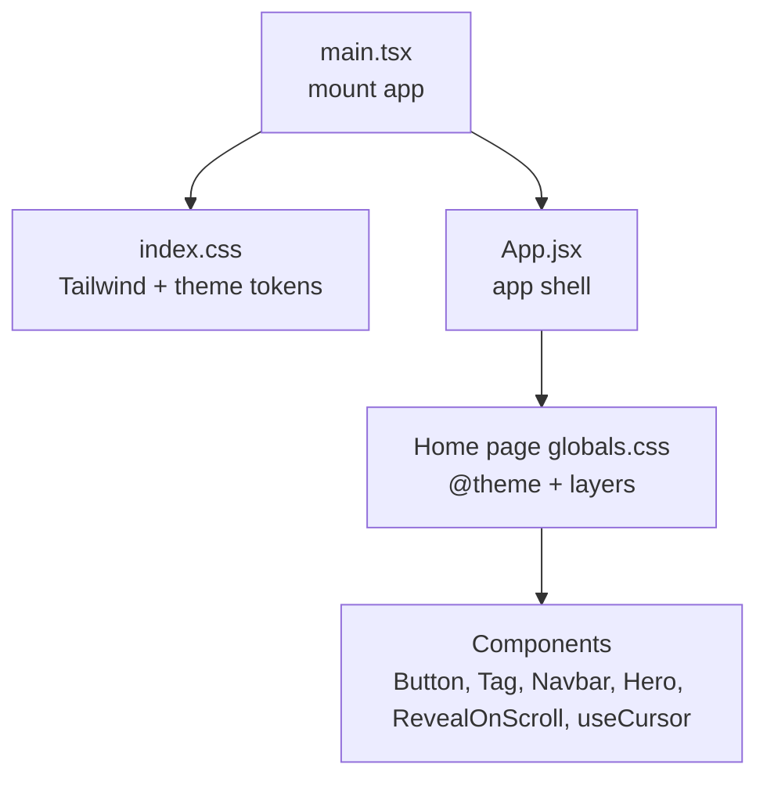
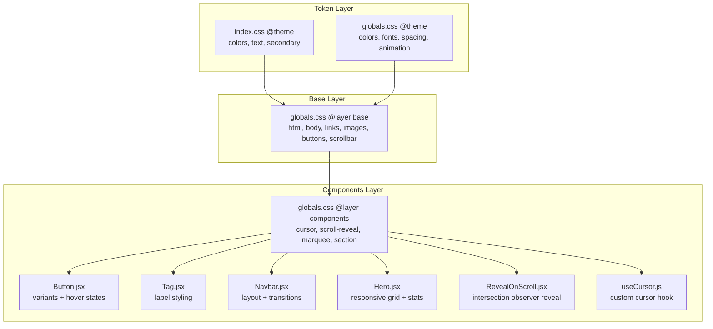
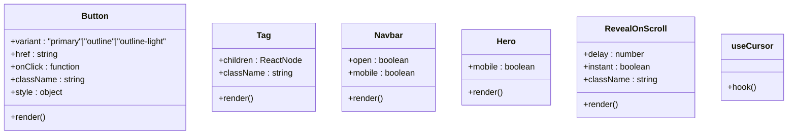
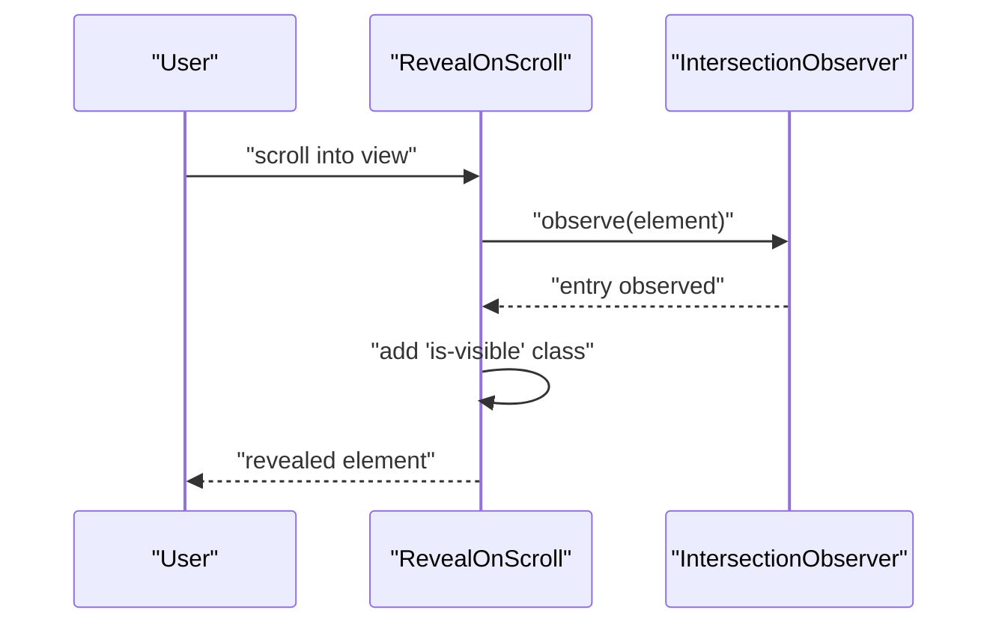
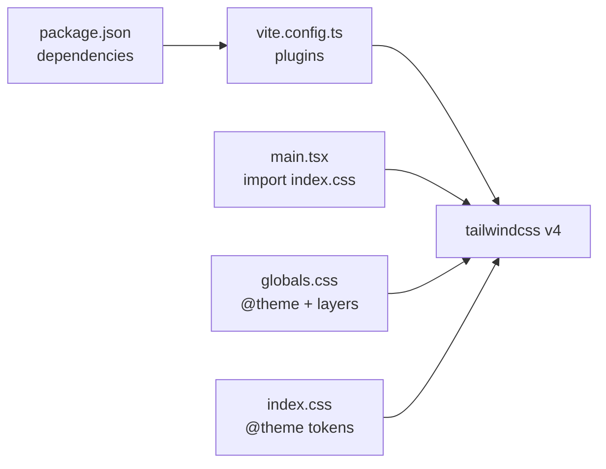

# Styling & Theming

<cite>
**Referenced Files in This Document**
- [index.css](file://src/index.css)
- [globals.css](file://src/pages/Home/globals.css)
- [vite.config.ts](file://vite.config.ts)
- [package.json](file://package.json)
- [main.tsx](file://src/main.tsx)
- [App.jsx](file://src/App.jsx)
- [Button.jsx](file://src/pages/Home/Button.jsx)
- [Tag.jsx](file://src/pages/Home/Tag.jsx)
- [Navbar.jsx](file://src/pages/Home/Navbar.jsx)
- [Hero.jsx](file://src/pages/Home/Hero.jsx)
- [RevealOnScroll.jsx](file://src/pages/Home/RevealOnScroll.jsx)
- [useCursor.js](file://src/pages/Home/useCursor.js)
</cite>

## Table of Contents
1. [Introduction](#introduction)
2. [Project Structure](#project-structure)
3. [Core Components](#core-components)
4. [Architecture Overview](#architecture-overview)
5. [Detailed Component Analysis](#detailed-component-analysis)
6. [Dependency Analysis](#dependency-analysis)
7. [Performance Considerations](#performance-considerations)
8. [Troubleshooting Guide](#troubleshooting-guide)
9. [Conclusion](#conclusion)
10. [Appendices](#appendices)

## Introduction
This document describes CourseCraft’s visual design system built with Tailwind CSS v4 and custom CSS. It explains the theme tokens, color schemes, typography, spacing, responsive behavior, and component styling patterns. It also covers animation and transitions, performance and compatibility considerations, accessibility guidance, and extension practices for maintaining visual consistency across components.

## Project Structure
CourseCraft integrates Tailwind CSS v4 via the official Vite plugin. Global design tokens and base styles are centralized in dedicated CSS files, while components apply utility-first classes and minimal custom styles.

**Diagram sources**
- [main.tsx:1-11](file://src/main.tsx#L1-L11)
- [index.css:1-8](file://src/index.css#L1-L8)
- [App.jsx:1-10](file://src/App.jsx#L1-L10)
- [globals.css:1-146](file://src/pages/Home/globals.css#L1-L146)

**Section sources**
- [vite.config.ts:1-8](file://vite.config.ts#L1-L8)
- [package.json:12-18](file://package.json#L12-L18)
- [main.tsx:1-11](file://src/main.tsx#L1-L11)
- [index.css:1-8](file://src/index.css#L1-L8)
- [globals.css:1-146](file://src/pages/Home/globals.css#L1-L146)

## Core Components
- Theme tokens and color scheme: Defined via CSS variables in global styles for consistent reuse across components.
- Typography system: Uses CSS variables for font families and maintains consistent sizing and line-height.
- Spacing conventions: Uses viewport-relative units and consistent padding/margins for scalable layouts.
- Responsive design: Breakpoints are applied via media queries and Tailwind utilities; mobile-first patterns dominate.
- Animation and transitions: Implemented with CSS keyframes and transition utilities for micro-interactions and reveals.

**Section sources**
- [index.css:2-7](file://src/index.css#L2-L7)
- [globals.css:3-19](file://src/pages/Home/globals.css#L3-L19)
- [globals.css:31-73](file://src/pages/Home/globals.css#L31-L73)
- [globals.css:75-145](file://src/pages/Home/globals.css#L75-L145)

## Architecture Overview
The styling architecture follows a layered approach:
- Token layer: Centralized CSS variables for colors, fonts, spacing, and animations.
- Base layer: Normalize-like resets and foundational styles.
- Components layer: Custom component styles that complement Tailwind utilities.
- Utility-first patterns: Prefer Tailwind utilities for layout and styling, with targeted overrides.

**Diagram sources**
- [index.css:1-8](file://src/index.css#L1-L8)
- [globals.css:1-146](file://src/pages/Home/globals.css#L1-L146)
- [Button.jsx:1-30](file://src/pages/Home/Button.jsx#L1-L30)
- [Tag.jsx:1-11](file://src/pages/Home/Tag.jsx#L1-L11)
- [Navbar.jsx:1-153](file://src/pages/Home/Navbar.jsx#L1-L153)
- [Hero.jsx:1-105](file://src/pages/Home/Hero.jsx#L1-L105)
- [RevealOnScroll.jsx:1-28](file://src/pages/Home/RevealOnScroll.jsx#L1-L28)
- [useCursor.js:1-29](file://src/pages/Home/useCursor.js#L1-L29)

## Detailed Component Analysis

### Theme Tokens and Color Schemes
- Primary palette: Background, text, secondary accent, and muted text tokens are defined as CSS variables.
- Page-level tokens: Additional colors (paper, paper variants, red), fonts (serif/sans), spacing (navigation height), and animation (marquee) are scoped to the home page.
- Usage pattern: Components reference tokens via CSS variables for consistent theming and easy overrides.

**Section sources**
- [index.css:2-7](file://src/index.css#L2-L7)
- [globals.css:3-19](file://src/pages/Home/globals.css#L3-L19)

### Typography System
- Font families: Serif and sans-serif stacks are defined as CSS variables for consistent application.
- Sizing and rhythm: Components use clamp-based scales and consistent line heights for readability across breakpoints.
- Monospace emphasis: Monospace is used for labels, stats, and small UI text to maintain typographic hierarchy.

**Section sources**
- [globals.css:10-12](file://src/pages/Home/globals.css#L10-L12)
- [Hero.jsx:31-42](file://src/pages/Home/Hero.jsx#L31-L42)
- [Tag.jsx:4-10](file://src/pages/Home/Tag.jsx#L4-L10)

### Spacing Conventions
- Viewport-relative padding: Sections use percentages and viewport units for scalable spacing.
- Grid-based layouts: Components rely on Tailwind grids and custom grid templates for responsive composition.
- Consistent gutters: Standardized spacing tokens and utilities ensure uniform rhythm across components.

**Section sources**
- [globals.css:14-15](file://src/pages/Home/globals.css#L14-L15)
- [globals.css:135-144](file://src/pages/Home/globals.css#L135-L144)
- [Hero.jsx:20-22](file://src/pages/Home/Hero.jsx#L20-L22)

### Responsive Design and Breakpoints
- Media queries: Explicit max-width breakpoints are used for cursor behavior and section padding.
- Tailwind utilities: Responsive modifiers are used extensively for layout and visibility.
- Mobile-first patterns: Navigation collapses into a slide-down drawer on smaller screens; hero stacks vertically.

**Section sources**
- [globals.css:68-72](file://src/pages/Home/globals.css#L68-L72)
- [globals.css:140-144](file://src/pages/Home/globals.css#L140-L144)
- [Navbar.jsx:14-19](file://src/pages/Home/Navbar.jsx#L14-L19)
- [Hero.jsx:10-17](file://src/pages/Home/Hero.jsx#L10-L17)

### Component Styling Patterns
- Utility-first: Components primarily use Tailwind classes for layout and styling.
- Minimal overrides: Inline styles and small overrides are used sparingly for dynamic states or layout exceptions.
- Variant-driven buttons: Buttons define idle and hover variants for consistent interactive states.

**Diagram sources**
- [Button.jsx:1-30](file://src/pages/Home/Button.jsx#L1-L30)
- [Tag.jsx:1-11](file://src/pages/Home/Tag.jsx#L1-L11)
- [Navbar.jsx:1-153](file://src/pages/Home/Navbar.jsx#L1-L153)
- [Hero.jsx:1-105](file://src/pages/Home/Hero.jsx#L1-L105)
- [RevealOnScroll.jsx:1-28](file://src/pages/Home/RevealOnScroll.jsx#L1-L28)
- [useCursor.js:1-29](file://src/pages/Home/useCursor.js#L1-L29)

**Section sources**
- [Button.jsx:3-18](file://src/pages/Home/Button.jsx#L3-L18)
- [Button.jsx:20-29](file://src/pages/Home/Button.jsx#L20-L29)
- [Tag.jsx:4-10](file://src/pages/Home/Tag.jsx#L4-L10)
- [Navbar.jsx:38-91](file://src/pages/Home/Navbar.jsx#L38-L91)
- [Hero.jsx:20-86](file://src/pages/Home/Hero.jsx#L20-L86)
- [RevealOnScroll.jsx:7-27](file://src/pages/Home/RevealOnScroll.jsx#L7-L27)
- [useCursor.js:4-28](file://src/pages/Home/useCursor.js#L4-L28)

### Animations and Transitions
- Keyframes: A marquee animation is defined and applied to a container class.
- Transition utilities: Hover states and UI interactions use transition utilities for smooth motion.
- Scroll reveal: An intersection observer toggles visibility classes for fade-up reveals.

**Diagram sources**
- [RevealOnScroll.jsx:10-20](file://src/pages/Home/RevealOnScroll.jsx#L10-L20)
- [globals.css:107-118](file://src/pages/Home/globals.css#L107-L118)

**Section sources**
- [globals.css:21-29](file://src/pages/Home/globals.css#L21-L29)
- [globals.css:129-133](file://src/pages/Home/globals.css#L129-L133)
- [RevealOnScroll.jsx:10-20](file://src/pages/Home/RevealOnScroll.jsx#L10-L20)

### Dark/Light Mode Implementation
- Current state: The design system defines a warm, earthy palette suitable for a light-on-dark theme. There is no explicit dark mode toggle in the current codebase.
- Recommended approach: Introduce a CSS variable for background and text, and switch values via a class on the root element. Apply the same variable-based patterns used in the existing styles.

[No sources needed since this section provides general guidance]

### Accessibility in Visual Design
- Contrast: Ensure sufficient contrast between backgrounds and text using the defined tokens.
- Focus and hover: Maintain visible focus states and hover affordances for interactive elements.
- Motion preferences: Respect reduced motion settings by avoiding excessive motion where possible.

[No sources needed since this section provides general guidance]

## Dependency Analysis
Tailwind CSS v4 is integrated via the official Vite plugin. The build pipeline compiles CSS from global styles and components, applying the theme tokens and utilities.

**Diagram sources**
- [package.json:12-18](file://package.json#L12-L18)
- [vite.config.ts:3](file://vite.config.ts#L3)
- [main.tsx:3](file://src/main.tsx#L3)
- [globals.css:1-146](file://src/pages/Home/globals.css#L1-L146)
- [index.css:1-8](file://src/index.css#L1-L8)

**Section sources**
- [package.json:12-18](file://package.json#L12-L18)
- [vite.config.ts:1-8](file://vite.config.ts#L1-L8)
- [main.tsx:1-11](file://src/main.tsx#L1-L11)

## Performance Considerations
- CSS delivery: Keep global styles minimal and scoped. Use Tailwind utilities to avoid generating unused CSS.
- Variable-based theming: Centralize tokens to reduce duplication and enable efficient updates.
- Animation performance: Prefer transform and opacity for animations; avoid layout-affecting properties.
- Bundle size: Leverage the Vite build to tree-shake unused CSS and optimize assets.

[No sources needed since this section provides general guidance]

## Troubleshooting Guide
- Styles not applying: Verify that global CSS is imported before component styles and that Tailwind layers are correctly structured.
- Theme tokens missing: Ensure CSS variables are defined in the appropriate @theme block and referenced consistently.
- Animations not playing: Confirm keyframes are defined and applied to the correct class, and that observers are initialized properly.

**Section sources**
- [globals.css:1-146](file://src/pages/Home/globals.css#L1-L146)
- [index.css:1-8](file://src/index.css#L1-L8)
- [RevealOnScroll.jsx:10-20](file://src/pages/Home/RevealOnScroll.jsx#L10-L20)

## Conclusion
CourseCraft’s styling system combines Tailwind CSS v4 with a robust token-based design system. By centralizing theme tokens, leveraging utility-first patterns, and applying thoughtful animations and responsive behavior, the system achieves consistency and scalability. Extending the design system should continue prioritizing tokens, layering, and accessibility.

## Appendices

### Design Token Reference
- Colors: Background, text, secondary, muted text, and page-specific accents.
- Fonts: Serif and sans-serif stacks for varied typographic roles.
- Spacing: Navigation height and section padding tokens.
- Animation: Marquee animation definition for continuous horizontal movement.

**Section sources**
- [index.css:2-7](file://src/index.css#L2-L7)
- [globals.css:3-19](file://src/pages/Home/globals.css#L3-L19)

### Extending the Design System
- Add new tokens: Define CSS variables in the nearest applicable @theme block.
- Create reusable components: Encapsulate common patterns into components with variant props.
- Maintain consistency: Prefer Tailwind utilities with targeted overrides; avoid ad hoc styles.

[No sources needed since this section provides general guidance]